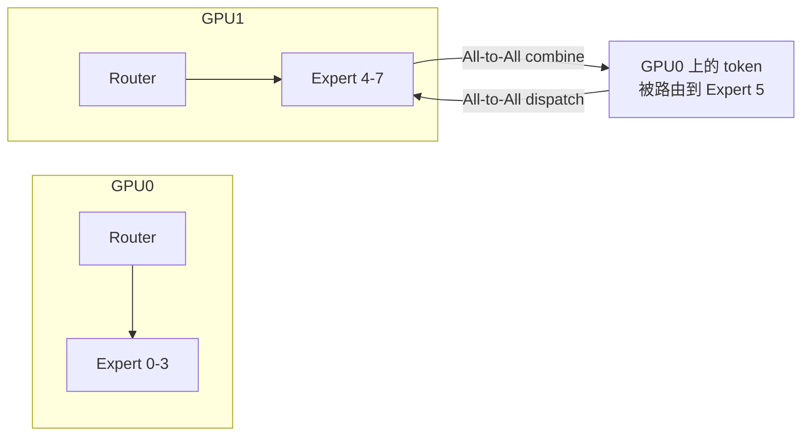
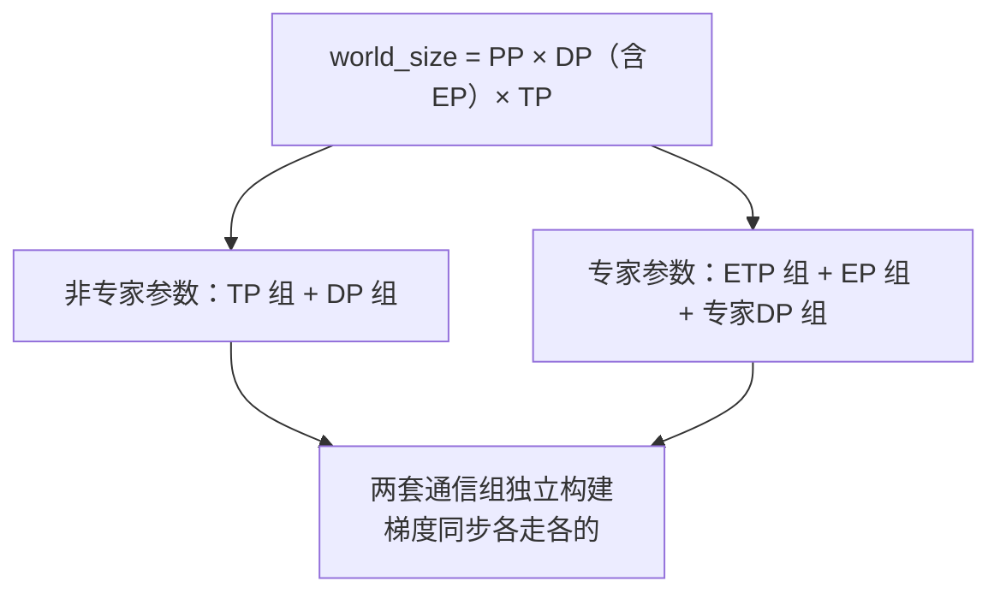

MoE 把"参数规模"和"单 token 计算量"解耦：参数可以堆到千亿、万亿，每个 token 却只激活其中一小部分。代价是引入了一个全新的分布式问题——专家散落在几十上百块 GPU 上，每个 token 要去哪块卡、怎么去、怎么回来、去的人会不会挤在少数几个专家门口。这就是 Expert Parallelism（EP）以及它标志性的 All-to-All 通信。围绕第 10 章概览的骨架，这里把 MoE 结构、EP 通信量、负载均衡两大流派（辅助损失 vs DeepSeek-V3 的 aux-loss-free）、容量因子与 token drop、EP 与其他并行的组合、DeepEP 等通信优化、以及推理场景的大 EP 部署逐一算清楚。

<!-- more -->

## 📑 目录

- [1. MoE 结构回顾](#1-moe-结构回顾)
- [2. Expert Parallelism 的基本思想](#2-expert-parallelism-的基本思想)
- [3. All-to-All 通信：dispatch 与 combine](#3-all-to-all-通信dispatch-与-combine)
- [4. 负载均衡](#4-负载均衡)
- [5. 容量因子与 token drop](#5-容量因子与-token-drop)
- [6. EP 与其他并行维度的组合](#6-ep-与其他并行维度的组合)
- [7. All-to-All 通信优化](#7-all-to-all-通信优化)
- [8. 推理场景的 EP](#8-推理场景的-ep)
- [9. 高频面试题解析](#9-高频面试题解析)
- [总结](#-总结)
- [参考资料](#-参考资料)

---

## 1. MoE 结构回顾

### 1.1 从稠密 FFN 到稀疏专家

标准 Transformer 层里，FFN 对**每个 token 都执行同一套完整计算**。MoE 的改造是：把这一个大 FFN 换成 $E$ 个较小的 FFN（称为 Expert），再配一个轻量的 **Router（Gating Network）**，让每个 token 只走其中 $K$ 个专家（$K \ll E$）：

$$
p = \mathrm{softmax}(W_g \cdot x), \qquad
y = \sum_{i \in \mathrm{TopK}(p)} g_i \cdot \mathrm{Expert}_i(x)
$$

其中 $W_g$ 是路由权重（一个 $h \times E$ 的小矩阵），$g_i$ 是归一化后的门控权重。这带来 MoE 最核心的性质——**稀疏激活**：

- **参数量**按专家数近似放大 $E$ 倍（FFN 部分）
- **单 token 计算量**只放大约 $K$ 倍（只过 $K$ 个专家）

| 📊 模型 | 总参数 | 单 token 激活参数 | 路由方式 |
|---|---|---|---|
| Switch Transformer | 最大 1.6T | 相当于底座稠密模型 | Top-1 |
| Mixtral 8x7B | ~47B | ~13B | 8 选 Top-2 |
| DeepSeek-V3 | 671B | 37B | 256 个路由专家选 Top-8 + 1 个共享专家 |

🔑 **核心概念**：MoE 用"条件计算"打破了稠密模型"参数量 ∝ 计算量"的绑定。这正是它能把参数堆到 671B 而训练/推理成本仍可控的原因——但代价是把"参数放不下单卡"和"token 要跨卡找专家"两个分布式难题同时引了进来。

⚠️ **注意**：路由是**逐 token** 做的——同一个序列里相邻两个 token 完全可能去不同的专家。这也是面试常见的辨析点：路由决策是 token 级的；"序列级"只出现在负载均衡损失的统计口径上（见 4.4 节）。

### 1.2 共享专家与 DeepSeekMoE 的细粒度专家

DeepSeekMoE（DeepSeek-V2/V3 沿用）在经典 Top-K MoE 上做了两个结构改造：

**（1）共享专家（Shared Expert）**：留 1 个（或几个）专家对**所有 token 恒定激活**，不经过路由。直觉是：语言里有大量"公共知识"（语法、常用搭配），与其让每个路由专家都冗余学一遍，不如集中放进共享专家，让路由专家专注差异化知识。

**（2）细粒度专家切分（Fine-Grained Expert Segmentation）**：把每个专家的中间维切小为原来的 $\frac{1}{m}$，专家数变成 $mE$ 个，同时把 Top-$K$ 提升为 Top-$mK$——总计算量不变，但组合灵活性指数级上升。以 8 个专家选 2 个为例：

$$
\binom{8}{2} = 28 \quad \xrightarrow{\ m=4\ } \quad \binom{32}{8} = 10{,}518{,}300
$$

可选的专家组合从 28 种暴涨到千万种，token 可以更精细地"拼装"自己需要的知识。DeepSeek-V3 走到极致：每层 256 个路由专家（每个中间维仅 2048）选 Top-8，外加 1 个共享专家；前 3 层保留稠密 FFN。

📌 **关键点**：细粒度专家对**系统**的影响同样深远——单个专家的 GEMM 变得很小，这既让"专家内部再切 TP"变得不划算（见第 6 节），也让每卡多专家时需要 GroupedGEMM 这类 kernel 来保持算力利用率。

---

## 2. Expert Parallelism 的基本思想

专家一多，参数就放不下了：DeepSeek-V3 的 671B 参数绝大部分在专家里，单卡无论如何装不下。**Expert Parallelism（EP）** 的做法直截了当：把 $E$ 个专家**按整份**分到 $N_{EP}$ 块 GPU 上，每卡只存 $\frac{E}{N_{EP}}$ 个专家：

与 TP 的区别值得专门对照——两者都是"把参数切开放到多卡"，但切法完全不同：

| 📊 维度 | 张量并行 TP | 专家并行 EP |
|---|---|---|
| 切分对象 | **单个**权重矩阵切成 $t$ 片 | 专家**集合**按整份分配，专家本身不切 |
| 每卡算什么 | 所有 token 的 $\frac{1}{t}$ 份计算 | 被路由到本卡专家的那部分 token 的**完整**计算 |
| 通信原语 | AllReduce（或 AllGather + ReduceScatter） | **All-to-All**（dispatch + combine） |
| 通信内容 | 部分和 / 激活分片 | token 的隐层向量本身 |
| 通信量是否依赖数据 | 否（只看形状） | **是**（取决于路由结果的分布） |

🔑 **核心概念**：EP 的通信是**数据依赖**的——token 发给谁由 Router 现场决定，每步、每层都不同。这是 All-to-All 成为 MoE 系统核心难题的根源：通信矩阵不规则、还可能严重倾斜（负载不均，见第 4 节）。

---

## 3. All-to-All 通信：dispatch 与 combine

### 3.1 一层 MoE 的完整数据流

设 EP 组大小 $N_{EP}$，每卡本地有 $T$ 个 token。一次前向里，MoE 层要做两次 All-to-All：

1. **Dispatch**：每卡的 Router 算出本地每个 token 的 Top-K 专家，把 token 的隐层向量发到对应专家所在的 GPU。每张卡既是发送方（发自己的 token）也是接收方（收别人发来的、路由到本卡专家的 token）——这正是 All-to-All 的语义。
2. **专家计算**：各卡对收到的 token 批量执行本卡专家的 FFN。
3. **Combine**：专家输出按原路发回 token 的来源卡，在来源卡上按门控权重 $g_i$ 加权求和，得到该 token 的 MoE 层输出。

反向传播时数据流反过来：combine 的反向是一次 All-to-All（把输出梯度散给各专家所在卡），dispatch 的反向又是一次 All-to-All（把输入梯度送回 token 原卡）。

📌 **关键点**：**每个 MoE 层、每个训练 step 共 4 次 All-to-All**——前向 dispatch + combine，反向再来一对。61 层模型中有 58 个 MoE 层（DeepSeek-V3），一个 step 就是两百多次 All-to-All，这个频率是理解"All-to-All 是 MoE 训练主要瓶颈"的第一步。

### 3.2 通信量推导

每个 token 要被发往 $K$ 个专家。在专家均匀分布、路由均匀的假设下，目标专家落在本卡的概率只有 $\frac{1}{N_{EP}}$，所以单卡单次 dispatch 的发送量约为：

$$
V_{\text{dispatch}} = T \cdot K \cdot h \cdot b_{\text{dtype}} \cdot \frac{N_{EP}-1}{N_{EP}} \approx T \cdot K \cdot h \cdot b_{\text{dtype}}
$$

其中 $h$ 是隐层维度，$b_{\text{dtype}}$ 是每元素字节数。combine 与 dispatch 对称，量级相同。代入 DeepSeek-V3 量级的数字感受一下（$T=4096$，$K=8$，$h=7168$，BF16 即 2 字节）：

$$
V_{\text{dispatch}} \approx 4096 \times 8 \times 7168 \times 2\,\text{B} \approx 470\,\text{MB}
$$

单卡单层单方向就接近 0.5 GB，一层前反向 4 次共约 2 GB。对照带宽：DeepSeek-V3 技术报告给出的集群参数是**节点内 NVLink 约 160 GB/s、节点间 IB 约 50 GB/s**——如果这些流量大部分要跨节点走 IB，仅通信就要拖住每层若干毫秒，而细粒度专家的 GEMM 本身很快，**通信时间轻松超过计算时间**。

从这个推导能读出三个结论：

- 通信量与 **Top-K 成正比**：K 越大、路由越"奢侈"，All-to-All 越重。这是结构设计（要多少组合灵活性）与系统代价的直接交易。
- 通信量与 **EP 组是否跨节点**强相关：同样的字节数，走 NVLink 和走 IB 的时间差 3 倍以上。
- 通信矩阵是**数据依赖**的：负载倾斜时，热点卡的收发量远超上式的均匀估计，All-to-All 的完成时间由最慢的一路决定（木桶效应）。

⚠️ **注意**：与 AllReduce 不同，All-to-All 没有"每卡通信量与卡数无关"的好性质保底，也难以像 DDP 梯度同步那样天然藏进反向计算——它在关键路径上，前向不做完 dispatch 专家就无米下锅。所以 MoE 系统优化的主战场就是这 4 次 All-to-All（第 7 节）。

### 3.3 与其他集合通信原语的对照

| 📊 原语 | 语义 | 典型场景 |
|---|---|---|
| AllReduce | 各卡数据规约后每卡拿到完整结果 | DP 梯度同步、TP 部分和合并 |
| AllGather | 各卡分片拼成完整数据、人手一份 | FSDP/ZeRO-3 拼参数、SP 恢复完整序列 |
| ReduceScatter | 规约 + 分片，各卡只留自己那片 | FSDP 梯度分片、SP 正向 |
| **All-to-All** | 每卡给**每张其他卡**发一段不同数据（分布式转置） | **EP 的 dispatch/combine**、序列并行的头/序列维交换 |

---

## 4. 负载均衡

### 4.1 问题：Router 天然会倾斜

Router 是学出来的，没有任何先验保证它均匀分发。训练早期一旦某几个专家稍强，就会被更多 token 选中、得到更多梯度、变得更强——正反馈之下出现**路由塌缩（routing collapse）**：少数专家承包了绝大多数 token。后果是双重的：

- **模型侧**：大部分专家学不到东西，MoE 退化成"昂贵的小稠密模型"，参数白堆了。
- **系统侧**：EP 下专家绑定在 GPU 上，路由倾斜 = **卡间负载倾斜**。热点卡计算、通信、显存三重过载，其他卡围观等待；All-to-All 是同步点，一步的时长由最热的卡决定。

⚠️ **注意**：路由塌缩时 loss 曲线**可能看起来完全正常**——模型退化成的"小稠密模型"仍然在正常下降，只是容量被浪费。所以不能只盯 loss，要监控每层的专家负载分布、路由熵、token drop 率等指标（这也是腾讯面经里"loss 正常但 expert 已退化"一题的答案要点）。

### 4.2 经典解法：辅助损失（Auxiliary Loss）

GShard / Switch Transformer 一脉的做法是在训练目标里加一项**负载均衡辅助损失**。以 Switch Transformer 的形式为例，对一个含 $T$ 个 token 的 batch、$E$ 个专家：

$$
\mathcal{L}\_{\text{aux}} = \alpha \cdot E \cdot \sum_{i=1}^{E} f_i \cdot P_i
$$

其中：

- $f_i$：实际被分到专家 $i$ 的 token 比例（硬统计，不可导）
- $P_i$：Router 给专家 $i$ 的平均概率（软概率，可导，梯度从这里流回 Router）
- $\alpha$：损失权重，Switch Transformer 取 $10^{-2}$

当分布完全均匀（$f_i = P_i = \frac{1}{E}$）时该损失取得最小值 $\alpha$。直觉上：哪个专家的 $f_i$ 偏大，它的 $P_i$ 就会被这项损失往下压——**用梯度惩罚过载专家的路由分数**。

但辅助损失有一个内在矛盾：

| 📊 $\alpha$ 取值 | 后果 |
|---|---|
| 太大 | 均衡目标压过语言建模目标，Router 被迫"平均主义"分发，**伤害模型质量** |
| 太小 | 压不住正反馈，仍然倾斜 |

这就是"均衡与质量的两难"：辅助损失的梯度会干扰主任务梯度，逼着模型在"分得均匀"和"分得正确"之间妥协。

### 4.3 DeepSeek-V3：aux-loss-free 的偏置调节

DeepSeek-V3 的核心创新是把负载均衡从**梯度通道**挪到**非梯度通道**。为每个专家维护一个偏置 $b_i$，它**只参与 Top-K 选择、不参与门控权重计算**：

$$
\text{选择依据: } s_{i,t} + b_i \quad \text{（取 Top-K）}, \qquad
\text{门控权重: 仍用原始亲和度 } s_{i,t} \text{ 归一化}
$$

其中 $s_{i,t}$ 是 token $t$ 对专家 $i$ 的亲和度（V3 用 sigmoid 打分）。$b_i$ 的更新完全不走梯度，而是每个 step 结束后按统计规则调整：

- 专家 $i$ **过载**（本 step 分到的 token 高于平均）→ $b_i \leftarrow b_i - \gamma$
- 专家 $i$ **欠载** → $b_i \leftarrow b_i + \gamma$

$\gamma$ 是偏置更新速度（V3 取 0.001）。效果像一个**反馈控制器**：热门专家被自动"抬高门槛"，冷门专家被"降价促销"，而**参与输出加权的 $g_i$ 完全没被扭曲**——语言建模目标不再为均衡付出梯度干扰的代价。DeepSeek-V3 技术报告的消融显示，这种策略比纯辅助损失方案取得了更好的模型效果，且专家分工（specialization）模式更明显。

### 4.4 序列级均衡损失：兜底项

aux-loss-free 的偏置统计的是整个 batch 的均衡，无法阻止**单条序列内部**的极端倾斜（比如一段代码序列的 token 全部涌向两三个专家，推理时同批次都是这类序列就会打爆热点卡）。V3 因此保留了一个权重极小的**序列级（sequence-wise）均衡损失**做兜底：

$$
\mathcal{L}\_{\text{seq-bal}} = \alpha \sum_{i=1}^{E} f_i^{(\text{seq})} \cdot P_i^{(\text{seq})}
$$

形式与经典辅助损失相同，但 $f_i, P_i$ 的统计范围是**单条序列**，且 $\alpha$ 取到 $10^{-4}$ 量级——只防极端情况，不干预正常分工。

📌 **关键点**：三层设计合起来看——batch 级用无损的偏置调节（主力），sequence 级用微弱辅助损失（兜底），再配合训练/推理都**不丢 token**（见第 5 节）。这是"均衡与质量两难"目前最优雅的一份答卷。

---

## 5. 容量因子与 token drop

专家在 GPU 上的计算是批量 GEMM，很多实现需要**固定形状**的缓冲区，于是引入**专家容量（expert capacity）**：

$$
C = \text{CF} \times \frac{T \cdot K}{E}
$$

即在"完全均匀"所需容量（每专家 $\frac{TK}{E}$ 个 token）基础上乘一个**容量因子 CF**留出余量。GShard 对 Top-2 路由取 CF = 2.0，Switch Transformer 实验了 1.0～1.25 的低容量区间。容量带来两种边界行为：

- **溢出 → token drop**：分给某专家的 token 超过 $C$，超出部分**不经过专家计算**，只靠残差连接直通到下一层（信息没丢，但这一层的专家变换没做）。
- **不满 → padding**：凑不满就填零，白白浪费算力。

| 📊 CF 取值 | drop 率 | padding 浪费 | 说明 |
|---|---|---|---|
| 小（≈1.0） | 高 | 低 | 省显存省算力，但更多 token 得不到专家处理，伤质量 |
| 大（≈2.0） | 低 | 高 | 质量稳，但缓冲区和无效计算翻倍 |

⚠️ **注意**：drop 不是均匀发生的——恰恰是**路由倾斜时热点专家溢出**，被 drop 的都是挤在热门专家门口的 token。所以 drop 率本身就是负载均衡的监控指标之一。

后来的演进方向是**dropless**：MegaBlocks 用块稀疏 GEMM 让专家计算支持变长 token 数，从 kernel 层面取消容量限制；DeepSeek-V3 则依靠出色的负载均衡策略，**训练与推理都不丢 token**（no token dropping），也就不再需要容量因子这个补丁。

---

## 6. EP 与其他并行维度的组合

EP 只切了 MoE 层的专家参数，注意力、Embedding 等"非专家参数"以及 batch、层深都还需要别的并行维度来管。组合的关键在于：**专家参数和非专家参数的通信组划分是两套体系**。

### 6.1 EP × DP

最基本的组合。设总卡数中划出 $N_{EP}$ 卡为一个 EP 组：

- **非专家参数**（注意力等）：在全部 DP 副本间完全冗余，梯度做常规 AllReduce/ReduceScatter；
- **专家参数**：每个专家只存在于 $\frac{N_{DP}}{N_{EP}}$ 个副本上，冗余度更低，梯度同步在"持有同一专家的卡"组成的**专家 DP 组**内进行。

也就是说 MoE 模型里同时存在两套 DP 通信组、两套梯度同步，这是实现（Megatron-Core 的 `expert_model_parallel_size`）里最容易搞混的地方。

### 6.2 EP × TP：专家内部还能再切吗

能，但要看专家大小。EP 分掉的是"专家个数"，如果单个专家本身很大（如 Mixtral 的专家中间维 14336），可以在 EP 之上对每个专家内部再做 TP（专家 TP，ETP）。取舍：

- **专家大**（传统少而大的专家）：ETP 值得做，GEMM 够大，切完仍能打满算力；
- **专家小**（DeepSeekMoE 细粒度专家，中间维 2048）：再切 TP 后 GEMM 碎成豆腐块，算力利用率暴跌，**通常纯 EP、不切 ETP**，每卡多个小专家用 GroupedGEMM 批量算。

### 6.3 EP × PP

PP 按层切，每个 pipeline stage 内部的 MoE 层再做 EP，即 EP 组存在于 stage 内部。要点是 All-to-All（EP）与 P2P 激活传递（PP)是两类互不相干的通信，可以在调度器层面相互重叠——DeepSeek-V3 的 DualPipe 正是围绕"把 All-to-All 藏进流水线的计算气泡里"设计的（详见 11.1 节）。

---

## 7. All-to-All 通信优化

第 3 节算过账：All-to-All 在关键路径上、量大、还常要跨节点。优化手段围绕三个思路展开：**少发（减少跨节点字节数）、快发（用对带宽层级）、边发边算（重叠）**。

### 7.1 少发：node-limited routing

DeepSeek-V3 在路由算法上直接施加拓扑约束：每个 token 最多只允许被发往 **4 个节点**（node-limited routing，先按节点聚合亲和度选节点、再在节点内选专家）。效果：

- 最坏情况下 Top-8 的 8 个目标专家可能散在 8 个节点，每个 token 要往 IB 上发 8 份副本；限定 4 节点后，跨 IB 的副本数上限砍半；
- 与两级转发（下述）配合，token 跨 IB 只发**一份到目标节点**，再靠节点内 NVLink 分发到具体 GPU——把稀缺的 IB 带宽用在刀刃上。

这是"**算法为系统让步**"的典型设计：路由自由度稍微受限，换来跨节点通信量的确定性上界。

### 7.2 快发：DeepEP 的两级转发

NCCL 的通用 All-to-All 对 MoE 这种"节点内 160 GB/s、节点间 50 GB/s"的**非对称带宽域**并不友好。DeepSeek 开源的 **DeepEP** 是专为 EP 设计的通信库，核心机制：

- **两级转发（NVLink/RDMA 分域）**：dispatch 时 token 先经**节点间 RDMA** 发一份到目标节点上的中转 GPU，再由中转 GPU 经**节点内 NVLink** 转发/复制给该节点内的多个目标专家所在卡。跨 IB 流量从"每目标专家一份"降为"每目标节点一份"，与 node-limited routing 严丝合缝。
- **两套 kernel 应对两种场景**：高吞吐 kernel（训练与 prefill，走 NVLink+RDMA 两级转发，追求带宽打满）；低延迟 kernel（decode，纯 RDMA 直达，配合 hook 机制做不占 SM 的通信-计算重叠，追求单次往返延迟最低）。
- **FP8 dispatch**：dispatch 方向的激活量化到 FP8 再发（combine 回程保持 BF16 精度），字节数相对 BF16 直接减半——通信量公式里的 $b_{\text{dtype}}$ 从 2 变 1。

### 7.3 边发边算：通信与计算重叠

- **专家分块流水**：把 dispatch/专家计算/combine 按专家或 token 块切开，第 $i$ 块在算专家 FFN 时，第 $i+1$ 块的 dispatch 已经在路上——单层内部的微流水。
- **跨 micro-batch 重叠**：DeepSeek-V3 的 DualPipe 让一个 micro-batch 的 All-to-All 与另一个 micro-batch 的计算互相掩盖，训练中只需划出约 20 个 SM 做通信，其余 SM 专注计算。
- **分层（hierarchical）All-to-All**：即使不用 DeepEP，也可以手工把一次全局 All-to-All 拆成"节点内 All-to-All 聚合 + 节点间 All-to-All + 节点内散发"，同样是利用带宽层级的思路。

📌 **关键点**：三类优化叠加后，MoE 的通信问题从"IB 上的洪水"变成"有上界、可重叠、字节减半的受控流量"——这是 DeepSeek-V3 能以 2048 张 H800 完成 671B MoE 训练的系统侧支柱之一。

---

## 8. 推理场景的 EP

训练与推理对 EP 的诉求不同：训练看重吞吐和均衡的梯度流；推理还要伺候 KV Cache 和延迟 SLA。

### 8.1 为什么推理要用"大 EP"

- **腾显存给 KV Cache**：EP 越大，每卡专家参数越少，省下的 HBM 直接变成 KV Cache 容量 → 能组更大的 batch → 吞吐越高。
- **专家 GEMM 的批量效率**：EP 小则每卡专家多、每个专家分到的 token 少，GEMM 细碎低效；EP 大 + 全局大 batch，每个专家聚到足够 token，算力利用率才打得满。

### 8.2 冗余专家与 EPLB

推理流量的路由分布随请求内容漂移，静态均匀摆放必然出现热点专家。解法是**冗余专家（redundant experts）**：把统计上的高负载专家**多复制几份**放到不同 GPU，把它的流量摊开。DeepSeek 开源的 **EPLB（Expert Parallelism Load Balancer）** 就是做这件事的调度算法：根据线上统计的专家负载，决定哪些专家需要冗余副本、每个副本放到哪张卡（并尽量把同组专家放在同节点内以减少跨节点流量），周期性重排。

DeepSeek-V3 技术报告给出的线上部署（H800 集群）可作参照：

| 📊 阶段 | 部署单元 | MoE 并行 | 冗余策略 |
|---|---|---|---|
| Prefill | 4 节点 32 卡 | EP32（注意力部分 TP4+SP、DP8） | 每卡 8 个常规专家 + 1 个冗余专家（共 32 个冗余副本） |
| Decode | 40 节点 320 卡 | EP320（注意力部分 TP4+SP、DP80） | 256 卡各驻 1 个专家，64 卡专门承载冗余专家与共享专家 |

### 8.3 prefill 与 decode 的不同 EP 策略

两阶段的瓶颈不同，EP 策略也随之分化（PD 分离部署下各自独立设计）：

- **Prefill：吞吐导向**。token 多、计算密集，用中等 EP（如 EP32）+ 高吞吐 All-to-All kernel，让通信带宽打满、和计算充分重叠即可。
- **Decode：延迟导向**。每次只有少量 token，All-to-All 的问题从带宽变成**延迟**——用超大 EP（如 EP320）摊薄权重、扩大 batch，同时改用纯 RDMA 的低延迟 kernel（DeepEP 的第二套 kernel）直达目标卡，跳过两级转发的中转开销。

💡 **提示**：面试里被问"训练 EP 和推理 EP 有什么区别"，抓三点：推理无反向（每层只有 2 次 All-to-All）、推理负载随流量漂移所以需要 EPLB/冗余专家这类**运行时**均衡（训练靠损失/偏置这类**学习时**均衡）、decode 对延迟敏感所以通信 kernel 都要换。

---

## 9. 高频面试题解析

以下题目均来自本站 `docs/interview/` 收录的真实面经。

**Q1：MoE 中路由模块的运行机制是怎样的？哪些因素会造成不同专家之间负载分配不均？**（MiniMax AI Infra 实习一面；MiniMax 一面-1 也考了同题）
Router 用一个 $h \times E$ 的线性层对 token 打分（softmax 或 sigmoid 亲和度），取 Top-K 个专家，输出按归一化门控权重加权求和（见 1.1 节）。负载不均的根源是"强者愈强"的正反馈：初始随机差异 → 某些专家被多选 → 得到更多梯度更新变强 → 被更多选中，最终路由塌缩；数据分布偏斜（如批内同领域序列扎堆）会加剧倾斜（见 4.1 节）。

**Q2：MoE 架构为何能在参数量极大的情况下控制训练和推理成本？其真正的技术难点在哪里？**（腾讯 AI Infra 实习一面-2；MiniMax 两场面试考了等价表述）
稀疏激活把参数量与单 token 计算量解耦：参数 ×E、计算只 ×K（1.1 节，DeepSeek-V3 671B 总参 / 37B 激活）。真正的难点在系统侧：专家必须 EP 分布到多卡，引入每层 4 次、数据依赖、常跨节点的 All-to-All（3.1/3.2 节）；以及路由均衡问题——不均衡同时伤模型容量和集群利用率（4.1 节）。

**Q3：MoE 中的负载均衡通常采用哪些方法？为何部分模型 loss 表现正常但 expert 已经退化？**（腾讯 AI Infra 实习一面-2）
方法分两派：辅助损失（GShard/Switch 的 $\alpha E \sum f_i P_i$，用梯度压热门专家，代价是干扰主任务，见 4.2 节）与 DeepSeek-V3 的 aux-loss-free（只影响 Top-K 选择的偏置 $b_i$ 按过载/欠载 ±γ 调节，不碰门控权重，另加极小的序列级均衡损失兜底，见 4.3/4.4 节）。loss 正常但专家退化：路由塌缩后模型退化为"小稠密模型"，其 loss 仍在正常下降，只是堆的参数没被用上——所以必须额外监控专家负载分布、路由熵、drop 率（4.1 节注意框）。

**Q4：All-Reduce、All-Gather、All-to-All 分别完成了什么数据交换？各自适用于哪些并行策略？**（B站 AI Infra 实习一面；快手一面-3 考了 All-Gather/All-to-All 适用场景）
AllReduce = 规约后人手一份完整结果，用于 DP 梯度同步、TP 部分和合并；AllGather = 分片拼全，用于 ZeRO/FSDP 拼参数；All-to-All = 每卡向每卡发不同数据段（分布式转置），专属场景就是 EP 的 dispatch/combine 与序列并行的维度交换（3.3 节对照表）。

**Q5：Dense 模型与 MoE 模型在推理实现上有哪些差异？Expert Parallelism 是如何实现的？**（理想汽车 AI Infra 一面）
差异：MoE 推理多了路由 + dispatch/combine 两次 All-to-All（无反向，故每层 2 次）；负载随流量漂移，需要运行时均衡；权重大头在专家，要靠大 EP 摊薄以腾出 KV Cache 空间；prefill/decode 的 EP 与通信 kernel 策略分化（8.1/8.3 节）。EP 实现：专家整份分布到 EP 组各卡，Router 决定路由后 All-to-All 送 token 到专家所在卡计算、再送回加权合并（第 2、3 节）。

**Q6：阐述 DeepEP 的设计思想与核心机制。**（美团 AI Infra 实习）
针对 EP All-to-All 的非对称带宽域（NVLink ~160 GB/s vs IB ~50 GB/s）做专用通信库：两级转发（跨节点 RDMA 只发一份到目标节点、节点内 NVLink 分发），与 DeepSeek-V3 的 node-limited routing 配套；高吞吐 kernel 服务训练/prefill、纯 RDMA 低延迟 kernel 服务 decode（hook 式重叠不占 SM）；dispatch 方向支持 FP8，通信字节减半（7.2 节）。

**Q7：介绍 DeepSeek V3 中 EPLB 的推理机制。**（小厂 AI Infra 实习-1）
EPLB 基于线上统计的专家负载，生成冗余专家的复制与放置方案：热点专家复制多份摊流量，放置时尽量把同组专家收拢在节点内减少跨节点 All-to-All，并周期性按最新负载重排。V3 部署中 prefill 每卡 1 个冗余专家（EP32），decode 用 64 张卡专门承载冗余与共享专家（EP320）（8.2 节）。

**Q8：MoE 架构中，专家路由是针对每个 token 进行还是针对每个序列进行？**（阿里巴巴 AI Infra 一面-1）
路由是**逐 token** 的——同一序列的不同 token 可以走完全不同的专家，这是"token 级条件计算"的本意。"序列级"只出现在负载均衡的统计口径上：DeepSeek-V3 的序列级均衡损失是把 $f_i, P_i$ 按单条序列统计，防止序列内部极端倾斜，但路由决策本身仍是 token 级（1.1 节注意框、4.4 节）。

---

## 📝 总结

- **结构**：MoE 用 Router + Top-K 稀疏激活解耦参数量与计算量；共享专家吸收公共知识，DeepSeekMoE 细粒度切分把专家组合数从 $\binom{8}{2}=28$ 提升到 $\binom{32}{8}\approx 10^7$ 量级。
- **EP 与 All-to-All**：专家整份分布多卡；每个 MoE 层每步 4 次 All-to-All（前向 dispatch/combine + 反向一对），单卡单次约 $T \cdot K \cdot h \cdot b_{\text{dtype}}$，数据依赖且常跨节点，是 MoE 训练的头号瓶颈。
- **负载均衡**：辅助损失 $\alpha E \sum f_i P_i$ 用梯度压热门专家但干扰主任务；DeepSeek-V3 的 aux-loss-free 用非梯度的偏置 ±γ 调节 Top-K 选择、门控权重不受污染，辅以 $10^{-4}$ 量级的序列级兜底损失，并做到不丢 token。
- **容量因子**：$C = \text{CF} \cdot TK/E$，CF 是 drop 率与 padding 浪费的权衡旋钮；dropless（MegaBlocks、V3）是演进方向。
- **组合**：专家参数与非专家参数是两套通信组体系；细粒度小专家通常不再切 ETP；EP 的 All-to-All 可与 PP 调度重叠。
- **通信优化**：node-limited routing 给跨节点流量上界、DeepEP 两级转发用对带宽层级 + FP8 减半字节、DualPipe 式重叠把通信藏进计算。
- **推理**：大 EP 摊权重腾 KV Cache + 专家批量效率；EPLB 冗余专家做运行时均衡；prefill 吞吐导向（中等 EP + 高吞吐 kernel）、decode 延迟导向（超大 EP + 纯 RDMA 低延迟 kernel）。

---

## 📚 参考资料

- [DeepSeek-V3 Technical Report](https://arxiv.org/abs/2412.19437)
- [DeepSeekMoE: Towards Ultimate Expert Specialization in Mixture-of-Experts Language Models](https://arxiv.org/abs/2401.06066)
- [Auxiliary-Loss-Free Load Balancing Strategy for Mixture-of-Experts](https://arxiv.org/abs/2408.15664)
- [Switch Transformers: Scaling to Trillion Parameter Models with Simple and Efficient Sparsity](https://arxiv.org/abs/2101.03961)
- [GShard: Scaling Giant Models with Conditional Computation and Automatic Sharding](https://arxiv.org/abs/2006.16668)
- [Mixtral of Experts](https://arxiv.org/abs/2401.04088)
- [MegaBlocks: Efficient Sparse Training with Mixture-of-Experts](https://arxiv.org/abs/2211.15841)
- [DeepEP: an efficient expert-parallel communication library（GitHub）](https://github.com/deepseek-ai/DeepEP)
- [EPLB: Expert Parallelism Load Balancer（GitHub）](https://github.com/deepseek-ai/EPLB)
