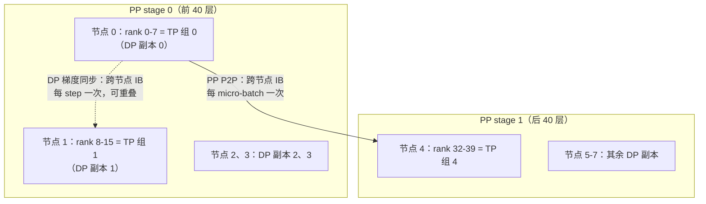

单独看，每种并行策略都不难；难的是把它们**拼在一起**：给你 64 张 A100 和一个 70B 模型，TP 取几、PP 切几段、DP 留多少、micro-batch 设多大、要不要 ZeRO——每个旋钮都牵动显存、通信、气泡三本账。这里先用一页表格收拢五个并行维度的代价，讲清"TP 进节点、PP 跨节点、DP 放最外"的排布原则背后的带宽逻辑，然后从显存账本出发**一步一步推演**一个完整配置案例，再对照 DeepSeek-V3 的真实生产配置（16 PP × 64 EP × ZeRO-1 DP、全程无 TP）验证方法论，最后给出 OOM 时的旋钮优先级。

<!-- more -->

## 📑 目录

- [1. 五个并行维度一页总览](#1-五个并行维度一页总览)
- [2. 排布原则：把并行维度映射到硬件](#2-排布原则把并行维度映射到硬件)
- [3. 完整推演案例：64 卡 A100 训 70B](#3-完整推演案例64-卡-a100-训-70b)
- [4. global batch size 与梯度累积](#4-global-batch-size-与梯度累积)
- [5. Megatron-LM 与 DeepSpeed 的混用生态](#5-megatron-lm-与-deepspeed-的混用生态)
- [6. 案例：DeepSeek-V3 的并行配置](#6-案例deepseek-v3-的并行配置)
- [7. 常见错误配置与 OOM 排查](#7-常见错误配置与-oom-排查)
- [8. 高频面试题解析](#8-高频面试题解析)
- [总结](#-总结)
- [参考资料](#-参考资料)

---

## 1. 五个并行维度一页总览

五种并行切的是**互不相同的东西**，所以可以正交叠加，总卡数满足：

$$
\text{world\_size} = TP \times PP \times DP \quad (\times\, EP \times CP \text{ 视模型而定})
$$

先给出这张"一页总结表"——面试被问"常见并行策略有哪些、各自代价"时，答案的骨架就是它：

| 📊 维度 | 切什么 | 主要通信 | 通信频率 | 省什么显存 | 主要代价 / 约束 |
|---|---|---|---|---|---|
| **DP** 数据并行 | batch 维 | 梯度 AllReduce（ZeRO 下 ReduceScatter + AllGather） | **每 step 一次**，可与反向重叠 | 纯 DP 不省；ZeRO-1/2/3 逐级分掉优化器/梯度/参数 | 不省激活；有效 batch 随卡数涨 |
| **TP** 张量并行 | 单个权重矩阵 | 激活 AllReduce（Megatron：每层前向 2 次 + 反向 2 次） | **每层多次**，在关键路径上 | 参数/梯度/优化器状态 ÷ $t$，部分激活 ÷ $t$ | 高频大流量，基本只能放 NVLink 域内（$t \le 8$） |
| **PP** 流水线并行 | 层（深度维） | stage 边界 P2P 传激活 | 每 micro-batch 每边界一次 | 参数/梯度/优化器状态 ÷ $p$ | 气泡 $\frac{p-1}{m+p-1}$，需要足够多 micro-batch；各 stage 负载要均衡 |
| **EP** 专家并行 | MoE 专家集合 | All-to-All（dispatch/combine，前反向共 4 次/层） | 每层多次 | 专家参数 ÷ $ep$ | 负载不均、数据依赖的跨节点通信（详见 10.1） |
| **CP** 上下文并行 | 序列维 | attention 处环形 P2P / KV AllGather | 每层 attention 处 | **激活** ÷ $cp$（唯一直接砍激活的维度） | attention 引入额外通信；负载要按因果掩码平衡 |

三条读表结论：

- **只有 DP 不省显存、只有 CP 直接省激活**。"装不下"要靠 TP/PP/ZeRO 切模型状态，长序列激活爆炸要靠 CP（配合重计算）。
- **通信频率排序：TP ≈ EP ≈ CP（每层多次）> PP（每 micro-batch）> DP（每 step 一次）**。这个排序直接决定第 2 节的硬件映射。
- 每个维度都有**收益递减点**：TP 超过 8 出节点、PP 太深气泡吃不消、DP 太宽 batch 涨到伤收敛——所以真实训练一定是多维组合，让每个维度都停在自己的舒适区里。

---

## 2. 排布原则：把并行维度映射到硬件

### 2.1 两个金字塔的对齐

硬件带宽是分层的（以 A100 集群为例）：节点内 NVLink 约 600 GB/s，节点间 InfiniBand 每卡通常 100～400 Gb/s（约 12.5～50 GB/s）——**差一个数量级以上**。排布的本质就是把"通信需求金字塔"对齐到"硬件带宽金字塔"：

$$
\text{通信最频繁、最难重叠的维度} \longrightarrow \text{带宽最高的链路}
$$

逐个维度算账（设序列长 $s$、micro-batch $b$、隐层 $h$，BF16）：

**TP 必须放节点内。** Megatron 式 TP 每个 Transformer 层前向要做 2 次激活 AllReduce（attention 输出与 MLP 输出各一次），反向再来 2 次，每次的消息就是整个激活张量 $s \times b \times h$。以 $s=4096, h=8192, b=1$ 计，单条消息 64 MB，每层 4 次、每个 micro-batch 都要来一轮，而且它**串行卡在计算路径上**（不做完 AllReduce 下一步算不了）、几乎无法重叠。这种"高频 + 大量 + 难重叠"的流量只有 NVLink 咽得下去，所以 TP 度数一般 ≤ 单机卡数 8。

**PP 最适合跨节点。** stage 边界每个 micro-batch 只传一次激活，消息同样是 $s \times b \times h$（64 MB 量级），但**频率低一个数量级**（每 micro-batch 一次 vs 每层 4 次），而且 send/recv 可以和本 stage 的计算重叠。跨机 IB 完全承受得起——这就是"PP 跨节点通信最少"的定量含义。

**DP 放最外层。** 每 step 只在反向末尾同步一次梯度（$2\Psi$ 量级，见 4.1 详解），Bucket 机制能把它几乎全部藏进反向计算。频率最低、重叠最好，放在最慢的链路（跨节点、甚至跨机架）损失最小。

**CP/EP 尽量收拢。** CP 与 attention 强耦合、每层通信，倾向与 TP 同在高带宽域；EP 的 All-to-All 若必须跨节点，则要靠 node-limited routing、分层转发等手段控制跨 IB 流量（见 10.1 第 7 节）。

### 2.2 rank 编排：让映射自动成立

原则要落到 rank 编号上。Megatron-Core 的 `initialize_model_parallel()` 默认按 **tp → cp → ep → dp → pp** 的顺序让维度从"变化最快"到"变化最慢"排布：

- TP 维变化最快 → **同一 TP 组的 rank 物理相邻**（rank 0-7 就是节点 0 的 8 张卡），天然落在 NVLink 域内；
- PP 维变化最慢 → 同一 pipeline 的不同 stage 分布在不同节点，stage 间 P2P 走 IB；
- DP 组由"不同副本中位置对应的卡"构成，横跨节点，走 IB 做梯度同步。

以 64 卡（8 节点 × 8 卡）、TP=8 / PP=2 / DP=4 为例，映射结果如下：

- 每个节点恰好承载一个 TP 组（每层 AllReduce 全部走 NVLink）；
- 同一 DP 副本的两个 stage 分属两个节点，P2P 走 IB；
- DP 组由 4 个副本中"同 stage 同 tp_rank"的卡构成，跨节点做梯度同步。

📌 **关键点**："TP 放节点内"不是框架的硬编码规则，而是 rank 排序的**结果**。一旦自定义 rank 映射或者容器调度打乱了物理拓扑（比如同一 TP 组被调度到两台机器上），性能会掉到面目全非——排查分布式训练性能问题时，第一件事就是确认逻辑通信组与物理拓扑对齐。

---

## 3. 完整推演案例：64 卡 A100 训 70B

**设定**：8 节点 × 8 卡 A100-80G（节点内 NVLink，节点间 IB）；训练一个 Llama-2-70B 结构的稠密模型（$\Psi = 70\text{B}$：80 层、$h = 8192$、64 头、FFN 28672）；序列长度 $s = 4096$；BF16 混合精度 + Adam。目标：先"装得下"，再"跑得快"。

### 3.1 第一步：算模型状态总账

混合精度 + Adam 的模型状态是 $16\Psi$ 字节（BF16 参数 $2\Psi$ + BF16 梯度 $2\Psi$ + FP32 master 权重与两个动量 $12\Psi$，推导见 4.1 第 7 节）：

$$
16 \times 70 \times 10^9 \,\text{B} = 1120\,\text{GB}
$$

单卡 80 GB，纯 DP（每卡一份完整 $16\Psi$）直接出局。64 卡总显存 $64 \times 80 = 5120$ GB，装下 1120 GB 的模型状态绰绰有余——问题只在**怎么切**。

### 3.2 第二步：定 TP

TP 只能在节点内，上限 8。先试满配 $TP = 8$：每卡分到模型状态

$$
\frac{1120}{8} = 140\,\text{GB} > 80\,\text{GB}
$$

仍然装不下，必须叠加 PP。（TP 是否一定取 8？$h = 8192$、FFN 28672 的矩阵切 8 份后 GEMM 仍然够大，不会碎；对 70B 这个量级 TP=8 是常规起点。）

### 3.3 第三步：定 PP 与 DP，加 ZeRO-1

约束 $TP \times PP \times DP = 64$，$TP = 8$ 则 $PP \times DP = 8$。候选方案：

| 📊 方案 | TP | PP | DP | 每卡参数分片 | 模型状态（配 ZeRO-1 后） |
|---|---|---|---|---|---|
| A | 8 | 2 | 4 | $70/16 = 4.38$B | $4\Psi' \times 2 + \frac{12\Psi'}{4} \approx 30.6$ GB |
| B | 8 | 4 | 2 | $70/32 = 2.19$B | $4\Psi' \times 2 + \frac{12\Psi'}{2} \approx 21.9$ GB |
| C | 8 | 8 | 1 | $70/64 = 1.09$B | $16\Psi' \approx 17.5$ GB（DP=1，ZeRO 无用武之地） |

以方案 B 演示计算过程（$\Psi' = 2.19$B 为每卡参数分片）：

$$
\underbrace{2\Psi'}\_{\text{BF16 参数, }4.4\,\text{GB}} + \underbrace{2\Psi'}\_{\text{BF16 梯度, }4.4\,\text{GB}} + \underbrace{\tfrac{12\Psi'}{DP}}\_{\text{ZeRO-1 优化器, }13.1\,\text{GB}} \approx 21.9\,\text{GB}
$$

这里 **ZeRO-1（只分片优化器状态）是 PP 的标准搭档**：优化器状态是 $16\Psi$ 里的大头（$12\Psi$），把它再沿 DP 维切一刀成本极低（只在 step 末多一次通信重排），而 ZeRO-3 那种按层 AllGather 参数的模式会和 PP 的 micro-batch 循环相乘，通信爆炸——所以 3D 并行里几乎只见 ZeRO-1（Megatron 的 distributed optimizer 同理）。

### 3.4 第四步：算激活账，定重计算策略

按 Megatron 激活估算公式，单层单 micro-batch 的激活（无重计算、含 TP+序列并行分摊 $t$ 份）约为：

$$
A_{\text{layer}} = \frac{s \cdot b \cdot h \left(34 + \frac{5as}{h}\right)}{t}
= \frac{4096 \times 1 \times 8192 \times (34 + 160)}{8} \approx 0.81\,\text{GB}
$$

方案 B 每个 stage 有 $80/4 = 20$ 层；1F1B 调度下第一个 stage 最多同时挂着 $p = 4$ 个 micro-batch 的激活：

$$
0.81 \times 20 \times 4 \approx 65\,\text{GB} \quad \text{（不做重计算：} 21.9 + 65 \approx 87\,\text{GB} > 80\text{，OOM）}
$$

装不下。改用**选择性重计算**（只重算 attention 内部的大激活，保留 GEMM 输入），单层激活降到约 $\frac{34\,s b h}{t} \approx 0.14$ GB：

$$
0.14 \times 20 \times 4 \approx 11.4\,\text{GB} \quad \Rightarrow \quad 21.9 + 11.4 \approx 33\,\text{GB}
$$

再预留 CUDA context、NCCL 缓冲、logits 峰值（$s \times b \times V$）与碎片约 10 GB，稳定在 45 GB 以内——**方案 B 成立**，且余量足以支撑加大 micro-batch 或拉长序列。同样算法验证方案 A：模型状态 30.6 GB + 激活 $0.14 \times 40 \times 2 = 11.4$ GB + 余量 ≈ 52 GB，也成立。

### 3.5 第五步：在"装得下"的方案里挑"跑得快"

A 和 C 都装得下，怎么选？看吞吐三要素：

| 📊 对比项 | 方案 A（PP2/DP4） | 方案 B（PP4/DP2） | 方案 C（PP8/DP1） |
|---|---|---|---|
| 气泡率 $\frac{p-1}{m+p-1}$（GBS=1024 seq，mbs=1） | $\frac{1}{257} \approx 0.4\%$ | $\frac{3}{515} \approx 0.6\%$ | $\frac{7}{1031} \approx 0.7\%$ |
| 每 DP 副本串行 micro-batch 数 $m$ | 256 | 512 | 1024 |
| ZeRO-1 摊薄程度 | ÷4 | ÷2 | 无 |
| 显存余量 | 中 | 大 | 最大 |

大梯度累积下三者气泡都不大，差异主要在：DP 越宽，单个副本要串行跑的 micro-batch 越少、step 墙钟时间越短。**首选方案 A（TP8 / PP2 / DP4 + ZeRO-1 + 选择性重计算）**；若后续要拉长序列或加大 mbs 导致激活紧张，再退到方案 B——这就是"先装得下、再跑得快，显存吃紧时优先加深 PP"的调参路径。

🔑 **核心概念**：整个推演只用了三个可背下来的公式——模型状态 $16\Psi$（ZeRO 按维分摊）、激活 $\approx s b h (34 + \frac{5as}{h})/t$ 乘"每 stage 层数 × 在途 micro-batch 数"、气泡率 $\frac{p-1}{m+p-1}$。任何规模的配置题都是这三本账的排列组合。

### 3.6 把通信账也对一遍

方案定了，回头验证第 2 节的排布原则在这个配置里到底"重"到什么程度。以方案 A（TP8 / PP2 / DP4，mbs=1，$m = 256$）为例，逐维度估算单卡一个 step 的通信量：

**TP**：每层 4 次激活 AllReduce，消息 $s \times b \times h \times 2\,\text{B} = 64$ MB，Ring AllReduce 单卡通信约 $2M\frac{t-1}{t} \approx 112$ MB/次。每个 stage 40 层、每 step 256 个 micro-batch：

$$
112\,\text{MB} \times 4 \times 40 \times 256 \approx 4.6\,\text{TB / step}
$$

**PP**：每 micro-batch 在 stage 边界收/发一次 64 MB 激活（反向再一次梯度）：

$$
64\,\text{MB} \times 2 \times 256 \approx 32\,\text{GB / step}
$$

**DP**：每 step 一次梯度同步，量级为每卡梯度分片的 2 倍（ReduceScatter + AllGather）：

$$
2 \times 4.38\,\text{B 参数} \times 2\,\text{B} \approx 17.5\,\text{GB / step}
$$

| 📊 维度 | 单卡通信量 / step | 相对 DP 的倍数 | 走的链路 |
|---|---|---|---|
| TP | ~4.6 TB | ~260× | 节点内 NVLink（600 GB/s） |
| PP | ~32 GB | ~2× | 跨节点 IB，可重叠 |
| DP | ~17.5 GB | 1× | 跨节点 IB，藏进反向 |

TP 的流量是 DP 的两个数量级以上——把它错放到 IB 上（50 GB/s 量级），仅 TP 通信就要 90 秒级/step，训练直接不可用；放在 NVLink 上则是秒级且大半与计算并行。**"TP 进节点、PP 跨节点、DP 最外"不是经验口诀，是这三行数字的直接结论。**

---

## 4. global batch size 与梯度累积

上面反复出现的 $m$（micro-batch 数）由三个量的关系决定：

$$
\text{GBS} = DP \times b_{\text{micro}} \times m
$$

- **GBS（global batch size）是算法量**：由收敛特性决定（70B 级预训练常见 4M token 量级，即 $s=4096$ 时约 1024 条序列），**不应该**因为并行配置变动而改变；
- $b_{\text{micro}}$ 是**显存旋钮**：单卡一次前反向吃多少激活；
- $m$ 是**被动算出来的**：梯度累积步数，PP 场景下同时决定气泡率。

梯度累积为什么与"直接跑一个大 batch"数学等价？把 GBS 个样本的平均梯度按 micro-batch 分组拆开即可：

$$
g = \frac{1}{\text{GBS}} \sum_{i=1}^{\text{GBS}} \nabla_\theta \ell(x_i)
= \frac{1}{DP \cdot m} \sum_{d=1}^{DP} \sum_{j=1}^{m} \underbrace{\left( \frac{1}{b_{\text{micro}}} \sum_{x \in \mathcal{B}\_{d,j}} \nabla_\theta \ell(x) \right)}\_{\text{第 } d \text{ 个副本第 } j \text{ 个 micro-batch 的梯度}}
$$

也就是"micro-batch 内平均 → 本地累加 $m$ 次 → 跨 DP 平均"，与一次算完全局 batch 的梯度严格相等（同 4.1 的 DP 等价性推导，多套了一层求和）。

三点常见误区：

- **加 DP 卡数时 GBS 不变**，变的是 $m$（每卡累积步数变少、跑得更快），而不是"卡多了就把 batch 撑大"——GBS 变了等于换了一组训练超参。
- **PP 需要 $m \gg p$**：$m < p$ 时气泡率 $\frac{p-1}{m+p-1}$ 会超过 50%，流水线大部分时间在空转。梯度累积在 PP 里不是可选项，而是气泡摊薄机制本身。
- 梯度累积在数学上与"一个大 batch"等价还要求：只在最后一个 micro-batch 做梯度同步（DDP 的 `no_sync`，否则白付 $m$ 倍通信），且累加的 loss 按 $m$ 归一（对应上式最外层的 $\frac{1}{m}$）。BatchNorm 这类跨样本统计的层会破坏等价性，Transformer 用 LayerNorm 不受影响。

---

## 5. Megatron-LM 与 DeepSpeed 的混用生态

两个框架的长板不同，工业界长期把它们拼着用：

| 📊 能力 | Megatron-LM / Megatron-Core | DeepSpeed |
|---|---|---|
| TP / 序列并行 | ✅ 原创实现（Column/RowParallelLinear） | 无原生实现 |
| PP 调度 | ✅ 1F1B、interleaved（虚拟流水线） | ✅ pipeline engine |
| DP 分片 | distributed optimizer（≈ ZeRO-1） | ✅ ZeRO-1/2/3、Offload、Infinity |
| 定位 | 极致性能、与 NVIDIA 栈深度耦合 | 显存优化工具箱、易用 |

**Megatron-DeepSpeed** 是这种混用的官方形态：Megatron 出 TP/PP 与高性能 kernel，DeepSpeed 出 ZeRO-DP 与 offload。BLOOM-176B 是教科书案例：384 张 A100-80G 上以 **TP=4 × PP=12 × DP=8 + ZeRO-1** 完成训练——正是第 3 节方法论在千亿模型上的实例（TP 不出机、PP 跨机、DP 最外 + ZeRO-1）。

💡 **提示**：混用的代价是版本耦合脆弱、两套配置体系容易打架（比如两边都想管梯度累积）。近年的趋势是收敛：Megatron-Core 自带 distributed optimizer 后，纯 Megatron 即可覆盖大多数 3D 并行需求；PyTorch 原生的 FSDP2 + DTensor + PP 组合则在中等规模上提供了无第三方依赖的路线。选型上：千卡级预训练看 Megatron 系，百卡级微调/继续预训练 FSDP 或 DeepSpeed 往往更省心。

---

## 6. 案例：DeepSeek-V3 的并行配置

DeepSeek-V3（671B MoE，37B 激活）在 2048 张 H800 上的训练配置，是对"教科书排布"的一次有趣偏离：

$$
\text{2048 卡} = \underbrace{16}\_{\text{PP（DualPipe）}} \times \underbrace{128}\_{\text{DP（ZeRO-1）}}, \qquad \text{EP} = 64 \text{（跨 8 节点，嵌在 DP 维内）}
$$

- **PP=16**：用自研的 **DualPipe** 双向流水线调度——micro-batch 从流水线两端同时喂入，精心编排每个 chunk 的计算与通信，把 EP 的 All-to-All 和 PP 的 P2P 几乎完全藏进计算里（通信只占用约 20 个 SM）。
- **EP=64**：每层 256 个路由专家分布在 64 卡（8 个节点）上；由 world_size 约束可推出专家参数在 128 路 DP 里的实际冗余度是 $128/64 = 2$。跨节点 All-to-All 靠 node-limited routing（每 token 最多 4 节点）+ 两级转发控制（见 10.1）。
- **DP 用 ZeRO-1**：优化器状态沿 DP 维分片，与第 3 节"PP 的标准搭档"结论一致。
- **没有 TP**——这是最值得琢磨的一点。

**为什么可以不用 TP？** 技术报告给出的理由链：

1. **单层权重本来就小**：MLA 压缩了注意力参数，细粒度专家把 FFN 拆成 256 个中间维仅 2048 的小矩阵——没有哪个矩阵大到必须切开才放得下；EP 已经承担了"参数分摊"的角色。
2. **显存被极限压榨**：FP8 训练砍参数与激活占用、RMSNorm 和 MLA 上投影重计算、EMA 参数放 CPU 内存、MTP 模块与主模型共享 Embedding 和输出头（放同一 PP rank）——一套组合拳省出的显存，抵掉了 TP 的份额。
3. **TP 的通信太贵**：每层 4 次激活 AllReduce 即使在 NVLink 上也是纯开销；省掉 TP，节点内 NVLink 带宽全部让给 EP 的 All-to-All 转发。

📌 **关键点**：DeepSeek-V3 不是推翻了排布原则，而是更彻底地执行了它——原则的本质是"为每一份带宽找到最划算的用途"。当算法侧（MLA、细粒度专家、FP8）把"必须用 TP"的前提拆掉之后，把 NVLink 让给 All-to-All 就是同一原则下的最优解。**并行配置从来不是孤立的系统决策，而是与模型结构协同设计的结果。**

---

## 7. 常见错误配置与 OOM 排查

### 7.1 常见错误配置

| ❌ 错误 | 后果 | 修正 |
|---|---|---|
| TP > 8 或 TP 组跨节点 | 每层 AllReduce 走 IB，吞吐崩塌 | TP ≤ 单机卡数；检查 rank 映射与物理拓扑对齐 |
| $m$ 与 $p$ 接近甚至 $m < p$ | 气泡率逼近甚至超过 50% | 加大梯度累积，保证 $m \gg p$ |
| PP 各 stage 均分层数 | 首/末 stage 因 Embedding、LM head、logits 而先 OOM | 首末 stage 少放几层（不均匀切分） |
| PP 搭配 ZeRO-3 | 参数 AllGather 次数 × micro-batch 数，通信爆炸 | PP 配 ZeRO-1 / distributed optimizer |
| GBS 不能被 $DP \times b_{\text{micro}}$ 整除 | 启动报错或隐性 batch 漂移 | 三者关系先定 GBS，再反推 |
| DP=1 还开 ZeRO | 分片对象只有自己，纯开销 | DP=1 时关闭 ZeRO |
| EP 组横跨过多节点且无路由约束 | All-to-All 打满 IB，计算等通信 | 收拢 EP 域 / node-limited routing / DeepEP |

### 7.2 OOM 了，先动哪个旋钮

顺序的逻辑：**先动便宜的（不改并行拓扑、不重启大改），再动贵的**。

1. **降 micro-batch size 到 1**：激活线性下降，零结构改动。已经是 1 → 下一条。
2. **上激活重计算**：先选择性重计算（约省 80% 激活、额外计算小），再全量重计算（激活降到 $O(sbh)$ 级、多付约 1/3 前向计算）。
3. **升 ZeRO 等级 / 开 distributed optimizer**：ZeRO-1 几乎白拿（分掉 $12\Psi$ 大头）；无 PP 时可考虑 ZeRO-2/3。
4. **加深 PP**：参数按 $p$ 摊薄，代价是气泡与调度复杂度；注意层数整除与首末 stage 均衡。
5. **加大 TP**（上限 8）：摊参数也摊激活，但通信代价最高，所以放在 PP 之后。
6. **长序列场景改上 CP**：激活是 $s$ 的函数，序列长导致的 OOM 加 PP/TP 是隔靴搔痒，CP 才对症。
7. **Offload 兜底**：CPU/NVMe offload 换显存，吞吐损失大，属最后手段。

💡 **提示**：动旋钮之前先**定位 OOM 的时机**——第一个 step 就炸多半是模型状态账没算对（回到 3.1 的 $16\Psi$）；训练中途偶发的炸更可能是激活峰值（logits、最长序列样本）、显存碎片（可试 `expandable_segments`）或 MoE 负载尖峰。账算对了，OOM 是能在开训前预测出来的。

---

## 8. 高频面试题解析

以下题目均来自本站 `docs/interview/` 收录的真实面经。

**Q1：解释 TP、PP、DP 三种并行策略的含义及具体执行流程。**（百度 AI Infra 实习一面-3）
DP 切 batch：每卡完整模型副本各算一份数据，反向末尾 AllReduce 平均梯度后各自更新；TP 切单个权重矩阵：一层的 GEMM 分到 $t$ 卡各算一部分，靠每层前向 2 次、反向 2 次的激活 AllReduce 拼回结果；PP 按层切段：micro-batch 依次流过各 stage，边界 P2P 传激活/梯度，用 1F1B 调度和梯度累积摊薄气泡（见 1 节总览表，各维执行流程详见第 4、6、7 章）。

**Q2：如何根据 TP 与 PP 的通信开销进行并行策略选择？**（百度 AI Infra 实习一面-3）
定量对比：TP 每层每 micro-batch 4 次激活 AllReduce、串行在关键路径上、难重叠 → 必须 NVLink 域内、度数 ≤ 8；PP 每 micro-batch 每边界仅一次 $s \times b \times h$ 的 P2P、可与计算重叠 → 适合跨节点。因此先在节点内用 TP 切到"单卡装得下每 stage"为止，跨节点扩展交给 PP 和 DP；单层权重不大时（或如 DeepSeek-V3 有 MLA/细粒度专家）甚至可以不用 TP（见 2.1、6 节）。

**Q3：大模型分布式训练的完整流程及并行策略选择依据？**（小米 AI Infra 实习一二面；字节、数坤等多家考"常见并行策略有哪些"）
流程即第 3 节的推演方法论：算 $16\Psi$ 模型状态总账 → 定 TP（节点内、够用即可）→ 定 PP/DP 组合并配 ZeRO-1 → 算激活账定重计算与 micro-batch → 在装得下的方案里按气泡率与 DP 宽度挑最快的。选择依据一句话：显存缺口决定切多少（TP×PP×ZeRO），带宽层级决定谁放哪（TP 内、PP 跨、DP 外），GBS 与气泡决定 micro-batch 与累积步数。

**Q4：训练超长序列时应如何设计并行策略？**（AI-Infra 综合面经题库-3）
长序列的矛盾是激活 $\propto s$（attention 内部一度 $\propto s^2$，被 FlashAttention 消掉显存项）而模型状态不变，所以加 TP/PP 收益有限，对症的是序列维并行：Megatron 序列并行（SP，把 LayerNorm/dropout 的激活也按 $t$ 分摊）+ 上下文并行 CP（Ring Attention 一类，激活 ÷ $cp$），配合选择性重计算；CP 通信与 attention 耦合，尽量放高带宽域（见 1 节表格 CP 行与 7.2 第 6 条，详见第 9 章）。

**Q5：Megatron-LM 中的通信优化是如何实现的？**（AI-Infra 综合面经题库-3）
要点：TP 通信极小化设计（每层只在两处做 AllReduce，列切/行切配对让中间结果无需通信）；序列并行把 AllReduce 拆成 AllGather + ReduceScatter，总量不变但把非 TP 区域的激活也分摊掉；PP 用 interleaved 虚拟流水线降低气泡、P2P 与计算重叠；distributed optimizer（≈ ZeRO-1）用 ReduceScatter 替代 AllReduce 同步梯度；rank 编排保证 TP 组落在 NVLink 域内（见 2.2、5 节）。

**Q6：ZeRO Stage 3 显存节省公式如何推导？ZeRO-1 如何在 P 个 GPU 之间分配显存？**（字节跳动一面-4；快手一面-3）
基线是混合精度 + Adam 的 $16\Psi$ = 参数 $2\Psi$ + 梯度 $2\Psi$ + 优化器 $12\Psi$（FP32 master + 一阶 + 二阶动量）。ZeRO-1 只把 $12\Psi$ 沿 DP 切分：每卡 $4\Psi + \frac{12\Psi}{P}$；ZeRO-2 再切梯度：$2\Psi + \frac{14\Psi}{P}$；ZeRO-3 全切：$\frac{16\Psi}{P}$。第 3.3 节的方案表就是 ZeRO-1 公式在 3D 并行里的实际应用（配合 3.1 节；完整推导见第 5 章与 4.1）。

**Q7：FSDP 与 DeepSpeed ZeRO Stage 1/2/3 的对比？**（百度 AI Infra 一面-3）
思想同源：FSDP FULL_SHARD ≈ ZeRO-3、SHARD_GRAD_OP ≈ ZeRO-2、Megatron distributed optimizer ≈ ZeRO-1。差异在生态位：FSDP 是 PyTorch 原生（FSDP2 基于 DTensor，与 TP/PP 组合的接口更统一），DeepSpeed 胜在 Offload/Infinity 等显存工具链和配置化易用性；3D 并行场景下 PP 只与 ZeRO-1 级别的分片兼容，ZeRO-3/FULL_SHARD 与 PP 组合会通信爆炸（见 3.3、5、7.1 节）。

**Q8：训练时 OOM 应如何排查与处理？**（蚂蚁 AI Infra 实习一面-1，结合项目追问）
先定位时机：首 step 即炸 → 模型状态账超了，重算 $16\Psi$ 分摊；中途偶发 → 激活峰值、碎片或 MoE 负载尖峰。处理按旋钮优先级：mbs→1、上重计算（选择性→全量）、ZeRO-1/distributed optimizer、加深 PP（注意首末 stage 不均衡切层）、加大 TP（≤8）、长序列改 CP、最后才 offload（见 7.2 节）。

---

## 📝 总结

- **五维正交**：DP 切 batch、TP 切矩阵、PP 切层、EP 切专家、CP 切序列，$\text{world\_size} = TP \times PP \times DP\,(\times EP \times CP)$；只有 DP 不省显存、只有 CP 直接省激活。
- **排布原则**：通信频率 TP ≈ EP ≈ CP > PP > DP，对应带宽层级 NVLink > IB——TP 进节点、PP 跨节点、DP 放最外；rank 按 tp→…→pp 从快到慢排布让映射自动成立。
- **推演方法论**：三本账走天下——模型状态 $16\Psi$（按 TP×PP 摊、优化器再按 ZeRO-1 沿 DP 摊）、激活 $sbh(34+\frac{5as}{h})/t \times$ 每 stage 层数 $\times$ 在途 micro-batch 数（决定重计算策略）、气泡 $\frac{p-1}{m+p-1}$（决定梯度累积）。64 卡 A100 训 70B 的落点：TP8 / PP2 / DP4 + ZeRO-1 + 选择性重计算。
- **GBS 铁律**：$\text{GBS} = DP \times b_{\text{micro}} \times m$；GBS 是算法超参不随扩卡改变，$m$ 是被动量且必须 $\gg p$。
- **生态**：Megatron 出 TP/PP 与 kernel、DeepSpeed 出 ZeRO 与 offload，Megatron-DeepSpeed（BLOOM：TP4×PP12×DP8+ZeRO-1）是经典混用；PP 只配 ZeRO-1。
- **DeepSeek-V3 案例**：16 PP（DualPipe）× 64 EP × ZeRO-1 DP、无 TP——MLA + 细粒度专家 + FP8 拆掉了"必须 TP"的前提，把 NVLink 让给 All-to-All，是"并行配置与模型结构协同设计"的范本。
- **OOM 旋钮序**：mbs → 重计算 → ZeRO → PP → TP → CP（长序列）→ offload；先定位炸的时机再动手。

---

## 📚 参考资料

- [Megatron-LM: Training Multi-Billion Parameter Language Models Using Model Parallelism](https://arxiv.org/abs/1909.08053)
- [Efficient Large-Scale Language Model Training on GPU Clusters Using Megatron-LM（3D 并行与 PTD-P）](https://arxiv.org/abs/2104.04473)
- [Reducing Activation Recomputation in Large Transformer Models（激活估算公式与序列并行）](https://arxiv.org/abs/2205.05198)
- [ZeRO: Memory Optimizations Toward Training Trillion Parameter Models](https://arxiv.org/abs/1910.02054)
- [DeepSeek-V3 Technical Report](https://arxiv.org/abs/2412.19437)
- [BLOOM: A 176B-Parameter Open-Access Multilingual Language Model（训练配置）](https://arxiv.org/abs/2211.05100)
- [Megatron-Core parallel_state.py（rank 编排源码）](https://github.com/NVIDIA/Megatron-LM/blob/main/megatron/core/parallel_state.py)
- [DeepSpeed: Extreme-scale model training for everyone](https://www.microsoft.com/en-us/research/blog/deepspeed-extreme-scale-model-training-for-everyone/)
