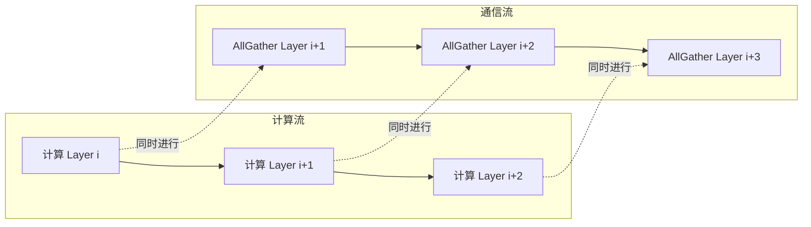
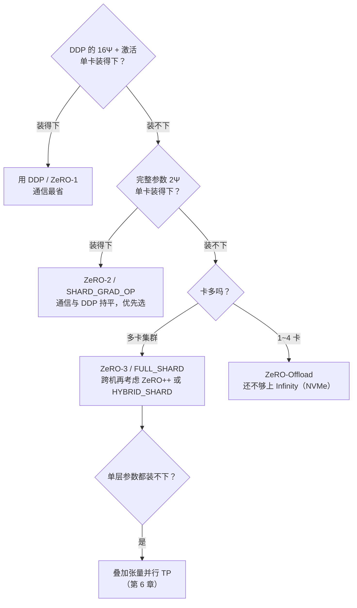

第 4 章讲清了数据并行的两笔账：DDP 通信省（$2\Psi$）但每卡冗余存一份完整的 $16\Psi$ 模型状态。ZeRO（Zero Redundancy Optimizer，零冗余优化器）正是冲着这份冗余来的——它是 DeepSpeed 的核心技术，思想可以浓缩成一句话：**平时每卡只存 $\frac{1}{N}$，用的时候通过通信临时凑齐，用完立刻扔掉**。本文沿"切什么、怎么通信、省多少、多花多少"四个问题，把 ZeRO-1/2/3 逐阶段推导清楚，再延伸到 ZeRO++ 的通信优化、Offload/Infinity 的异构卸载，最后落到与 FSDP 的对应关系和选型决策。

<!-- more -->

## 📑 目录

- [1. 训练显存账本](#1-训练显存账本)
- [2. ZeRO 的核心思想](#2-zero-的核心思想)
- [3. 通信基础：AllReduce 的等价拆解](#3-通信基础allreduce-的等价拆解)
- [4. ZeRO-1：切分优化器状态](#4-zero-1切分优化器状态)
- [5. ZeRO-2：切分梯度](#5-zero-2切分梯度)
- [6. ZeRO-3：切分参数](#6-zero-3切分参数)
- [7. ZeRO-3 的执行时序与 Prefetch](#7-zero-3-的执行时序与-prefetch)
- [8. ZeRO++ 通信优化](#8-zero-通信优化)
- [9. ZeRO-Offload 与 ZeRO-Infinity](#9-zero-offload-与-zero-infinity)
- [10. ZeRO 与 FSDP 的对应关系](#10-zero-与-fsdp-的对应关系)
- [11. DeepSpeed 配置实践](#11-deepspeed-配置实践)
- [12. 选型决策指南](#12-选型决策指南)
- [总结](#-总结)
- [高频面试题解析](#-高频面试题解析)
- [参考资料](#-参考资料)

---

## 1. 训练显存账本

要理解 ZeRO 切的是什么，先把训练时的显存账算清楚。按 ZeRO 论文的口径，训练显存分为两大类：**模型状态（Model States）**和**剩余状态（Residual States，主要是激活值、临时缓冲区和碎片）**。ZeRO-1/2/3 针对的全部是模型状态。

设模型参数量为 $\Psi$，采用混合精度（FP16/BF16）+ Adam 训练——这是大模型训练的标准配置。模型状态由三部分组成：

- **FP16 参数**：前向/反向计算用的低精度权重，每参数 2 Bytes，共 $2\Psi$
- **FP16 梯度**：反向传播的产物，每参数 2 Bytes，共 $2\Psi$
- **Adam 优化器状态（Optimizer States）**：全部以 FP32 存储，包括
  - FP32 主参数（Master Weights）：$4\Psi$（为什么更新必须在 FP32 上做，见 **8.1 混合精度详解**）
  - 一阶动量（momentum）：$4\Psi$
  - 二阶动量（variance）：$4\Psi$

合计：

$$
\underbrace{2\Psi}\_{\text{FP16 参数}} + \underbrace{2\Psi}\_{\text{FP16 梯度}} + \underbrace{4\Psi + 4\Psi + 4\Psi}\_{\text{优化器状态 } K\Psi,\ K=12} = 16\Psi
$$

ZeRO 论文把优化器状态部分记为 $K\Psi$，Adam 对应 $K=12$。换用其他优化器 $K$ 会变（如 SGD + momentum 时 $K=8$），但结构不变。

📌 **关键点**：**优化器状态占 $12\Psi$，是整份账单的 75%**。参数本体（$2\Psi$）只占 12.5%。这个比例决定了 ZeRO 的切分顺序——先切最大头、又最容易切的优化器状态（ZeRO-1），收益立竿见影。

代入具体数字感受一下量级（$1\ \text{GB} \approx 10^9\ \text{Bytes}$，粗算）：

| 📊 模型规模 | $\Psi$ | 模型状态 $16\Psi$ | 单卡 80 GB 装得下吗 |
|---|---|---|---|
| 7B | $7 \times 10^9$ | ~112 GB | ❌ |
| 13B | $1.3 \times 10^{10}$ | ~208 GB | ❌ |
| 70B | $7 \times 10^{10}$ | ~1.12 TB | ❌（需要 14+ 张卡分摊） |

⚠️ **注意**：这笔账**不含激活值**。激活值随 batch size 和序列长度增长，长序列场景下往往才是大头，需要 Activation Checkpointing、序列并行等手段（见第 8、9 章）。面试里被问"70B 模型要多少显存"时，先答模型状态 $16\Psi \approx 1.12$ TB，再主动补一句"激活值另算，与 batch/序列长度有关"，是加分项。

---

## 2. ZeRO 的核心思想

### 2.1 冗余在哪里

DDP 中，$N$ 张卡每张都持有**完全相同**的 $16\Psi$。从全局看，这份数据只需要一份，却存了 $N$ 份——冗余率是 $\frac{N-1}{N}$。64 卡集群里，98% 以上的模型状态存储是纯浪费。

但这份冗余不是白痴设计，它换来了两样东西：**计算时数据就在本地**（无需通信）和**通信模式极简**（只需一次梯度 AllReduce）。ZeRO 要做的，是把冗余消掉、同时尽量少付通信代价。

### 2.2 切分-聚合范式

🔑 **核心概念**：ZeRO 的所有阶段共享同一个范式——**切分（Partition）+ 按需聚合（Gather on demand）**。每类状态沿参数维度均匀切成 $N$ 份，rank $k$ 只持久保存第 $k$ 份；某个计算步骤需要完整数据时，通过集合通信临时重建，用完立即释放。

三类状态的"聚合难度"不同，决定了三个阶段的递进关系：

| 📊 状态 | 什么时候需要完整数据 | 切分难度 |
|---|---|---|
| 优化器状态 | 从不——每个参数的更新只依赖自己的动量 | ⭐ 最容易（ZeRO-1） |
| 梯度 | 只在更新"自己负责的参数分片"时需要对应分片 | ⭐⭐（ZeRO-2） |
| 参数 | **每次前向和反向都需要完整参数** | ⭐⭐⭐ 最难（ZeRO-3） |

优化器状态天然"逐参数独立"，切了不用聚合；梯度只要保证"负责更新第 $k$ 片参数的 rank 能拿到第 $k$ 片的聚合梯度"即可；参数最麻烦——每层前向反向都要用，切了就必须反复聚合，通信代价由此而来。

---

## 3. 通信基础：AllReduce 的等价拆解

推导各阶段通信量之前，必须先讲透一个等式，它是全部分析的钥匙：

$$
\text{AllReduce} = \text{ReduceScatter} + \text{AllGather}
$$

- **ReduceScatter**：把每卡数据切成 $N$ 块，跨卡对同位置的块做归约（求和/平均），结束时**每卡只持有一块**归约完成的结果——"聚合"和"分片"一步完成
- **AllGather**：每卡把自己那块广播出去，结束时**所有卡持有完整**数据

在 Ring 实现下（推导见 **4.1 第 5 节**），两者的单卡通信量都是：

$$
(N-1) \times \frac{\Psi}{N} = \Psi \cdot \frac{N-1}{N} \approx \Psi
$$

所以 AllReduce 的单卡通信量 $\approx 2\Psi$，正是两个 $\Psi$ 级原语的叠加。

📌 **关键点**：把 AllReduce 看成"可拆的两半"，ZeRO 的通信分析就变成了搭积木：**DDP 用整个 AllReduce（$2\Psi$）同步梯度；ZeRO-2 把它拆开——ReduceScatter 这一半用在梯度上，AllGather 那一半挪去同步更新后的参数，总量不变；ZeRO-3 则再多付一次前向的参数 AllGather，变成 $3\Psi$**。后面三节会逐一展开。

💡 **提示**：通信量以"每卡每步发送的数据量"计，单位用参数个数 $\Psi$ 近似（实际字节数乘以 dtype 宽度）。这是 ZeRO 论文的分析口径。

---

## 4. ZeRO-1：切分优化器状态

### 4.1 切什么、怎么存

ZeRO-1（论文记号 $P_{os}$）只切分优化器状态：$12\Psi$ 的 FP32 主参数 + 一阶/二阶动量均匀切成 $N$ 份，rank $k$ 只保存第 $k$ 份（$\frac{12\Psi}{N}$）。FP16 参数和梯度仍然每卡一份完整的。

每卡显存：

$$
\underbrace{2\Psi}\_{\text{FP16 参数}} + \underbrace{2\Psi}\_{\text{FP16 梯度}} + \underbrace{\frac{12\Psi}{N}}\_{\text{优化器状态分片}} = 4\Psi + \frac{12\Psi}{N} \xrightarrow{N \to \infty} 4\Psi
$$

$N=64$ 时，7B 模型每卡从 112 GB 降到约 $4\Psi + \frac{12\Psi}{64} \approx 29.3$ GB——只切一样东西，显存降到约 1/4。

### 4.2 训练流程与通信

一步迭代的完整流程：

1. **前向 + 反向**：每卡持有完整 FP16 参数，独立计算，得到完整 FP16 梯度（与 DDP 无异）
2. **梯度同步**：跨卡归约梯度
3. **局部更新**：rank $k$ 只用自己那份优化器状态，更新第 $k$ 片 FP32 主参数，再转成 FP16
4. **参数同步**：各卡手里只有第 $k$ 片是新的，需要一次 **AllGather**（$\Psi$）把完整的新 FP16 参数拼出来

通信量取决于第 2 步怎么做，这里正是"论文与实现的差距"所在（一道真实面经题，见文末）：

- **论文口径**：rank $k$ 更新第 $k$ 片参数，只需要第 $k$ 片的聚合梯度——用 **ReduceScatter**（$\Psi$）就够了。加上第 4 步的 AllGather（$\Psi$），总通信量 $2\Psi$，**与 DDP 完全相同**
- **常见实现口径**：早期/部分实现图省事，第 2 步仍做完整 **AllReduce**（$2\Psi$）——让每卡都拿到完整聚合梯度（虽然只用得上 $\frac{1}{N}$），再加参数 AllGather，总量约 $3\Psi$

⚠️ **注意**：所以"ZeRO-1 通信量与 DDP 相同"这个结论成立的前提是梯度同步用 ReduceScatter。回答面试时把两种口径都说出来，并指出差距的根源——**AllReduce 让所有卡拿到了完整梯度，但 ZeRO-1 的每张卡其实只需要 $\frac{1}{N}$**——比背结论有说服力得多。

### 4.3 适用场景

优化器状态是 75% 的大头，ZeRO-1 用几乎为零的额外代价把它切掉，是"性价比之王"。只要 $4\Psi$ + 激活值单卡装得下（参数和梯度还放得下），ZeRO-1 就是首选。

---

## 5. ZeRO-2：切分梯度

### 5.1 切什么、怎么存

ZeRO-2（$P_{os+g}$）在 ZeRO-1 基础上把梯度也切了。关键洞察：**既然 rank $k$ 只负责更新第 $k$ 片参数，它就只需要第 $k$ 片的聚合梯度——其余 $\frac{N-1}{N}$ 的梯度存着纯属浪费**。

每卡显存：

$$
\underbrace{2\Psi}\_{\text{FP16 参数}} + \underbrace{\frac{2\Psi}{N}}\_{\text{梯度分片}} + \underbrace{\frac{12\Psi}{N}}\_{\text{优化器状态分片}} = 2\Psi + \frac{14\Psi}{N} \xrightarrow{N \to \infty} 2\Psi
$$

### 5.2 通信：ReduceScatter 替代 AllReduce

反向传播过程中，梯度按 bucket 就绪后立即发起 **ReduceScatter**（而非 DDP 的 AllReduce）：归约结果直接以分片形式落到各卡，rank $k$ 只留第 $k$ 片，其余 buffer 立刻释放。与 DDP 的 bucket AllReduce 一样，这个过程与反向计算重叠。

每步通信账：

$$
\underbrace{\Psi}\_{\text{反向：梯度 ReduceScatter}} + \underbrace{\Psi}\_{\text{更新后：参数 AllGather}} = 2\Psi
$$

🔑 **核心概念**：对照第 3 节的拆解，这里发生的事情本质上是——**DDP 的 AllReduce 被拆成两半用了**：ReduceScatter 那一半仍然作用在梯度上；AllGather 那一半从"梯度聚合的收尾"挪到了"参数更新的收尾"。梯度侧确实"丢失了 AllReduce 隐含的 AllGather"（各卡不再拥有完整梯度），但训练根本不需要完整梯度——每卡拿到自己那片就够更新了。所以 ZeRO-2 的总通信量与 DDP 持平（$2\Psi$），显存却又省下一大块，**几乎是免费的午餐**。

### 5.3 适用场景

通信与 DDP 持平、显存进一步压到 $2\Psi + \frac{14\Psi}{N}$，因此**只要参数本身单卡装得下，就没有理由停在 ZeRO-1 而不用 ZeRO-2**。DeepSpeed 实践中 Stage 2 也是最常用的默认档位。它的天花板是那份不可切的 $2\Psi$ 完整参数——参数装不下时，只能走向 ZeRO-3。

---

## 6. ZeRO-3：切分参数

### 6.1 切什么、怎么存

ZeRO-3（$P_{os+g+p}$）把最后一块硬骨头也啃了：FP16 参数本身也切成 $N$ 份。每卡持久显存：

$$
\frac{2\Psi}{N} + \frac{2\Psi}{N} + \frac{12\Psi}{N} = \frac{16\Psi}{N}
$$

模型状态实现**理想线性缩放**：卡越多每卡越省，理论上只要卡够多，任意大的模型都能装下。7B 模型 8 卡时每卡仅约 14 GB；70B 模型 64 卡时每卡约 17.5 GB。

### 6.2 代价：参数必须反复聚合

参数与优化器状态/梯度的本质区别：**每次前向和反向、每一层的计算都需要完整参数**。切了参数，就必须在计算前临时凑齐：

1. **前向**：算第 $i$ 层前，AllGather 凑齐该层完整参数 → 计算 → **立即释放**非本地分片
2. **反向**：算第 $i$ 层梯度前，**再次 AllGather**（前向后已经释放了）→ 计算出该层完整梯度 → ReduceScatter 把聚合梯度分片落到各卡 → 释放参数

每步通信账（对全模型累计）：

$$
\underbrace{\Psi}\_{\text{前向参数 AllGather}} + \underbrace{\Psi}\_{\text{反向参数 AllGather}} + \underbrace{\Psi}\_{\text{反向梯度 ReduceScatter}} = 3\Psi
$$

比 DDP/ZeRO-2 的 $2\Psi$ **多 50%**。

📌 **关键点**：细心的话会发现 ZeRO-2 里那次"更新后参数 AllGather"在 ZeRO-3 中消失了——因为参数本来就以分片形式存储，更新完各自的分片即可，**不需要**再拼出完整参数；下一步前向的逐层 AllGather 天然承担了"把新参数发给所有人"的职责。所以 $3\Psi$ 的构成是"两次参数 AllGather + 一次梯度 ReduceScatter"，而不是在 ZeRO-2 的 $2\Psi$ 上简单加一。

### 6.3 三阶段总览

| 📊 阶段 | 切分对象 | 每卡显存 | 每步通信量 | 7B/8 卡显存 |
|---|---|---|---|---|
| DDP | 无 | $16\Psi$ | $2\Psi$ | ~112 GB |
| ZeRO-1 | 优化器状态 | $4\Psi + \frac{12\Psi}{N}$ | $2\Psi$（RS+AG 口径） | ~40 GB |
| ZeRO-2 | + 梯度 | $2\Psi + \frac{14\Psi}{N}$ | $2\Psi$ | ~26 GB |
| ZeRO-3 | + 参数 | $\frac{16\Psi}{N}$ | $3\Psi$（多 50%） | ~14 GB |

---

## 7. ZeRO-3 的执行时序与 Prefetch

$3\Psi$ 只是通信总量，真正决定吞吐的是**通信能不能藏进计算里**。ZeRO-3 的工程精髓在于参数的生命周期管理与预取（Prefetch）。

### 7.1 分片单元与参数生命周期

DeepSpeed 以子模块（submodule，通常是一个 Transformer Block 或线性层）为粒度管理参数：在模块的前向/反向 hook 里触发"AllGather → 计算 → 释放"三部曲。任一时刻，GPU 上只有**少数几层**的完整参数是"活着"的，其余都处于分片态——这就是显存能压到 $\frac{16\Psi}{N}$ 量级的原因（外加少量正在聚合/待释放的临时缓冲）。

### 7.2 Prefetch：把 AllGather 藏进计算

朴素实现是"用到才聚合"：算第 $i$ 层前同步等待它的 AllGather 完成，通信完全暴露在关键路径上。DeepSpeed 的做法是**流水线化**：



- 首次迭代记录模块的实际执行顺序（trace）
- 之后每步，在计算第 $i$ 层的**同时**，在独立的通信流（stream）上异步发起第 $i+1$、$i+2$ 层的 AllGather
- 反向同理，按反向顺序预取；梯度 ReduceScatter 也按 bucket 与反向计算重叠

相关配置旋钮（第 11 节示例中会用到）：

| 📊 参数 | 作用 | 权衡 |
|---|---|---|
| `stage3_prefetch_bucket_size` | 单次预取的参数量上限 | 越大重叠越充分，但峰值显存越高 |
| `stage3_max_live_parameters` | 同时保持完整形态的参数总量上限 | 控制显存峰值，太小则频繁等待 |
| `stage3_param_persistence_threshold` | 小于该阈值的参数**不切分、常驻**各卡 | 避免为 LayerNorm 等小参数付 AllGather 延迟 |

💡 **提示**：`param_persistence_threshold` 背后是通信的固定开销问题——小张量的 AllGather 延迟远大于带宽收益（latency-bound），不如各卡冗余存一份。这与 DDP bucket "攒大了再通信"是同一个道理：**通信要么攒大、要么藏起来，就是不能又碎又暴露**。

⚠️ **注意**：在高带宽互联（NVLink/NVSwitch）下，$3\Psi$ 基本能被重叠掉，ZeRO-3 吞吐损失可控；跨机低带宽场景下通信容易暴露，这是 ZeRO++ 和 HYBRID_SHARD 要解决的问题。

---

## 8. ZeRO++ 通信优化

ZeRO-3 的 $3\Psi$ 在跨机训练（尤其低带宽以太网集群）和小 batch 场景下会成为瓶颈。ZeRO++（2023）用三项技术压缩通信量，官方称相比 ZeRO-3 通信量最多可减少约 4 倍：

### 8.1 qwZ：量化权重通信

前向的参数 AllGather 之前，把 FP16 权重做**分块量化（block-based quantization）**到 INT8 再传输，接收端反量化使用——通信量直接减半（$\Psi \to 0.5\Psi$）。分块量化（每块独立计算 scale）而非整张量量化，是控制精度损失的关键。

### 8.2 hpZ：二级分片（Hierarchical Partitioning）

反向还需要一次参数 AllGather，跨机做这件事最伤。hpZ 的思路是**用一点显存换跨机通信**：在 ZeRO-3 全局分片（主分片）之外，每台机器内部再冗余维护一份**完整模型权重的机内分片（secondary partition）**。前向 AllGather 后不全扔，把权重按机内卡数切片留下；反向的 AllGather 就只需在**机内**（NVLink 高带宽域）完成，跨机流量为零。

### 8.3 qgZ：量化梯度通信

梯度 ReduceScatter 的量化更棘手：如果在 Ring 的每一跳上"量化→传输→反量化→累加→再量化"，误差会随 $N$ 跳累积。qgZ 改用**基于 All-to-All 的分层归约**：梯度量化到 INT4 后先机内聚合、再跨机 All-to-All 交换，归约计算始终在高精度上进行，只在传输段用低精度——一次量化一次反量化，误差不随卡数放大。

| 📊 技术 | 作用对象 | 手段 | 效果 |
|---|---|---|---|
| qwZ | 前向参数 AllGather | INT8 分块量化 | 通信减半 |
| hpZ | 反向参数 AllGather | 机内二级分片 | 跨机流量归零（换少量显存） |
| qgZ | 梯度 ReduceScatter | INT4 + 分层 All-to-All | 大幅压缩且误差可控 |

---

## 9. ZeRO-Offload 与 ZeRO-Infinity

切分靠的是"卡多"。卡少（1~4 张）又想训大模型，就要把状态挪出 GPU——这是另一条正交的路线：**异构卸载（Heterogeneous Offloading）**。

### 9.1 ZeRO-Offload：把优化器搬到 CPU

ZeRO-Offload 建立在 ZeRO-2 之上，核心分工：

- **GPU**：保留 FP16 参数，负责前向 + 反向（计算密集，必须留在 GPU）
- **CPU**：保存全部 $12\Psi$ 的 FP32 优化器状态，**并执行 Adam 更新这个计算本身**

每步的数据流：反向产生的 FP16 梯度经 PCIe 传到 CPU（下行 $2\Psi$ Bytes）→ CPU 用优化器状态完成参数更新 → 更新后的 FP16 参数传回 GPU（上行 $2\Psi$ Bytes）。

这个划分是经过刻意计算的：Adam 更新是 $O(\Psi)$ 的逐元素运算（访存密集、计算稀疏），放在 CPU 不亏；前反向是 $O(\Psi \cdot B)$ 的矩阵乘（$B$ 为 batch 维度），必须留在 GPU。DeepSpeed 还实现了 SIMD 优化的 CPU Adam，并支持**延迟一步参数更新（Delayed Parameter Update）**——让第 $t$ 步的 CPU 更新与第 $t+1$ 步的 GPU 计算重叠。

⚠️ **注意**：瓶颈在 **PCIe**。PCIe 4.0 x16 单向约 32 GB/s，而 A100 的 HBM 带宽约 2 TB/s、NVLink 数百 GB/s——差着一到两个数量级。每步 $4\Psi$ Bytes 的往返传输如果无法与计算重叠，吞吐会明显下降。Offload 的适用判据是：**显存不够是硬约束、而吞吐可以妥协**（典型如单机微调大模型）。

### 9.2 ZeRO-Infinity：把 NVMe 也用上

ZeRO-Infinity 把存储层级再往下推一级：GPU HBM → CPU DRAM → **NVMe SSD**，配合 ZeRO-3 使用，目标是"有限 GPU 训练万亿参数模型"。关键技术：

- **Infinity Offload Engine**：参数/优化器状态/梯度可分别指定卸载目标（CPU 或 NVMe），按层分块换入换出
- **带宽为中心的分片（Bandwidth-Centric Partitioning）**：需要某层参数时，不是由一个 rank 从慢速存储读完整参数再广播，而是**每个 rank 并行读自己那 $\frac{1}{N}$ 片再 AllGather**——把所有节点的 PCIe/NVMe 带宽聚合起来用
- **重叠引擎**：NVMe→CPU、CPU→GPU、GPU 计算三级流水线，用预取把 I/O 藏进计算
- **内存为中心的算子分块（Memory-Centric Tiling）**：超大单层（如巨型线性层）拆成 tile 逐块换入计算，避免"单层都装不下"

💡 **提示**：Offload/Infinity 与 ZeRO 阶段是正交组合：Offload 通常搭配 Stage 2（卸优化器），Infinity 必须搭配 Stage 3（参数也要可分片才能分块换入换出）。

---

## 10. ZeRO 与 FSDP 的对应关系

ZeRO 是**算法思想**（论文），DeepSpeed 是微软的实现，FSDP（FullyShardedDataParallel）是 PyTorch 的原生实现。概念对应关系：

| 📊 ZeRO 阶段 | DeepSpeed 配置 | FSDP 对应 | 说明 |
|---|---|---|---|
| ZeRO-1 | `"stage": 1` | 无独立档位 | FSDP 不单独提供"只切优化器" |
| ZeRO-2 | `"stage": 2` | `SHARD_GRAD_OP` | 切梯度 + 优化器状态 |
| ZeRO-3 | `"stage": 3` | `FULL_SHARD` | 全切分 |
| —— | —— | `HYBRID_SHARD` | 机内 FULL_SHARD + 机间 DP，思想与 hpZ 相近 |
| Offload | `offload_optimizer/param` | `CPUOffload` | FSDP 的 offload 能力较简单，无 NVMe |

两套实现的主要差异：

- **接口哲学**：DeepSpeed 走 JSON 配置驱动（改配置不改代码），FSDP 走原生 API（用 wrap policy / `fully_shard()` 包模型）
- **分片粒度**：FSDP1 以模块为单位把参数拍平成 FlatParameter 再切；**FSDP2**（`fully_shard`）改为 **per-parameter 分片**，底层基于 DTensor 抽象，与张量并行、序列并行组合（2D/3D 并行）时接口统一，是 PyTorch 官方主推方向
- **功能边界**：需要 ZeRO-Infinity（NVMe）、ZeRO++ 或已有 DeepSpeed 生态（如 Megatron-DeepSpeed）选 DeepSpeed；纯 PyTorch 技术栈、要与 TP/PP 原生组合，选 FSDP/FSDP2

💡 **提示**：面试答"FSDP 与 ZeRO 的对比"时，最稳的框架是：先说思想同源（FULL_SHARD ≈ ZeRO-3、SHARD_GRAD_OP ≈ ZeRO-2），再从接口哲学、分片粒度、功能边界三个维度说差异，最后给选型结论。

---

## 11. DeepSpeed 配置实践

两个有代表性的配置骨架（只保留说明机制的关键字段）。

**Stage 2：中等模型的默认档位**——通信与 DDP 持平，重点是让 ReduceScatter 与反向重叠：

```json
{
  "train_micro_batch_size_per_gpu": 4,
  "gradient_accumulation_steps": 8,
  "bf16": { "enabled": true },
  "zero_optimization": {
    "stage": 2,
    "overlap_comm": true,
    "contiguous_gradients": true,
    "reduce_bucket_size": 5e8
  }
}
```

- `overlap_comm`：梯度 ReduceScatter 与反向计算重叠（对应 DDP 的 bucket 机制）
- `contiguous_gradients`：梯度写入连续缓冲区，减少显存碎片
- `reduce_bucket_size`：通信桶大小，同 DDP 的 bucket 权衡——太小通信碎、太大重叠差

**Stage 3 + 优化器卸载：单机压榨极限**：

```json
{
  "bf16": { "enabled": true },
  "zero_optimization": {
    "stage": 3,
    "overlap_comm": true,
    "stage3_prefetch_bucket_size": 5e8,
    "stage3_max_live_parameters": 1e9,
    "stage3_param_persistence_threshold": 1e5,
    "offload_optimizer": { "device": "cpu", "pin_memory": true }
  }
}
```

- 三个 `stage3_*` 旋钮的含义见第 7.2 节
- `offload_optimizer.pin_memory`：CPU 侧使用锁页内存（pinned memory），启用异步 DMA 传输，缓解 PCIe 瓶颈
- 显存仍不够时，再加 `"offload_param": { "device": "cpu" }` 或换 `"device": "nvme"`（即 Infinity 路线）

---

## 12. 选型决策指南

核心判断只有两个：**装不装得下**和**通信扛不扛得住**。



落成规则：

- ✅ 装得下就别切参数——ZeRO-2 以内通信零额外代价，ZeRO-3 要多付 50%
- ✅ 参数装不下 → ZeRO-3；跨机低带宽 → 叠加 ZeRO++（qwZ/hpZ/qgZ）或 FSDP 的 HYBRID_SHARD
- ✅ 卡少显存小 → Offload（牺牲吞吐换容量）；万亿级 → Infinity
- ✅ ZeRO 只切"模型状态"这一维；激活值大头要靠 Checkpointing/序列并行（第 8、9 章），单层装不下要靠 TP（第 6 章）

---

## 📝 总结

- **显存账本**：混合精度 + Adam 下模型状态 $= 2\Psi + 2\Psi + 12\Psi = 16\Psi$，优化器状态占 75%，是切分的第一目标
- **切分-聚合范式**：平时存 $\frac{1}{N}$，用时通信凑齐、用完即弃；三个阶段按"聚合难度"递进
- **通信推导的钥匙**：AllReduce = ReduceScatter + AllGather，各 $\approx \Psi$。ZeRO-2 把 AllReduce 拆成两半分别用在梯度和参数上（总量仍 $2\Psi$）；ZeRO-3 多付一次前向参数 AllGather（$3\Psi$，多 50%）
- **三阶段公式**：$4\Psi + \frac{12\Psi}{N}$ → $2\Psi + \frac{14\Psi}{N}$ → $\frac{16\Psi}{N}$（线性缩放）
- **工程关键**：ZeRO-3 靠 trace + prefetch 把 AllGather 藏进计算；小参数常驻避免碎通信
- **延伸**：ZeRO++ 用 qwZ/hpZ/qgZ 压缩跨机通信；Offload 把优化器（$12\Psi$ + 更新计算）搬到 CPU，瓶颈在 PCIe；Infinity 再挂 NVMe 并聚合全集群 I/O 带宽
- **生态对应**：FULL_SHARD ≈ ZeRO-3、SHARD_GRAD_OP ≈ ZeRO-2；PyTorch 栈选 FSDP/FSDP2，要 Infinity/ZeRO++ 选 DeepSpeed

---

## 🎯 高频面试题解析

以下题目均来自本站 `docs/interview/` 收录的真实面经，按考察频率排列。

### Q1：ZeRO 三个阶段各切分了什么？显存节省和通信量上有何递进关系？

（MiniMax 实习二面、华为二面、华为实习二面、快手实习一面）

- 切分对象递进：Stage 1 优化器状态（$12\Psi$）→ Stage 2 + 梯度（$2\Psi$）→ Stage 3 + 参数（$2\Psi$）
- 显存公式：$4\Psi + \frac{12\Psi}{N}$ → $2\Psi + \frac{14\Psi}{N}$ → $\frac{16\Psi}{N}$（见第 4~6 节）
- 通信量：Stage 1/2 与 DDP 持平（$2\Psi$），Stage 3 为 $3\Psi$（多 50%）——加分点：说清 Stage 2 为什么"免费"（AllReduce 拆两半，见第 5.2 节）、Stage 3 的 $3\Psi$ 是"两次参数 AllGather + 一次梯度 ReduceScatter"（见第 6.2 节）

### Q2：给定参数量，如何估算训练显存？70B 模型单卡需要多少？

（MiniMax 实习二面、中兴二面、百度一面）

- 混合精度 + Adam：FP16 参数 $2\Psi$ + FP16 梯度 $2\Psi$ + FP32 优化器状态 $12\Psi$（主参数/动量/方差各 $4\Psi$）= $16\Psi$（见第 1 节）
- 70B：$16 \times 70 \times 10^9 \approx 1.12$ TB，单卡远装不下；用 ZeRO-3 除以卡数，64 卡约 17.5 GB/卡
- 必须补充：这只是模型状态，激活值随 batch/序列长度另算；各部分占比为参数 12.5%、梯度 12.5%、优化器状态 75%

### Q3：参数量 N、P 张卡、Adam 优化器，ZeRO-1 如何分配显存？FP32/FP16 的选择有何影响？

（快手实习一面）

- ZeRO-1 只切优化器状态：每卡 $2N + 2N + \frac{12N}{P}$ Bytes（见第 4.1 节）
- 数据类型影响系数：纯 FP32 训练时参数/梯度各 $4N$、优化器状态 $8N$（动量+方差，无需另存主参数）；混合精度下参数/梯度减半，但优化器状态反而更大（$12N$，多出 FP32 主参数副本）——低精度省的是计算态，优化器侧一分不省

### Q4：ZeRO Stage 1 与 Stage 2 通信量有何差异？论文与实现之间有差距吗？

（AI-Infra 综合面经题库）

- 论文口径：两者都是 $2\Psi$（梯度 ReduceScatter $\Psi$ + 参数 AllGather $\Psi$），与 DDP 相同
- 实现差距：部分 Stage 1 实现的梯度同步仍用完整 AllReduce（$2\Psi$），加上参数 AllGather 实际约 $3\Psi$；根源是 AllReduce 给了每卡完整梯度、而 ZeRO-1 每卡只需 $\frac{1}{N}$（见第 4.2 节）
- Stage 2 天然用 ReduceScatter（每卡只留自己的梯度分片），不存在这个浪费（见第 5.2 节）

### Q5：为什么选 ZeRO-3？推导它的显存节省公式。

（字节跳动实习一面）

- 动机：参数本身（$2\Psi$）单卡装不下，Stage 2 到头了，必须切参数（见第 6.1 节）
- 推导：三类状态全部均分，每卡 $\frac{2\Psi + 2\Psi + 12\Psi}{N} = \frac{16\Psi}{N}$，随卡数线性下降
- 代价与缓解：通信 $2\Psi \to 3\Psi$；靠 prefetch 重叠（第 7 节）、跨机靠 ZeRO++/HYBRID_SHARD（第 8 节）

### Q6：FSDP 与 DeepSpeed ZeRO Stage 1/2/3 如何对比？

（百度一面）

- 思想同源：`FULL_SHARD` ≈ ZeRO-3、`SHARD_GRAD_OP` ≈ ZeRO-2、`NO_SHARD` ≈ DDP；FSDP 无单独的 Stage 1 档位（见第 10 节）
- 差异三维度：接口哲学（JSON 配置 vs 原生 API）、分片粒度（FlatParameter vs FSDP2 的 per-parameter DTensor）、功能边界（Infinity/ZeRO++ 只在 DeepSpeed；与 TP/PP 原生组合选 FSDP2）
- 独有能力：FSDP 的 `HYBRID_SHARD`（机内分片 + 机间 DP）是跨机场景利器

### Q7：请介绍 DeepSpeed 的核心功能与设计理念。

（字节跳动实习一面、中兴二面、京东实习）

- 核心是 ZeRO 系显存优化：三阶段切分（第 4~6 节）、Offload/Infinity 异构卸载（第 9 节）、ZeRO++ 通信压缩（第 8 节）
- 设计理念：JSON 配置驱动、与训练代码解耦；"切分-聚合"消除数据并行冗余，让数据并行具备训大模型的能力
- 此外还有推理引擎（DeepSpeed-Inference）、MoE 支持、流水线并行等模块，按面试方向选择性展开

---

## 📚 参考资料

- [ZeRO: Memory Optimizations Toward Training Trillion Parameter Models](https://arxiv.org/abs/1910.02054)
- [ZeRO-Offload: Democratizing Billion-Scale Model Training](https://arxiv.org/abs/2101.06840)
- [ZeRO-Infinity: Breaking the GPU Memory Wall for Extreme Scale Deep Learning](https://arxiv.org/abs/2104.07857)
- [ZeRO++: Extremely Efficient Collective Communication for Giant Model Training](https://arxiv.org/abs/2306.10209)
- [DeepSpeed ZeRO 官方教程](https://www.deepspeed.ai/tutorials/zero/)
- [DeepSpeed 配置 JSON 文档](https://www.deepspeed.ai/docs/config-json/)
- [PyTorch FSDP: Experiences on Scaling Fully Sharded Data Parallel](https://arxiv.org/abs/2304.11277)
- [PyTorch FSDP2（fully_shard）教程](https://docs.pytorch.org/tutorials/intermediate/FSDP_tutorial.html)
