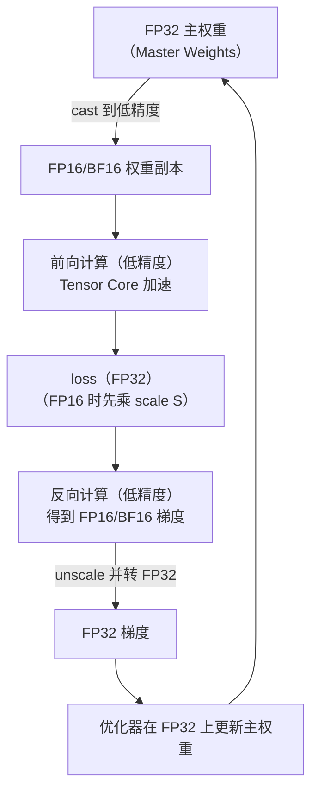

并行策略解决的是"切到多卡"，但在动用更多卡之前，单卡内部还有大量显存和算力可以榨取。混合精度（Mixed Precision）用更低的位宽换取翻倍的算力和减半的存储；梯度检查点（Activation Checkpointing）用重算换显存；再加上对 PyTorch 显存分配器行为的理解，这三样是所有大模型训练的基本功。本文从浮点格式的位级结构讲起，把"为什么 FP16 要 Loss Scaling 而 BF16 不要""DeepSeek-V3 的 FP8 是怎么落地的""碎片是怎么产生、怎么治理的"这些高频问题逐一推导清楚。

<!-- more -->

## 📑 目录

- [1. 浮点格式全景：从 FP32 到 FP8](#1-浮点格式全景从-fp32-到-fp8)
- [2. AMP 混合精度训练机制](#2-amp-混合精度训练机制)
- [3. Loss Scaling：为什么 FP16 需要而 BF16 不需要](#3-loss-scaling为什么-fp16-需要而-bf16-不需要)
- [4. FP8 训练：Transformer Engine 与 DeepSeek-V3](#4-fp8-训练transformer-engine-与-deepseek-v3)
- [5. 梯度检查点：用计算换显存](#5-梯度检查点用计算换显存)
- [6. 显存碎片与 Caching Allocator](#6-显存碎片与-caching-allocator)
- [7. CPU Offload](#7-cpu-offload)
- [8. 显存分析工具](#8-显存分析工具)
- [9. 显存优化全景图](#9-显存优化全景图)
- [总结](#-总结)
- [自我检验清单](#-自我检验清单)
- [高频面试题解析](#-高频面试题解析)
- [参考资料](#-参考资料)

---

## 1. 浮点格式全景：从 FP32 到 FP8

### 1.1 浮点数的三段结构

IEEE 754 风格的浮点数由三部分组成：**符号位（sign）**、**指数位（exponent）**、**尾数位（mantissa/fraction）**，数值为：

$$
x = (-1)^s \times 1.m \times 2^{\,e - \text{bias}}
$$

两类位各管一件事，这是理解一切格式取舍的钥匙：

- **指数位决定动态范围（Dynamic Range）**——能表示多大和多小的数。指数位每多 1 位，可表示的数量级范围大约翻一倍
- **尾数位决定精度（Precision）**——相邻两个可表示数之间的相对间隔约为 $2^{-(m+1)}$，尾数位越多，能分辨的细节越细

### 1.2 训练相关格式对比

| 📊 格式 | 总位宽 | 指数位 | 尾数位 | 最大正数 | 最小正规格数 | 定位 |
|---|---|---|---|---|---|---|
| FP32 | 32 | 8 | 23 | ~$3.4 \times 10^{38}$ | ~$1.2 \times 10^{-38}$ | 主权重、优化器、归约累加 |
| TF32 | 19（存储占 32） | 8 | 10 | ~$3.4 \times 10^{38}$ | ~$1.2 \times 10^{-38}$ | Ampere+ Tensor Core 的矩阵乘内部格式 |
| FP16 | 16 | 5 | 10 | 65504 | ~$6.1 \times 10^{-5}$（$2^{-14}$） | 早期混合精度方案 |
| BF16 | 16 | 8 | 7 | ~$3.4 \times 10^{38}$ | ~$1.2 \times 10^{-38}$ | 大模型训练事实标准 |
| FP8 E4M3 | 8 | 4 | 3 | 448 | ~$1.6 \times 10^{-2}$（$2^{-6}$） | 前向权重/激活 |
| FP8 E5M2 | 8 | 5 | 2 | 57344 | ~$6.1 \times 10^{-5}$（$2^{-14}$） | 反向梯度 |

几个格式的设计意图值得单独看：

- **TF32**：不是一种存储格式，而是 Ampere 起 Tensor Core 做矩阵乘时的**内部计算格式**——保留 FP32 的 8 位指数（范围不变）、把尾数砍到 10 位（精度对齐 FP16）。程序里张量仍是 FP32，无需改代码即可获得数倍矩阵乘加速，这是"免费档"（PyTorch 通过 `torch.backends.cuda.matmul.allow_tf32` 控制）
- **BF16**：直接把 FP32 的高 16 位截下来——指数位与 FP32 完全一致（8 位），范围相同，从根上消灭了溢出/下溢问题；代价是尾数只剩 7 位，相对精度约 $2^{-8} \approx 0.4\%$
- **FP16 的两头受限**：上限 65504，激活或 loss 稍大就上溢为 `inf`；下限 $2^{-24}$（含非规格数），小梯度轻易下溢归零——这两个问题催生了 Loss Scaling（第 3 节）

📌 **关键点**：**FP16 与 BF16 的 16 位分配是"精度 vs 范围"的两种哲学**。深度学习的实践结论是：范围比精度重要——梯度分布跨越很多个数量级，溢出/下溢是致命的（数值直接变 `inf`/0），而尾数精度损失只是噪声，训练对噪声本就鲁棒。这就是大模型训练collectively转向 BF16 的原因。

⚠️ **注意**：低位宽的收益是双重的——**显存减半**（张量、通信量都小一半）和**算力翻倍**（同代 Tensor Core 上 FP16/BF16 吞吐约为 FP32/TF32 的 2 倍，FP8 再翻倍）。面试答"为什么混合精度快"时两条都要说，还可以补第三条：访存量减半，对访存受限（memory-bound）的算子同样加速。

---

## 2. AMP 混合精度训练机制

### 2.1 为什么不能纯低精度训练

如果把参数、梯度、优化器状态全放低精度，训练会失败，核心障碍在**参数更新**这一步：

$$
w \leftarrow w - \eta \cdot g
$$

更新量 $\eta \cdot g$ 通常比 $w$ 小很多个数量级（学习率 $10^{-4}$ 量级，梯度本身也小）。浮点加法要先对阶，当 $\frac{|\eta \cdot g|}{|w|} < 2^{-(m+1)}$（FP16 为 $2^{-11}$，BF16 更糟，为 $2^{-8}$）时，小加数会被完全舍入吞掉——**更新彻底无效**（这一现象称为 swamping）。此外动量的长期累加也会不断损失小量。

结论：**前向/反向可以低精度，但"权重的积累"必须高精度**。

### 2.2 AMP 标准流程

AMP（Automatic Mixed Precision，自动混合精度）的标准做法（NVIDIA 混合精度训练论文，Micikevicius et al. 2017）：



三个要点：

1. **计算密集的前向/反向用低精度**，吃满 Tensor Core 与减半的访存
2. **FP32 主权重常驻**，更新永远在 FP32 上做——这正是第 5 章显存账本里优化器状态 $12\Psi$ 中那份 $4\Psi$ 主权重的来历
3. **个别数值敏感算子保留 FP32**：归约类操作（softmax、layernorm、loss、梯度累加）容易累积舍入误差，PyTorch `autocast` 维护了一份"哪些 op 跑低精度、哪些保 FP32"的名单，自动插入 cast

💡 **提示**：一个反直觉的事实——混合精度**并不总省总显存**：参数相关显存从纯 FP32 的 $4\Psi(\text{参数}) + 4\Psi(\text{梯度}) + 8\Psi(\text{动量})=16\Psi$ 变成 $2+2+12=16\Psi$，不降反平（多出的正是主权重副本）。真正省一半的是**激活值**和**通信量**，赚到的是**速度**。这也是为什么激活为主的场景收益最大。

### 2.3 PyTorch 使用骨架

```python
scaler = torch.amp.GradScaler()          # 仅 FP16 需要；BF16 可省
for x, y in loader:
    optimizer.zero_grad(set_to_none=True)
    with torch.autocast(device_type="cuda", dtype=torch.bfloat16):
        loss = model(x, y)               # 前反向自动选精度
    scaler.scale(loss).backward()        # loss * S 再反向
    scaler.unscale_(optimizer)           # 梯度 / S，便于梯度裁剪
    torch.nn.utils.clip_grad_norm_(model.parameters(), 1.0)
    scaler.step(optimizer)               # 内部检查 inf/nan，决定是否跳步
    scaler.update()                      # 动态调整 S
```

---

## 3. Loss Scaling：为什么 FP16 需要而 BF16 不需要

### 3.1 问题：FP16 的梯度下溢

FP16 能表示的最小正数约为 $2^{-24} \approx 6 \times 10^{-8}$（非规格数）。而实际训练中，激活梯度的分布大量集中在非常小的数值区间，相当一部分落在 FP16 可表示范围之外——这些梯度会被**直接冲刷为 0**（underflow）。梯度大面积归零，训练停滞或发散。

NVIDIA 论文中的关键观察：梯度直方图整体偏小，但 FP16 的**高位动态范围却大量闲置**（梯度很少接近 65504）。既然表示区间"住不满"，把整个分布**平移**进可表示区间即可。

### 3.2 机制：缩放的传递性

反向传播是线性算子链，把 loss 乘以常数 $S$，链式法则保证**所有梯度都恰好放大 $S$ 倍**：

$$
\nabla_w (S \cdot L) = S \cdot \nabla_w L
$$

流程：前向算出 loss 后乘 $S$（如 $2^{16}$）→ 反向得到放大 $S$ 倍的 FP16 梯度（原本下溢的小梯度被抬进可表示区间）→ 更新前把梯度除以 $S$（unscale，在 FP32 上做）→ 正常更新。数学上与不缩放完全等价，唯一变化是梯度在 FP16 中"存活"了下来。

### 3.3 动态 Loss Scaling 算法

$S$ 太小 → 下溢没救回来；$S$ 太大 → 梯度上溢成 `inf`。最优 $S$ 随训练动态变化，静态定值不可靠，因此实践都用**动态缩放（Dynamic Loss Scaling）**，本质是一个"试探-回退"控制器：

```text
初始化 S 为较大值（PyTorch GradScaler 默认 2^16 = 65536）
每步反向后：
  if 梯度中出现 inf/nan:
      跳过本次参数更新（丢弃该步梯度）
      S = S * backoff_factor        # 默认 0.5，立即减半
  else:
      正常更新参数
      连续无溢出步数 += 1
      if 连续无溢出步数 == growth_interval:   # 默认 2000
          S = S * growth_factor     # 默认 2，尝试放大
```

设计意图：**贪心地把 $S$ 顶到不溢出的最大值**——溢出立刻退（乘性减半，反应快），安全一段时间才试探性进（每 2000 步才翻倍，避免震荡）。偶尔跳过一步更新对训练几乎无影响。

### 3.4 BF16 为什么通常不需要

BF16 指数位与 FP32 相同，最小正规格数约 $1.2 \times 10^{-38}$——梯度实际分布远远够不到这个下限，**不存在系统性下溢**，上限 $3.4 \times 10^{38}$ 也几乎不可能上溢。所以 BF16 训练通常直接省掉 GradScaler 整套机制，少一个超参、少一类"loss scale 塌缩"的故障模式。这是 BF16 在工程上碾压 FP16 的第二个理由（第一个是范围本身）。

⚠️ **注意**：BF16 的代价是尾数只有 7 位。对小模型或对精度敏感的任务（以及梯度累加、EMA 等长链累加），BF16 的舍入噪声可能可感；大模型实践中普遍结论是影响可忽略，且累加类操作本就应放在 FP32 中进行（如 DDP 梯度归约用 FP32 buffer，见 4.2 节）。

---

## 4. FP8 训练：Transformer Engine 与 DeepSeek-V3

### 4.1 E4M3 / E5M2 的分工

FP8 只有 8 位，指数与尾数怎么分都捉襟见肘，于是 NVIDIA 的 FP8 方案（Hopper 起硬件支持）干脆定义了**两种格式按用途分工**：

- **E4M3**（4 指数 + 3 尾数）：范围小（最大 448）但精度相对高——用于**前向的权重与激活**，它们分布相对集中、更吃精度
- **E5M2**（5 指数 + 2 尾数）：范围大（最大 57344，指数位与 FP16 相同）但精度低——用于**反向的梯度**，梯度动态范围大、更吃范围

这延续了第 1 节的主线逻辑：**哪里的张量分布宽，就把位宽预算花在指数上**。

### 4.2 Per-Tensor Scaling

FP8 范围太窄，裸用必然溢出/下溢，必须配合**缩放因子（scaling factor）**：每个张量在量化前乘上 per-tensor 的 $s$，把分布搬进 FP8 可表示区间，计算后再除回来。Transformer Engine（TE）的经典实现是**延迟缩放（delayed scaling）**——用最近若干步的 amax（绝对值最大值）历史预测本步的缩放因子，避免为求 amax 多扫一遍张量。硬件侧，Hopper/Blackwell 的 Tensor Core 原生支持 FP8 矩阵乘，吞吐约为 BF16 的 2 倍，这是 FP8 训练的根本动力。

### 4.3 DeepSeek-V3 的细粒度 FP8 方案

DeepSeek-V3 是首个公开的大规模 MoE 模型 FP8 训练实践，其技术报告给出了一套比 TE 默认更细的方案，两个关键设计：

**（1）细粒度分块量化**。per-tensor 一个缩放因子的问题在于**离群值（outlier）**：单个异常大的元素会把整个张量的 $s$ 拉大，其余正常值被压到低位、精度全失。DeepSeek-V3 把量化粒度切小：

- **激活**：按 $1 \times 128$ 的 tile 量化（每个 token 的每 128 个通道共享一个缩放因子）
- **权重**:按 $128 \times 128$ 的 block 量化（每个块一个缩放因子）

离群值的破坏被限制在自己所在的小块内。细粒度缩放使得 DeepSeek-V3 可以**全程使用精度更高的 E4M3**（而不是前向 E4M3/反向 E5M2 的混搭）——范围不够的问题由更细的缩放因子兜底，位宽预算全部花给精度。

**（2）高精度累加**。FP8 矩阵乘的另一个隐患是**累加精度**：Hopper Tensor Core 上 FP8 GEMM 的内部累加精度有限（有效位宽明显低于 FP32），K 维很长时累加误差不可接受。DeepSeek-V3 的做法是**分段提升（promotion）**：Tensor Core 每累加 128 个元素，就把部分和转移到 CUDA Core 的 FP32 寄存器里继续累加，兼顾 FP8 吞吐与 FP32 累加精度。

配套的精度分配：主权重、权重梯度仍为 FP32，优化器一阶/二阶动量用 BF16 存储；对数值敏感的算子（embedding、输出头、归一化、attention 内部等）保留 BF16/FP32——**FP8 只用在收益最大的大矩阵乘上**。

| 📊 方案 | 量化粒度 | 格式选择 | 累加 |
|---|---|---|---|
| TE 经典方案 | per-tensor（delayed scaling） | 前向 E4M3 + 反向 E5M2 | Tensor Core 内部 |
| DeepSeek-V3 | 激活 $1\times128$ / 权重 $128\times128$ | 全程 E4M3 | 每 128 元素提升到 FP32 |

📌 **关键点**：FP8 训练的叙事和当年 FP16→BF16 一脉相承——**位宽不够，缩放来凑；粒度越细，离群值越可控；省下来的范围预算换成精度**。面试中能把"细粒度量化为什么允许全用 E4M3"讲清楚，就抓住了 DeepSeek-V3 FP8 方案的灵魂。

---

## 5. 梯度检查点：用计算换显存

### 5.1 问题：激活值是显存里的"变量"

反向传播需要前向的中间激活值（activation）来计算梯度，默认全部保存。对 $L$ 层网络，激活显存为 $O(L)$，且随 batch size 和序列长度线性增长——模型状态是常数（$16\Psi$），而激活是"踩一脚油门就涨"的那部分，长序列大 batch 下往往反超模型状态成为显存主体。

### 5.2 核心思想与 O(√n) 推导

梯度检查点（Activation/Gradient Checkpointing，也称重计算 Recomputation）的策略：**前向只保存少数"检查点"层的激活，其余全部丢弃；反向传播到某段时，从最近的检查点出发重新前向，现算出该段激活**。

显存怎么算：把 $L$ 层均分为每段 $k$ 层，只保存段边界的激活，共 $\frac{L}{k}$ 个检查点；反向重算某段时，还需临时持有段内 $k$ 层的激活。峰值激活显存：

$$
M(k) = \underbrace{\frac{L}{k}}\_{\text{检查点}} + \underbrace{k}\_{\text{段内重算}} \quad\Rightarrow\quad \frac{dM}{dk} = -\frac{L}{k^2} + 1 = 0 \;\Rightarrow\; k = \sqrt{L}
$$

取 $k=\sqrt{L}$ 时最优，峰值激活显存 $M = 2\sqrt{L}$，即**从 $O(L)$ 降到 $O(\sqrt{L})$**（Chen et al. 2016）。

计算代价：每段在反向时多做一次前向，整个网络等效多算一遍前向。按前向 : 反向计算量 $\approx 1:2$ 估算，总计算量从 $3$ 份变为 $4$ 份，**约增加 33%**。

### 5.3 Selective Recomputation：只重算"划算"的

全量重算把 33% 的算力一视同仁地花在所有算子上，但算子的"显存/计算比"差异巨大。Megatron 的选择性重算（Korthikanti et al. 2022）抓住了 Transformer 里最划算的目标——**attention 内部的中间结果**（softmax 输出、dropout mask 等）：

- 显存上：这些张量是 $O(s^2)$（$s$ 为序列长度）的大头，长序列下增长最快
- 计算上：产生它们的操作（softmax、逐元素乘）FLOPs 占比极低，重算几乎白捡

于是策略变为：**只丢弃并重算 attention 内部激活，矩阵乘的输出照存**。Megatron 论文报告该方法配合序列并行可将激活显存降到约 1/5，而额外计算开销仅约 2.7%。这也是 FlashAttention 的默认行为——它本就不物化 $O(s^2)$ 的注意力矩阵，反向时重算，与 selective recomputation 思想同源。

```python
# PyTorch：以 Transformer Block 为粒度做检查点
from torch.utils.checkpoint import checkpoint
for block in self.blocks:
    hidden = checkpoint(block, hidden, use_reentrant=False)
```

💡 **提示**：与并行策略的配合——流水线并行下每个 stage 只存自己层的激活，1F1B 调度本身就在控制激活峰值（第 7 章）；张量并行 + 序列并行消除了 TP 域内的激活冗余（第 6 章）。检查点与它们正交，可叠加。

---

## 6. 显存碎片与 Caching Allocator

### 6.1 PyTorch 为什么自己管显存

`cudaMalloc`/`cudaFree` 代价高昂（尤其 `cudaFree` 隐式同步整卡），训练每步都成千上万次申请释放，不能直接怼到 CUDA API 上。PyTorch 的**缓存分配器（Caching Allocator）**向 CUDA 申请大块显存（segment）后自己切块（block）管理：释放的 block 不还给 CUDA，进池子缓存复用；大小请求分池管理，块可以分裂（split）与合并。

这带来一个面试常考的现象：`nvidia-smi` 显示的占用（reserved，已从 CUDA 拿到的）远大于张量实际占用（allocated）——差值就是缓存池和碎片。

### 6.2 碎片是怎么产生的

🔑 **核心概念**：**碎片（fragmentation）= 空闲显存总量够，但不连续，无法满足一次大块分配**。典型触发场景是**变长负载**：序列长度不一的批次交替出现，大小交错的张量把 segment 切得七零八落——"上一批的坑，下一批填不满也拼不上"。最终表现为经典报错：

```text
CUDA out of memory. Tried to allocate 2.5 GiB
(… reserved memory >> allocated memory …)
```

reserved 与 allocated 差值巨大却依然 OOM，就是碎片的签名。

### 6.3 治理手段：expandable_segments

`PYTORCH_CUDA_ALLOC_CONF` 提供两个关键旋钮：

- `max_split_size_mb`：禁止超过阈值的大块被分裂——大块留给大请求，减少"大块被小请求啃碎"
- **`expandable_segments:True`**：釜底抽薪的方案。传统 segment 一经 `cudaMalloc` 大小固定，装不下就再开新 segment（新旧之间必然产生碎片）。expandable segments 改用 CUDA 虚拟内存 API（`cuMemAddressReserve` 预留一大段虚拟地址 + `cuMemMap` 按需映射物理页）：**segment 可以原地长大**，物理页也可按需归还，变长负载下碎片显著减少

```bash
PYTORCH_CUDA_ALLOC_CONF=expandable_segments:True python train.py
```

💡 **提示**：其他常用的碎片/缓存手段——`torch.cuda.empty_cache()` 把缓存池中**完全空闲的 segment** 还给 CUDA（救不了碎片在 segment 内部的情况，且后续分配会变慢，勿在训练循环里滥用）；训练前固定 shape 预热（让池子按最大 shape 成型）；推理侧 vLLM 的 PagedAttention 则是把"分页治碎片"的思想做进了 KV Cache 管理。

---

## 7. CPU Offload

显存内部压榨到头，下一步是把不急用的数据挪到 CPU 内存，用时再搬回——**卸载（Offload）**，本质是"PCIe 带宽 + 内存容量"换"显存容量"。三类常见对象：

- **优化器状态卸载**：$12\Psi$ 的大头常驻 CPU，Adam 更新也在 CPU 上执行（逐元素运算，CPU 做不亏），即 ZeRO-Offload 的核心（机制与 PCIe 瓶颈的定量分析见 **5.1 第 9 节**）
- **参数卸载**：ZeRO-Infinity 路线，参数分块存于 CPU/NVMe，按层预取
- **激活卸载**：前向算完的激活异步搬到 CPU，反向前预取回来，与重计算互为替代（PyTorch 提供 `torch.autograd.graph.save_on_cpu` 钩子）

工程上能不能用，取决于一个对比：PCIe 4.0 x16 单向约 32 GB/s，与 GPU HBM（TB/s 级）差近两个数量级。可行的前提是**传输能与计算重叠**——用锁页内存（pinned memory）+ 异步拷贝，把搬运藏在前反向计算后面；藏不住（层计算太快或传输量太大）时，吞吐会显著下降。

📌 **关键点**：选择顺序应当是——先并行切分（多卡分摊，通信走 NVLink）、再重计算（GPU 内部解决）、最后才是 Offload（跨越最慢的 PCIe）。Offload 是"容量不够的兜底"，不是"吞吐优化"。

---

## 8. 显存分析工具

优化前先测量。三层工具由粗到细：

**（1）计数器 API**——代码里埋点看水位：

```python
torch.cuda.memory_allocated()      # 张量实际占用
torch.cuda.memory_reserved()       # 分配器已向 CUDA 申请的总量
torch.cuda.max_memory_allocated()  # 历史峰值（配合 reset_peak_memory_stats）
```

`reserved - allocated` 持续增大 → 碎片或缓存膨胀的信号。

**（2）`torch.cuda.memory_summary()`**——打印分配器全景报表：各池的 allocated/reserved、分配次数、`cudaMalloc` 重试次数（`num_alloc_retries` 非零说明已经历"清缓存再试"的挣扎，离 OOM 不远）。

**（3）Memory Snapshot**——最强武器，逐次分配的时间线：

```python
torch.cuda.memory._record_memory_history(max_entries=100000)
# ... 跑若干个 step ...
torch.cuda.memory._dump_snapshot("snapshot.pickle")
```

把 pickle 拖进 [pytorch.org/memory_viz](https://pytorch.org/memory_viz) 可视化，每块显存"何时分配、哪行代码分配、何时释放"一目了然。三类问题各有签名：

| 📊 症状 | Snapshot 上的形态 | 常见根因 |
|---|---|---|
| 泄漏 | 台阶状只涨不落 | 张量被 Python 引用挂住（如 loss 未 `.item()` 就累加进 list） |
| 峰值过高 | 单步内尖峰 | 激活过大、临时 buffer（可对症上检查点/换算子） |
| 碎片 | 空洞密布、reserved 远超 allocated | 变长 shape（上 `expandable_segments`） |

💡 **提示**：`nvidia-smi` 只能看到进程级 reserved + CUDA context 开销（每进程数百 MB 量级），看不见分配器内部——排查显存问题以 PyTorch 侧工具为准。

---

## 9. 显存优化全景图

把本章与第 5 章的技术放回"显存四大组成"的账本上，形成统一视角：

| 📊 显存组成 | 混合精度 | 梯度检查点 | 梯度累积 | ZeRO/FSDP | Offload |
|---|---|---|---|---|---|
| 参数 | ✅ 减半（低精度副本） | —— | —— | ✅ 切 $N$ 份 | ✅ 挪 CPU/NVMe |
| 梯度 | ✅ 减半 | —— | —— | ✅ 切 $N$ 份 | ✅ |
| 优化器状态 | ❌（反增主权重） | —— | —— | ✅ 切 $N$ 份 | ✅（最常卸载） |
| 激活值 | ✅ 减半 | ✅ $O(\sqrt{L})$ | ✅ 小 micro-batch | ❌ | ✅（较少用） |
| 碎片/缓存 | —— | —— | —— | —— | `expandable_segments` 治理 |

梯度累积（Gradient Accumulation）在表中补一句：连续 $K$ 个 micro-batch 前反向只累积梯度、每 $K$ 步更新一次，等效 batch = micro-batch × world_size × $K$——用时间换激活显存；DDP 下配合 `no_sync()` 跳过中间步的梯度同步以省通信。

实践中的叠加顺序（先零成本、后有代价）：

1. **BF16 混合精度**——速度显存双收，几乎无风险，永远打开
2. **梯度累积**——显存不够先降 micro-batch 补累积步数
3. **Selective/Full Checkpointing**——激活仍大时，按 33% 算力预算逐级加码
4. **ZeRO/FSDP 提档**——模型状态装不下，走第 5 章的选型
5. **Offload**——以上全用仍不够的兜底

---

## 📝 总结

- **格式的本质**：指数位管范围、尾数位管精度。FP16（5+10）与 BF16（8+7）是两种取舍，深度学习选择了范围——BF16 与 FP32 同范围，免疫溢出/下溢，成为大模型标配；TF32 是 Ampere 矩阵乘的"免费加速档"
- **AMP 三件套**：低精度前反向 + FP32 主权重更新（防 swamping）+ 敏感算子保 FP32。混合精度省的是激活/通信和时间，模型状态账仍是 $16\Psi$
- **Loss Scaling**：FP16 梯度大面积下溢，乘 $S$ 平移分布、更新前除回，数学等价；动态算法"溢出即减半、稳定 2000 步翻倍"；BF16 因范围同 FP32 通常免掉整套机制
- **FP8**：E4M3（前向，重精度）/E5M2（反向，重范围）分工 + per-tensor scaling；DeepSeek-V3 用 $1\times128$/$128\times128$ 细粒度量化驯服离群值、全程 E4M3，并每 128 元素把累加提升到 FP32
- **梯度检查点**：只存 $\sqrt{L}$ 个检查点、反向分段重算，激活显存 $O(L) \to O(\sqrt{L})$，代价约 33% 计算；selective recomputation 只重算 attention 内 $O(s^2)$ 的"高显存低计算"部分，开销降到约 2.7%
- **碎片治理**：Caching Allocator 缓存复用导致 reserved > allocated；变长负载产生碎片；`expandable_segments:True` 用虚拟内存让 segment 原地生长
- **测量先行**：memory_allocated/reserved 看水位，memory_summary 看报表，memory snapshot + memory_viz 定位每一块显存的来龙去脉

---

## ✅ 自我检验清单

**1. 能说出浮点数三段结构中指数位与尾数位各管什么，并据此解释 FP16 与 BF16 的 16 位是哪两种分法**

<details>
<summary>参考答案</summary>

指数位决定动态范围（每多 1 位，可表示的数量级范围约翻一倍），尾数位决定精度（相邻可表示数的相对间隔约 $2^{-(m+1)}$）。FP16 = 1+5+10，把预算给精度，但范围两头受限（最大 65504、最小正规格数 $2^{-14}$）；BF16 = 1+8+7，指数位与 FP32 完全一致、范围相同，尾数只剩 7 位（相对精度约 0.4%）。深度学习的实践结论是范围比精度重要——溢出/下溢致命，尾数噪声可容忍（另见 Q1）。（对应正文第 1 节）

</details>

**2. 能解释 TF32 为什么是"免费加速档"**

<details>
<summary>参考答案</summary>

TF32 不是存储格式，而是 Ampere 起 Tensor Core 做矩阵乘时的内部计算格式：保留 FP32 的 8 位指数（范围不变）、尾数砍到 10 位（精度对齐 FP16）。程序里张量仍是 FP32，无需改任何代码即可获得数倍矩阵乘加速，由 `torch.backends.cuda.matmul.allow_tf32` 控制。（对应正文第 1.2 节）

</details>

**3. 能用 swamping 现象解释为什么参数更新必须在 FP32 主权重上做**

<details>
<summary>参考答案</summary>

更新量 $\eta \cdot g$ 通常比 $w$ 小很多个数量级，浮点加法要先对阶，当 $\frac{|\eta \cdot g|}{|w|} < 2^{-(m+1)}$（FP16 为 $2^{-11}$，BF16 更糟为 $2^{-8}$）时，小加数被完全舍入吞掉，更新彻底无效（swamping）。所以前向/反向可以低精度，但"权重的积累"必须高精度——这也是显存账本里优化器状态 $12\Psi$ 中那份 $4\Psi$ 主权重的来历。（对应正文第 2.1 节）

</details>

**4. 能复述 AMP 标准流程的三个要点，并指出混合精度"并不总省总显存"时省的到底是什么**

<details>
<summary>参考答案</summary>

三要点：计算密集的前向/反向用低精度吃 Tensor Core 与减半访存；FP32 主权重常驻、更新永远在 FP32 上做；softmax/layernorm/loss/梯度累加等归约类敏感算子保 FP32（`autocast` 按算子名单自动 cast）。模型状态账从纯 FP32 的 $4+4+8=16\Psi$ 变成 $2+2+12=16\Psi$，不降反平（多出的正是主权重副本）；真正省一半的是激活值与通信量，赚到的是速度。（对应正文第 2.2 节）

</details>

**5. 能讲清 Loss Scaling 的数学依据，以及动态缩放算法的"试探-回退"具体参数**

<details>
<summary>参考答案</summary>

反向传播是线性算子链，$\nabla_w(S \cdot L) = S \cdot \nabla_w L$——loss 乘 $S$ 后所有梯度恰好放大 $S$ 倍，把原本下溢归零的小梯度抬进 FP16 可表示区间，更新前在 FP32 上 unscale 除回，数学完全等价。动态算法：$S$ 初始取较大值（GradScaler 默认 $2^{16}=65536$），梯度出现 inf/nan 就跳过该步更新并把 $S$ 乘 0.5 立即减半，连续 2000 步无溢出才乘 2 试探放大——贪心地把 $S$ 顶到不溢出的最大值。（对应正文第 3.2~3.3 节）

</details>

**6. 能说出 BF16 通常不需要 Loss Scaling 的原因及其代价**

<details>
<summary>参考答案</summary>

BF16 指数位与 FP32 相同，最小正规格数约 $1.2 \times 10^{-38}$，梯度实际分布远够不到这个下限，不存在系统性下溢，上限 $3.4 \times 10^{38}$ 也几乎不可能上溢——GradScaler 整套机制可以直接省掉，少一个超参、少一类"loss scale 塌缩"故障模式。代价是尾数只有 7 位，小模型或梯度累加、EMA 等长链累加场景舍入噪声可能可感，累加类操作本就应放 FP32。（对应正文第 3.4 节）

</details>

**7. 能写出 FP8 两种格式的位分配、最大值与分工逻辑**

<details>
<summary>参考答案</summary>

E4M3（1+4+3，最大 448）精度相对高，用于前向的权重与激活；E5M2（1+5+2，最大 57344，指数位与 FP16 相同）范围大，用于反向的梯度。分工延续同一主线：哪里的张量分布宽，就把位宽预算花在指数上。FP8 裸用必然溢出/下溢，须配缩放因子（TE 用 delayed scaling，按 amax 历史预测本步 scale）；Hopper 起 Tensor Core 原生 FP8 矩阵乘，吞吐约 BF16 的 2 倍（另见 Q4）。（对应正文第 4.1~4.2 节）

</details>

**8. 能解释 DeepSeek-V3 的细粒度量化为什么允许"全程 E4M3"，以及它如何解决 FP8 累加精度不足**

<details>
<summary>参考答案</summary>

激活按 $1 \times 128$ tile、权重按 $128 \times 128$ block 各配独立缩放因子，离群值的破坏被锁死在小块内；范围不够由更细的 scale 兜底，位宽预算全部花给精度，因此无需 E4M3/E5M2 混搭。累加侧用分段提升：Tensor Core 每累加 128 个元素，就把部分和转移到 CUDA Core 的 FP32 寄存器继续累加。配套精度分配：FP8 只用于大矩阵乘，主权重/权重梯度 FP32、动量 BF16、embedding/输出头/归一化等敏感算子保高精度（另见 Q5）。（对应正文第 4.3 节）

</details>

**9. 能推导梯度检查点的最优分段 $k=\sqrt{L}$，并说出全量重算与 selective recomputation 各自的代价**

<details>
<summary>参考答案</summary>

每段 $k$ 层、只存段边界激活，峰值激活 $M(k) = \frac{L}{k} + k$（检查点 + 段内重算），求导取零得 $k=\sqrt{L}$，峰值 $2\sqrt{L}$，激活显存从 $O(L)$ 降到 $O(\sqrt{L})$。全量重算等效多算一遍前向，按前向:反向 $\approx 1:2$，总计算量约增加 33%。Megatron 的 selective recomputation 只重算 attention 内部 $O(s^2)$ 的"高显存低计算"张量（softmax 输出、dropout mask 等），配合序列并行激活显存降到约 1/5、额外开销仅约 2.7%。（对应正文第 5.2~5.3 节）

</details>

**10. 能识别"reserved 远超 allocated 却 OOM"的碎片签名，并说出 `expandable_segments` 的治理原理与排查工具链**

<details>
<summary>参考答案</summary>

Caching Allocator 向 CUDA 申请大 segment 后自己切块、释放不还，变长负载把 segment 切得七零八落——空闲总量够但不连续，无法满足一次大块分配，这就是碎片。`expandable_segments:True` 改用 CUDA 虚拟内存 API（`cuMemAddressReserve` 预留虚拟地址 + `cuMemMap` 按需映射物理页），让 segment 原地长大、物理页可归还。排查由粗到细：`memory_allocated/reserved` 计数器看水位 → `memory_summary()` 看报表（`num_alloc_retries` 非零离 OOM 不远）→ memory snapshot + memory_viz 定位每块显存的来源（另见 Q7）。（对应正文第 6、8 节）

</details>

---

## 🎯 高频面试题解析

以下题目均来自本站 `docs/interview/` 收录的真实面经。

### Q1：BF16 与 FP16 在数值表示上有什么区别？为什么大模型训练普遍选 BF16？

（科大讯飞校招一面）

- 位分配：FP16 = 1+5+10，BF16 = 1+8+7；FP16 精度更高（尾数 10 位）但范围窄（最大 65504、最小正规格数 $2^{-14}$）；BF16 范围与 FP32 完全相同（指数位一致）但尾数只有 7 位（见第 1.2 节）
- 选 BF16 的两个理由：范围问题是致命的（溢出成 `inf`、下溢归零），精度损失只是可容忍的噪声；BF16 免去 Loss Scaling 整套机制，少一个超参和一类故障模式（见第 3.4 节）

### Q2：FP32、FP16、INT8 在底层的存储格式有何差异？

（阿里巴巴实习一二面、飞腾实习一面）

- FP32：1 符号 + 8 指数 + 23 尾数；FP16：1+5+10；数值 = $(-1)^s \times 1.m \times 2^{e-\text{bias}}$，指数管范围、尾数管精度（见第 1.1 节）
- INT8 是定点表示：8 位补码，范围 $[-128, 127]$，本身无指数，靠外部缩放因子映射实数——这也正是量化（quantization）中 scale 的由来
- 展开方向：可补 IEEE 特殊值（非规格数、inf、NaN）和 FP8 两种变体（见第 4.1 节）

### Q3：混合精度训练的原理和实现方式是什么？

（中兴二面、飞腾校招二面）

- 原理：前反向用 FP16/BF16 吃 Tensor Core 和减半访存；参数更新在 FP32 主权重上做，避免更新量被舍入吞掉（swamping，相对比值小于 $2^{-11}$ 即失效，见第 2.1 节）
- 实现：`torch.autocast` 按算子名单自动选精度 + `GradScaler` 动态 loss scaling（FP16 时）；完整流程图见第 2.2 节
- 加分：指出混合精度下模型状态仍是 $16\Psi$（主权重是优化器状态 $12\Psi$ 的一部分），真正省的是激活与通信

### Q4：FP8 的 E4M3 与 E5M2 有什么区别？NVIDIA GPU 对 FP8 有哪些硬件支持？

（科大讯飞飞星校招、蚂蚁实习三面）

- E4M3：4 指数 + 3 尾数，最大 448，精度相对高 → 前向权重/激活；E5M2：5 指数 + 2 尾数，最大 57344，范围大 → 反向梯度（见第 4.1 节）
- 硬件：Hopper 起 Tensor Core 原生 FP8 矩阵乘（吞吐约 BF16 的 2 倍），配套 Transformer Engine 做 per-tensor 缩放管理（delayed scaling，见第 4.2 节）
- 训练/推理适用性：训练需精细缩放与高精度累加护航；推理侧 FP8 KV Cache/权重量化更成熟、门槛更低

### Q5：DeepSeek-V3 的 FP8 训练方案有哪些要点？

（小厂实习面）

- 细粒度分块量化：激活 $1\times128$ tile、权重 $128\times128$ block，各配独立缩放因子，把离群值的破坏锁死在小块内；因此得以全程使用 E4M3（见第 4.3 节）
- 高精度累加：Tensor Core 每累加 128 元素将部分和提升到 CUDA Core 的 FP32 寄存器，解决 FP8 GEMM 内部累加精度不足
- 精度分配策略：FP8 只用于大矩阵乘；主权重/权重梯度 FP32、动量 BF16，embedding/输出头/归一化等敏感算子保持高精度

### Q6：训练显存不足时有哪些优化方案？

（阿里一面、字节实习一二三面、MiniMax 二面）

- 按叠加顺序作答（见第 9 节）：BF16 混合精度 → 降 micro-batch + 梯度累积 → 梯度检查点（先 selective 后 full，$O(\sqrt{L})$ 换约 33% 计算，见第 5 节）→ ZeRO/FSDP 切分模型状态（见 5.1）→ CPU/NVMe Offload 兜底（见第 7 节）
- 加分：先用 memory snapshot 判断显存花在哪一类（激活 or 模型状态 or 碎片），对症下药而不是背菜单

### Q7：遇到显存异常（缓慢增长、碎片 OOM）如何定位与排查？

（阿里云二面、蚂蚁实习一面、科大讯飞校招）

- 先分型：`memory_allocated` 涨 → 真泄漏（找 Python 引用，典型如累加未 `.item()` 的 loss）；`reserved` 远超 `allocated` 且 OOM → 碎片（见第 6.2 节）
- 工具链：埋点计数器 → `memory_summary()`（看 `num_alloc_retries`）→ memory snapshot + memory_viz 定位分配来源（见第 8 节）
- 碎片处置：`expandable_segments:True`、`max_split_size_mb`、固定 shape/预热；`empty_cache()` 只治缓存不治碎片，勿在循环内滥用

---

## 📚 参考资料

- [Mixed Precision Training（NVIDIA/百度，Loss Scaling 原始论文）](https://arxiv.org/abs/1710.03740)
- [FP8 Formats for Deep Learning（E4M3/E5M2 定义）](https://arxiv.org/abs/2209.05433)
- [DeepSeek-V3 Technical Report（细粒度 FP8 训练方案）](https://arxiv.org/abs/2412.19437)
- [Training Deep Nets with Sublinear Memory Cost（梯度检查点 O(√n)）](https://arxiv.org/abs/1604.06174)
- [Reducing Activation Recomputation in Large Transformer Models（Selective Recomputation）](https://arxiv.org/abs/2205.05198)
- [NVIDIA Transformer Engine 文档](https://docs.nvidia.com/deeplearning/transformer-engine/)
- [PyTorch AMP（torch.amp）文档](https://docs.pytorch.org/docs/stable/amp.html)
- [PyTorch CUDA 内存管理与 expandable_segments](https://docs.pytorch.org/docs/stable/notes/cuda.html#memory-management)
- [PyTorch Memory Snapshot 可视化工具](https://pytorch.org/memory_viz)
