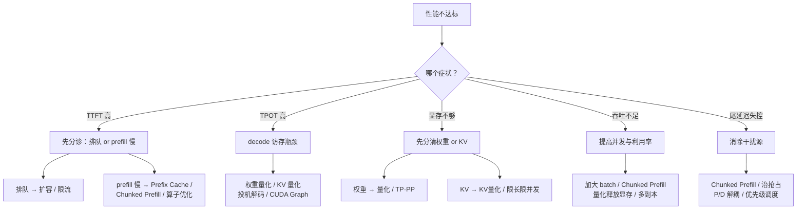
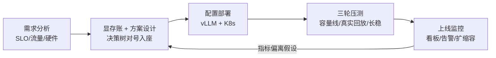
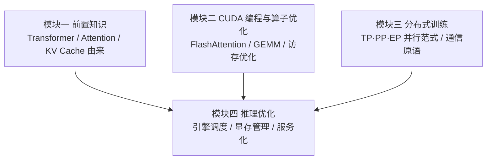

前面十章把 PagedAttention、Continuous Batching、Prefix Cache、量化、投机解码、分布式并行、P/D 解耦、生产运维逐个讲透了，但真实工作中没人会问"请解释 Chunked Prefill"，只会甩给你一个问题："服务 P99 太高了，怎么办？"或者"这个 70B 模型加两个 SLO，用手头的卡怎么上线？"这一节把散落的技术收束成两样东西：一棵**按症状选技术的决策树**，和一条**从需求分析到上线监控的端到端流水线**。面试里的开放场景题（"你来负责优化这个推理服务，怎么展开？"）考的就是这两样。

## 目录

- [1. 先定位瓶颈，再谈优化](#1-先定位瓶颈再谈优化)
- [2. 按症状选技术的决策树](#2-按症状选技术的决策树)
- [3. 优化组合的冲突分析](#3-优化组合的冲突分析)
- [4. 推荐优化顺序](#4-推荐优化顺序)
- [5. 端到端实战：7B 对话服务上线全流程](#5-端到端实战7b-对话服务上线全流程)
- [6. 变式：换成 70B 方案怎么改](#6-变式换成-70b-方案怎么改)
- [7. 模块总结：知识关联与核心 trade-off](#7-模块总结知识关联与核心-trade-off)
- [8. 高频面试题解析](#8-高频面试题解析)

---

## 1. 先定位瓶颈，再谈优化

选型决策树的入口不是"我想用什么技术"，而是"指标说明瓶颈在哪"。第 9 章的性能分析在这里派上用场——四个指标各自指向不同的病灶：

| 症状 | 先查什么 | 典型病灶 |
|------|----------|----------|
| TTFT 高 | 排队时间 vs prefill 时间 | 容量不足在排队；或长输入 prefill 慢 |
| TPOT 高 | decode batch 大小、带宽利用 | decode 访存瓶颈；batch 过大；被 prefill 干扰 |
| OOM / 上下文上不去 | 权重、KV Cache、激活各占多少 | 显存预算超支，要分清是权重还是 KV 不够 |
| 吞吐不足 | GPU 利用率、batch 饱和度 | 并发上不去，算力空转 |
| P99 失控（P50 正常） | 抢占次数、长请求分布、扩容事件 | 干扰问题而非容量问题 |

**没有 profiling 就开药方是最常见的错误**：TTFT 高的原因如果是排队（`request_queue_time` 占大头），任何单请求优化都是无用功，答案是扩容或限流；只有排队正常、prefill 本身慢，才轮到 Chunked Prefill 和 Prefix Cache 出场。

---

## 2. 按症状选技术的决策树

先看全景，再逐支展开：



### 2.1 分支一：TTFT 高

- **排队时间占大头**（`vllm:request_queue_time_seconds` 高）：容量问题。
  - 扩副本（第 10 章 HPA）；网关限流保护存量请求；
  - 适用条件：单请求延迟本身达标，只是请求进不去。
- **prefill 本身慢**：
  - **Prefix Cache（RadixAttention）**：适用条件是请求间真实存在共享前缀（长 System Prompt、多轮对话、RAG 固定模板），命中的前缀完全跳过计算；配合前缀感知路由才能在多副本下生效；
  - **Chunked Prefill**：适用条件是长输入 + 混合负载，把长 prefill 切块与 decode 混排，避免"一个 20K 输入把所有人卡住"；对单条长请求自身的 TTFT 帮助有限，主要治的是相互干扰（也见分支五）；
  - **算子层优化**：FlashAttention 类 prefill kernel、GEMM 调优（模块二的内容），prefill 是 compute-bound，算力打不满时才有空间；
  - **P/D 解耦**：prefill 单独成池、独立扩容，适合大规模、prefill/decode 负载比例波动大的场景。

### 2.2 分支二：TPOT 高

decode 阶段每生成一个 token 都要读全量权重和 KV Cache，是典型的**访存带宽瓶颈**：

- **权重量化（W4A16/W8A16）**：decode 时权重搬运量直接减半/减 3/4，带宽受限场景可以直接转化为 TPOT 改善；适用条件是精度评测通过；
- **KV Cache 量化（FP8）**：长上下文时 KV 读取量占比高，收益随上下文变长；
- **投机解码 / MTP**：一次前向验证多个草稿 token，把逐 token 的带宽成本摊薄；适用条件是**低并发**（算力有闲置）且接受率足够（领域匹配的草稿模型），高并发下慎用（见 3.1 节）；
- **CUDA Graph / kernel 融合**：decode 每步都是小 kernel，启动开销占比高，图捕获消除 CPU 发射瓶颈（vLLM 默认开启）；
- **控制 decode batch**：`max_num_seqs` 压小可换 TPOT，但牺牲吞吐——这是纯 trade-off，不是免费优化。

### 2.3 分支三：显存不够

先算账（第 1 章公式），分清是谁不够：

- **权重放不下**：
  - 权重量化：INT8 减半、INT4 再减半（AWQ/GPTQ），单卡就能多装一档模型；
  - **TP**：权重切到多卡，代价是每层两次 AllReduce，需要 NVLink 级互联；
  - **PP**：跨节点切层，带宽要求低，代价是流水线气泡与实现复杂度；
- **KV Cache 不够**（权重装得下，但上下文/并发上不去、抢占频发）：
  - KV Cache FP8 量化；
  - 压 `max_model_len` / `max_num_seqs`，把并发压力转移给"加副本"；
  - 选型阶段优先 GQA/MLA 架构的模型（KV 头数少，天然省 KV）；
- **PagedAttention** 解决的是碎片浪费，现代引擎默认开启，面试要能说出"它让 KV 利用率从经验上的六成以下提到接近全部"这一层价值；
- **CPU/磁盘 offload**：延迟代价巨大，只适合离线批处理，在线服务基本不考虑。

### 2.4 分支四：吞吐不足

延迟达标但单卡出活太少、成本太高：

- **加大并发**：提高 `max_num_seqs`、`gpu-memory-utilization`，让 Continuous Batching 吃满——代价是 TPOT 上升，顶到 SLO 为止；
- **量化释放显存 → 更大 batch**：量化的第二重收益，显存省下来全给 KV Cache，托起更高并发；
- **Chunked Prefill**：让 decode batch 始终混着 prefill 块，填满算力空隙，提高 GPU 利用率；
- **关掉投机解码**：高负载下验证失败的草稿挤占 batch 容量，反而降吞吐；
- **横向扩副本**：单副本调到收益递减后，剩下的就是第 10 章的容量规划问题。

### 2.5 分支五：尾延迟失控

P50 正常、P99 起飞，说明不是普遍容量问题，而是**少数请求被干扰**：

- **长 prefill 阻塞**：一条 20K 输入让同 batch 所有请求的 decode 停顿 → Chunked Prefill 强制混排；
- **抢占**：KV 满时低优请求被换出重算，尾部翻倍 → 降并发上限、扩 KV 空间（量化/换卡）、监控 `num_preemptions_total`；
- **P/D 解耦**：把 prefill 干扰从物理上消除，decode 池的 TPOT 方差大幅收窄，适合对 SLO 严苛的大规模服务；
- **调度与准入**：SLO 感知调度、按租户优先级、过载时快速拒绝（fail fast）优于全员排队；
- **基础设施抖动**：冷启动的副本被提前放量、缩容引发的重平衡——这类要靠第 10 章的运维手段而不是引擎参数。

### 2.6 决策速查表

面试或救火时的一页纸版本：

| 症状 | 首选手段 | 次选手段 | 慎用/无效 |
|------|----------|----------|-----------|
| TTFT 高（排队型） | 扩副本、限流 | 前缀感知路由分摊热点 | 单请求优化（治不了排队） |
| TTFT 高（计算型） | Prefix Cache（有共享前缀时） | prefill 算子优化、P/D 解耦 | 投机解码（只加速 decode） |
| TPOT 高 | 权重量化（W4A16） | KV 量化、投机解码（低并发） | 盲目加大 batch（反向恶化） |
| 权重放不下 | 量化、TP | PP（跨节点） | CPU offload（在线服务） |
| KV 不够 | KV FP8、压长度/并发 | 换 GQA/MLA 模型、加显存 | 只调 gpu-memory-utilization |
| 吞吐不足 | 加大并发、量化释放显存 | Chunked Prefill、多副本 | 投机解码（高负载降吞吐） |
| 尾延迟失控 | Chunked Prefill、治抢占 | P/D 解耦、优先级/准入 | 简单扩容（治标不治本） |

表格是索引不是答案——每格背后的适用条件在上面五个分支里，面试时先报条件再报技术才是加分项。

---

## 3. 优化组合的冲突分析

技术叠加不等于收益叠加，四组高频冲突：

### 3.1 投机解码 × 大 batch：收益随负载衰减

投机解码的本质是**用闲置算力换延迟**：验证草稿的额外 FLOPs 在低并发时"免费"（GPU 本来就空转），高并发时 GPU 已被 Continuous Batching 填满，每个被拒绝的草稿 token 都在挤占本可服务其他请求的容量——延迟收益缩水，吞吐反而下降。所以它是**低并发延迟敏感场景的技术**，高 QPS 服务要么关掉，要么按负载动态启停/调节草稿长度。

### 3.2 投机解码 × 量化：草稿-目标分布错位

投机解码的接受率取决于草稿分布与目标分布的接近程度。把目标模型量化后，它的输出分布已经偏移，而草稿模型（尤其 EAGLE/MTP 这类**基于原模型隐状态训练**的草稿头）还在拟合量化前的分布——接受率下降，加速比缩水。两者可以共存，但必须：量化后**实测接受率**再决定保留与否；条件允许时用量化后的模型重新校准/训练草稿头。

### 3.3 Chunked Prefill × Prefix Cache：交互良性但要分开归因

两者在现代 vLLM 中默认同时开启，方向兼容：命中的前缀直接跳过，未命中的剩余部分照常切块。要注意的交互是**收益此消彼长**——前缀命中率高时，实际要算的 prefill 变短，Chunked Prefill 的防阻塞价值随之变小；反之命中率低时 Chunked Prefill 才是主角。压测时应该分别开关做 A/B，弄清自己流量下谁在贡献收益，否则容量评估会把两者的收益重复计入。

### 3.4 量化 × MoE gate：小算子，大敏感

MoE 模型里 gate/router 的参数量微不足道，但它的输出决定 token 路由给哪些专家——数值误差会**改变路由决策本身**，选错专家的误差远大于权重量化误差，且会级联放大。工程惯例是：专家 FFN 权重放心量化（它们占了绝大部分显存），**router 与共享层保持 FP16/BF16**。同理，LayerNorm、lm_head 等数值敏感的小模块通常也被排除在量化之外。

| 组合 | 冲突机理 | 处置建议 |
|------|----------|----------|
| 投机解码 + 大 batch | 验证算力在高负载下不再免费，挤占 batch 容量 | 低并发开、高并发关或动态调节 |
| 投机解码 + 量化 | 目标分布偏移，草稿接受率下降 | 量化后实测接受率，必要时重训草稿头 |
| Chunked Prefill + Prefix Cache | 收益互相摊薄，归因易重复计算 | 可以都开，但压测分开 A/B 归因 |
| 量化 + MoE gate | 路由决策被数值误差改变，误差级联 | 只量化专家权重，router 保持高精度 |

---

## 4. 推荐优化顺序

顺序错了会反复返工——比如先调好了 TPOT 再发现 OOM，量化引入后前面的压测全部作废。推荐顺序：

1. **第一步：跑通且不 OOM（正确性与稳定性）**。算显存账，定精度（必要时量化）与并行方案（TP/PP），确定 `max_model_len`、`max_num_seqs`、`gpu-memory-utilization` 的安全组合，长稳压测无抢占风暴、无泄漏。这一步锁定"底盘"，后续所有调优都在这个底盘上进行；
2. **第二步：保 TTFT（可用性体感）**。开 Prefix Cache（有共享前缀时）+ 前缀感知路由，长输入场景确认 Chunked Prefill 生效，确保排队时间受控。先保 TTFT 是因为它决定用户"觉得服务活着"；
3. **第三步：拉 TPOT 与吞吐（成本效率）**。在 SLO 允许范围内加大并发拉吞吐；带宽瓶颈上权重/KV 量化；低并发场景此时才考虑投机解码。每改一项重新过一遍精度评测与压测；
4. **第四步：治尾延迟（SLO 兜底）**。看 P99 与 P50 的裂口：抢占治理、优先级与准入控制，规模够大且 SLO 严苛时上 P/D 解耦。尾延迟放最后，是因为它的手段（解耦、冗余）成本最高，前三步做好后很多尾部问题已经消失。

一句话版本：**先不 OOM，再保 TTFT，然后拉吞吐，最后治 P99**。

---

## 5. 端到端实战：7B 对话服务上线全流程

把决策树放进一个完整案例。**本节所有性能数字均为示例假设，用于演示推演方法，不代表真实实测。**

### 5.1 需求分析

| 维度 | 内容（示例假设） |
|------|------------------|
| 模型 | Qwen2.5-7B-Instruct，FP16/BF16 |
| 场景 | 客服对话，统一 System Prompt 约 1500 token，多轮 |
| 流量 | 峰值 30 QPS；平均输入 1200 token（含前缀）、输出 350 token |
| SLO | P99 TTFT ≤ 2s；P99 TPOT ≤ 60ms；错误率 < 0.1% |
| 硬件 | 单副本一张 80GB GPU，可申请至 12 张 |

先算显存账：7B 参数 FP16 权重约 14GB；80GB 卡按 `gpu-memory-utilization 0.90` 预算 72GB，扣除权重与激活/运行时开销后，50GB 以上留给 KV Cache——对 8K 上下文、百级并发绰绰有余，**无需量化与多卡并行**，单卡单副本即为最简底盘（对应第 4 节第一步）。

### 5.2 方案设计

按流量特征对号入座：

- 统一 System Prompt + 多轮 → **Prefix Cache 收益确定**，配前缀感知路由/会话亲和；
- 输入中等长度、混合负载 → **Chunked Prefill** 保持默认开启防长请求干扰；
- 峰值 30 QPS 属高并发 → **不开投机解码**（3.1 节的反面条件）；
- 框架选 vLLM：生态成熟、指标完备、与第 10 章部署运维栈无缝衔接。若场景以共享前缀的 Agent 工作流和结构化输出为主，SGLang 是对等候选——选型结论应来自用自己流量做的对比压测，而非社区 benchmark。

### 5.3 配置与部署

单副本启动命令（vLLM V1 默认已开启 Prefix Cache 与 Chunked Prefill，显式写出便于审阅）：

```bash
vllm serve Qwen/Qwen2.5-7B-Instruct \
  --host 0.0.0.0 --port 8000 \
  --gpu-memory-utilization 0.90 \
  --max-model-len 8192 \
  --max-num-seqs 128 \
  --enable-prefix-caching
```

参数与需求的对应关系：`--max-model-len 8192` 覆盖"1500 前缀 + 多轮历史 + 350 输出"的最长会话并留余量；`--max-num-seqs 128` 是并发上限的初值，压测中它是主要的调节旋钮——调大拉吞吐、调小保 TPOT；`--gpu-memory-utilization 0.90` 决定 KV 块池大小，剩下 10% 留给激活峰值与碎片，压测若出现偶发 OOM 先降它。

K8s 化部署（Deployment、探针、Service、网关认证）完整照搬第 10 章 2.5 节的清单，此处不重复；唯一要改的是把上面的参数写进容器 `args`。

### 5.4 压测验证

三轮压测，目的各不相同：

```bash
# 第一轮：扫 request rate，找 SLO 内极限（逐档 2/3/4/5 QPS）
vllm bench serve \
  --model Qwen/Qwen2.5-7B-Instruct \
  --base-url http://127.0.0.1:8000 \
  --dataset-name random \
  --random-input-len 1200 --random-output-len 350 \
  --request-rate 4 --num-prompts 500
```

第一轮的输出形如（示例假设的结果）：

| request rate (QPS) | P99 TTFT | P99 TPOT | 输出吞吐 (tok/s) | 是否满足 SLO |
|---:|---:|---:|---:|:---:|
| 2 | 0.5s | 32ms | 700 | ✅ |
| 3 | 0.8s | 41ms | 1050 | ✅ |
| 4 | 1.6s | 56ms | 1380 | ✅（临界） |
| 5 | 4.2s | 75ms | 1450 | ❌ 队列积压 |

- **第一轮（容量线）**：随机数据集扫负载，得到单副本 SLO 内极限——4 QPS（示例假设）。注意 5 QPS 档吞吐仍在涨而延迟已崩，说明"最大吞吐"和"SLO 内吞吐"是两个数，容量要按后者算；
- **第二轮（真实流量回放）**：用采样的真实请求（带真实共享前缀）重放，验证 Prefix Cache 命中率与命中后的 TTFT 改善；假设命中率 70%、SLO 内极限提升到 6 QPS（示例假设）——这一轮的数字才能进容量规划；
- **第三轮（长稳与异常）**：峰值负载持续数小时看抢占与显存水位；注入副本宕机验证 N-1 容量下 SLO 仍成立。

容量结论（示例假设）：副本数 $\lceil 30 \times 1.5 / 6 \rceil = 8$，冗余系数 1.5 覆盖突发、发布与单点故障（推演方法见第 10 章第 5 节）。

### 5.5 上线监控

第 10 章的观测栈直接落地：Grafana 四层看板（SLO 层 / 引擎饱和层 / 吞吐结构层 / 硬件层），三条核心告警（P99 TTFT 违约、waiting 队列积压、抢占风暴），KEDA 按 `num_requests_waiting` 扩缩容并为冷启动留提前量。

放量本身也要有节奏：先切 5% 流量灰度观察一到两天，SLO 稳定后再逐级放大到全量；每次改引擎参数（哪怕只是调 `max_num_seqs`）都走同样的灰度路径，因为压测流量永远无法完全复刻线上。

上线后第一周重点盯三件事：

1. 真实流量的输入/输出长度分布是否与压测假设一致——不一致则单副本极限失真，容量结论重算；
2. Prefix Cache 命中率是否达到压测水平——未达则查网关的会话亲和/前缀路由是否真的生效；
3. 抢占计数是否为零——出现抢占说明 KV 预算在真实长会话下被低估，按 2.3 节分支处理。

### 5.6 流程复盘



闭环的关键在最后一条回边：**上线不是终点，监控数据会不断修正压测阶段的假设**。

## 6. 变式：换成 70B 方案怎么改

同样的 SLO 与流量，模型换成 Llama-3.1-70B-Instruct 级别，每一步都要重推：

| 环节 | 7B 方案 | 70B 方案的变化 |
|------|---------|----------------|
| 显存账 | 14GB 权重，单卡富余 | FP16 权重约 140GB，单卡放不下——**必须并行或量化** |
| 并行方案 | 无 | 首选单机 4×80GB TP=4（NVLink 内 AllReduce），每卡权重 35GB，其余给 KV |
| 量化选项 | 不需要 | AWQ/GPTQ INT4 后权重约 35~40GB，可 2 卡 TP=2 甚至单卡跑，省一半卡——代价是必须过精度评测 |
| 单副本吞吐 | 高 | 明显更低且每副本占 4 卡，副本数×4 才是卡数，容量规划的分母变小、单位成本陡增 |
| 投机解码 | 高并发不开 | 若实际并发低（企业内部问答），70B 的高单 token 成本反而让投机解码变得划算 |
| 冷启动 | 分钟级 | 权重拉取与加载更久，探针阈值、扩容提前量、节点本地缓存全部加码 |

启动命令相应变为：

```bash
vllm serve meta-llama/Llama-3.1-70B-Instruct \
  --tensor-parallel-size 4 \
  --gpu-memory-utilization 0.92 \
  --max-model-len 8192 \
  --max-num-seqs 64
```

若单机 4 卡都凑不齐（比如手头只有 2×80GB 的两台机器），还有一档组合：节点内 TP=2 + 节点间 PP=2（`--pipeline-parallel-size 2`），把高带宽需求的 TP 留在 NVLink 内、低带宽需求的 PP 走以太网——这正是模块三"并行策略按通信量分层摆放"结论在推理侧的直接复用。

这个对比想说明的是：**方案没有模板，只有推演链路是固定的**——显存账定底盘，流量特征定技术组合，压测定容量，SLO 定冗余。面试遇到"给你 X 卡部署 Y 模型"类题目，照这条链路推演即可，数字可以现场假设，链路不能缺环。

---

## 7. 模块总结：知识关联与核心 trade-off

### 7.1 四大模块的知识关联



- **模块一**回答"为什么"：因果注意力的结构决定了 KV Cache 的存在，也决定了 prefill compute-bound、decode memory-bound 的基本格局——整个模块四的优化都是围绕这个格局展开的；
- **模块二**决定"单卡天花板"：FlashAttention、GEMM 调优、kernel 融合设定了 roofline，引擎层调度做得再好也超不过算子层的上限；
- **模块三**提供"多卡语言"：推理的 TP/PP/EP 与训练同源，AllReduce/AllGather 的通信代价分析可以直接迁移，差别在于推理无反向、对延迟更敏感；
- **模块四**在三者之上做**系统级编排**：把算力、显存、带宽在调度器里统一分配，最终以 SLO 和成本这两个业务语言交卷。

### 7.2 核心 trade-off 汇总

推理优化没有免费午餐，所有技术都是在四种资源（算力、显存、带宽、延迟预算）之间倒手：

| trade-off | 代表技术 | 换到了什么 | 付出了什么 |
|-----------|----------|------------|------------|
| 显存换算力 | KV Cache 本身、Prefix Cache | 免去重复计算，TTFT/吞吐提升 | 显存占用，需要分页管理与淘汰策略 |
| 精度换显存与带宽 | 权重/KV 量化 | 更小权重、更大 batch、更快 decode | 精度风险，敏感层（MoE gate 等）需豁免 |
| 算力换延迟 | 投机解码 / MTP | 单请求 TPOT 下降 | 闲置算力被占用，高并发下吞吐受损 |
| 延迟换吞吐 | Continuous Batching 加大并发 | 单卡 QPS 与利用率上升 | TPOT 上升，顶着 SLO 的边界调 |
| 通信换单卡显存 | TP / PP | 装下更大模型 | AllReduce 开销 / 流水线气泡 |
| 资源冗余换尾延迟 | P/D 解耦、容量冗余系数 | P99 稳定、故障不违约 | 更多卡、更复杂的系统 |

面试收尾的万能框架：**任何优化技术，说清它把哪种资源换成了哪种收益、适用条件是什么、和谁冲突**——这三问答对，就超过了背名词的绝大多数候选人。

### 7.3 持续学习建议

- **跟一线开源**：vLLM/SGLang 的 release note 与 RFC 是推理系统演进最快的信息源，重要特性（新调度器、新量化格式、P/D 解耦实现）都先在这里出现；
- **读系统论文**：MLSys/OSDI/SOSP 上的推理系统工作（PagedAttention、SGLang、DistServe 等原始论文）比二手解读更能建立判断力；
- **动手闭环**：拿真卡真流量把本节的端到端链路亲手走一遍——面试中"实测过"和"看过博客"的差距，三个追问之内必然暴露。

---

## 8. 高频面试题解析

**Q1：LLM 推理部署中有哪些常用的优化技术？**（百度二面原题）
别报菜名，按层次收纳（呼应第 2 节决策树）：显存管理层——PagedAttention、KV Cache 量化；调度层——Continuous Batching、Chunked Prefill、Prefix Cache；算法层——权重量化（AWQ/GPTQ/FP8）、投机解码/MTP；算子层——FlashAttention、CUDA Graph、kernel 融合；架构层——TP/PP/EP 并行、P/D 解耦。然后补一句选型逻辑：按症状（TTFT/TPOT/显存/吞吐/尾延迟）对号入座，并点出一两组冲突（投机解码在高并发下失效）——展示的是体系而不是词汇量。

**Q2：假设你作为技术负责人，要优化一个云端推理服务，目标是提升单卡吞吐并降低响应延迟，你会如何展开？**（OPPO 云实习一面原题）
答方法论（呼应第 1、4、5 节）：先 profile 定位瓶颈——延迟拆成排队/计算，利用率区分 compute-bound 还是 memory-bound；再按第 4 节顺序动手：稳定底盘（batch 与显存配置）→ 保延迟（缓存/干扰治理）→ 拉吞吐（加大并发、量化释放资源、必要时换更优 kernel 或引擎）；每一步用固定压测协议验证，避免"优化了但没测"或多项一起改无法归因。吞吐和延迟本质冲突（延迟换吞吐 trade-off），要先问清 SLO 是多少，答案随 SLO 变——主动指出这一点是负责人视角的体现。

**Q3：vLLM 和 SGLang 有哪些差别？SGLang 的优势体现在哪？**（Teleai 实习一面原题）
共同点先立住：都是 Continuous Batching + 分页 KV 管理的生产级引擎。差异讲来历与侧重：vLLM 以 PagedAttention 起家，生态与硬件覆盖最广、周边（部署栈、指标）最全；SGLang 的标志性设计是 RadixAttention——用基数树管理前缀缓存使共享前缀自动复用，配合高效的结构化输出（压缩状态机跳跃解码）和低开销调度，在多轮对话、Agent 工作流、大量 JSON 约束输出这类场景优势明显。"为什么推理类模型上表现好"可以答：推理模型输出极长，decode 占比高，调度开销被放大数千倍，SGLang 的重叠调度把 CPU 开销压到最低；两家互相吸收很快（vLLM V1 也重构了零开销调度并默认开前缀缓存），所以结论要靠自己流量实测（呼应 5.2 节）。

**Q4：常见推理框架的对比与选型？**（传音校招一面原题）
按部署形态分三类答：数据中心 LLM Serving——vLLM/SGLang/TensorRT-LLM（前两者易用生态好，TRT-LLM 在 NVIDIA 卡上极致 kernel 性能但工程链路重）；通用模型服务平台——Triton Inference Server、KServe（多框架多模型统一托管）；端侧/轻量——llama.cpp、ONNX Runtime、TensorRT（见第 12 章）。选型维度：模型类型与规模、硬件、SLO 形态、团队工程能力、生态锁定风险，最后落到"用自己的模型和流量压测对比"（呼应 5.2、6 节的选型逻辑）。

**Q5：Qwen 模型部署时占用多少显存？采用怎样的部署方案？**（快手实习一面原题）
考显存账（呼应 5.1 节）：权重 ≈ 参数量 × 每参数字节数（7B FP16 约 14GB，72B 约 144GB），再加 KV Cache（2 × 层数 × token 数 × KV 头数 × head_dim × 字节数 × 并发数，GQA 使 KV 头数远小于 Q 头数）、激活与 CUDA 上下文开销；vLLM 会按 `gpu-memory-utilization` 把剩余显存全部预分配给 KV 块池，所以 nvidia-smi 显示占满是正常的。方案随规模走：7B 单卡、72B 4×80GB TP=4 或 INT4 量化减卡（呼应第 6 节的推演表）。

**Q6：面对一个尚未量化的模型，如何系统地推进量化工作？**（蚂蚁实习一面原题）
给流水线（呼应 3.2、3.4、4 节）：先做模型结构分析——找数值敏感模块（MoE router、LayerNorm、lm_head）列入豁免清单，用少量数据观察激活 outlier 分布决定难度；再定部署目标——目标硬件支持什么 kernel（有无 INT8/FP8 Tensor Core）决定格式上限，W4A16 还是 W8A8；然后选粒度与算法——per-channel/per-group 优于 per-tensor，PTQ 起步（AWQ/GPTQ + 有代表性的校准集），不达标再上 QAT；最后迭代验证——精度上跑业务评测集而非只看 PPL，性能上过一遍完整压测（量化会改变最优 batch 配置），敏感层逐个回退直到精度性能双达标。若模型带投机解码，量化后还要复测草稿接受率。

**Q7：实际部署中常见的量化目标格式有哪些？FP8 与 NVFP4 如何选？**（智谱实习一面原题）
常见格式按"权重-激活"记法：W8A16/W4A16（weight-only，decode 带宽优化主力，AWQ/GPTQ 属此类）、W8A8（INT8 或 FP8，算力与带宽双收益）、KV Cache FP8。FP8 与 NVFP4 的对比：FP8（E4M3/E5M2）从 Hopper 代起有原生 Tensor Core 支持，精度损失小、几乎可默认使用，适合对精度敏感的通用服务；NVFP4 是 Blackwell 引入的 4 位浮点微缩放格式（细粒度块级 scale），显存和带宽再省一半、算力密度更高，适合显存紧张或成本敏感、且能接受更严格校准流程的场景——前提是硬件是 Blackwell 代，老卡上选它没有 kernel 支持。选型仍回到 3.4 节原则：敏感层豁免 + 业务评测集验证。

---
