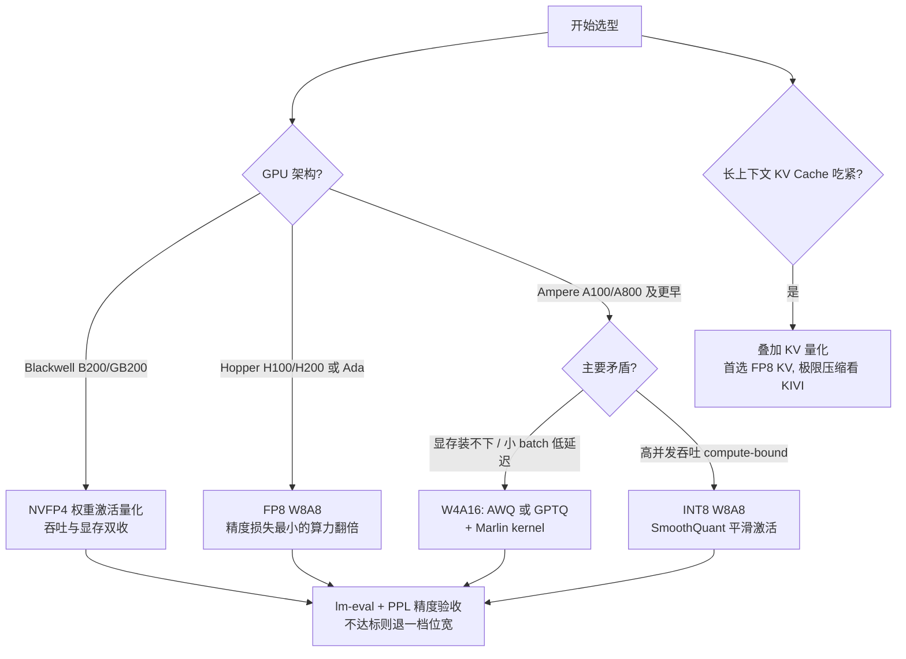

前面几章我们一直在"省显存、提吞吐"的路上打转：PagedAttention 省的是 KV Cache 的碎片，Continuous Batching 榨的是调度的空隙。量化则更直接——把数字本身变小。权重从 FP16 压到 INT4，显存立刻降到四分之一，Decode 读权重的带宽压力也降到四分之一。但"压数字"不是白拿的：激活里藏着的 Outlier 会把朴素量化打得溃不成军，于是有了 SmoothQuant 的等价变换、GPTQ 的二阶误差补偿、AWQ 的显著权重保护，也有了 Hopper/Blackwell 把 FP8/FP4 直接做进 Tensor Core 的硬件答案。这一篇把第 4 章 4.1~4.6 的完整链路一次讲透：量化的数学基础、W8A8 与 INT4 两条路线、KV Cache 量化、低比特浮点格式，最后落到选型决策树和 vLLM 实战。

<!-- more -->

## 📑 目录

- [1. 量化基础：把 FP16 压进低比特](#1-量化基础把-fp16-压进低比特)
- [2. W8A8 与 SmoothQuant：驯服 Activation Outlier](#2-w8a8-与-smoothquant驯服-activation-outlier)
- [3. Weight-only INT4：GPTQ、AWQ 与 Marlin](#3-weight-only-int4gptqawq-与-marlin)
- [4. KV Cache 量化：FP8 KV 与 KIVI](#4-kv-cache-量化fp8-kv-与-kivi)
- [5. FP8 与 MXFP4/NVFP4：低比特浮点的硬件原生时代](#5-fp8-与-mxfp4nvfp4低比特浮点的硬件原生时代)
- [6. 量化选型决策树与 vLLM 实战](#6-量化选型决策树与-vllm-实战)
- [7. 精度评估：量化完怎么知道没量坏](#7-精度评估量化完怎么知道没量坏)
- [总结](#-总结)
- [高频面试题解析](#-高频面试题解析)
- [参考资料](#-参考资料)

---

## 1. 量化基础：把 FP16 压进低比特

### 1.1 对称量化与非对称量化

量化的本体是一个**仿射映射**：把浮点区间 $[x_{\min}, x_{\max}]$ 线性映射到整数区间 $[q_{\min}, q_{\max}]$（INT8 有符号时为 $[-128, 127]$，无符号时为 $[0, 255]$）。两个参数决定这个映射：

- **scale（缩放因子）$s$**：一个整数刻度对应多大的浮点跨度；
- **zero-point（零点）$z$**：浮点数 $0$ 落在整数轴的哪个位置。

**非对称量化（Asymmetric / Affine）**要求浮点区间两端分别映到整数区间两端，联立两个端点条件 $x_{\min} \mapsto q_{\min}$、$x_{\max} \mapsto q_{\max}$ 即可解出：

$$
s = \frac{x_{\max} - x_{\min}}{q_{\max} - q_{\min}}, \qquad
z = \mathrm{round}\!\left(q_{\min} - \frac{x_{\min}}{s}\right)
$$

量化与反量化过程为：

$$
q = \mathrm{clamp}\!\left(\mathrm{round}\!\left(\frac{x}{s}\right) + z,\; q_{\min},\; q_{\max}\right), \qquad
\hat{x} = s \cdot (q - z)
$$

**对称量化（Symmetric）**是它的特例：强制 $z = 0$，即浮点 $0$ 精确映到整数 $0$，量化范围取 $[-\max|x|, +\max|x|]$：

$$
s = \frac{\max|x|}{2^{b-1} - 1} \quad (\text{INT8 时分母为 } 127), \qquad
q = \mathrm{clamp}\!\left(\mathrm{round}\!\left(\frac{x}{s}\right), -127, 127\right)
$$

两者的取舍非常清晰：

| 维度 | 对称量化 | 非对称量化 |
|---|---|---|
| 参数 | 只有 $s$ | $s$ + $z$ |
| 计算开销 | 反量化只乘一次 $s$；矩阵乘无交叉项 | 展开 $(q_x - z_x)(q_w - z_w)$ 会多出含 $z$ 的交叉项，需要预计算或在线补偿 |
| 适合的分布 | 近似零对称（权重、大部分激活） | 明显偏斜或单侧（ReLU/GELU 后的激活、KV Cache 的某些通道） |
| 有效比特利用 | 分布偏斜时浪费一半码点 | 始终占满整数区间 |

📌 **关键点**：工程惯例是**权重用对称、激活视情况用非对称**。权重分布天然近似零均值对称，用对称量化省掉 zero-point 的交叉项，GEMM 内核最干净；激活如果明显偏斜（例如经过 GELU），非对称能少浪费码点。

### 1.2 量化粒度：per-tensor / per-channel / per-group

上面的 $s, z$ 按多大范围共享，就是**量化粒度**。粒度越细，每组的动态范围越窄、误差越小，但 scale 的存储与计算开销越大：

| 粒度 | scale 共享范围 | 一个 $4096 \times 4096$ 权重的 scale 数量 | 特点 |
|---|---|---|---|
| **per-tensor** | 整个张量一个 $s$ | 1 | 最粗，开销最小；一个 outlier 毁掉整个张量的分辨率 |
| **per-channel** | 每个输出通道一个 $s$ | 4096 | 权重量化的主流粒度；通道间幅值差异被隔离 |
| **per-group** | 每个通道内再按 $g$ 个元素分组（常见 $g=128$） | $4096 \times 4096 / 128 = 131072$ | 最细；INT4 量化（GPTQ/AWQ）的标配，进一步压低组内动态范围 |

为什么 group-wise 能进一步降误差？因为量化误差的上界正比于组内动态范围：均匀量化的舍入误差 $|x - \hat{x}| \le s/2$，而 $s \propto \max|x_{\text{group}}|$。把 4096 个元素切成 32 组，每组的 $\max|x|$ 通常远小于全通道的 $\max|x|$，误差随之整体下降。这也是 INT4 这种"码点只有 16 个"的极低比特必须配 per-group 的原因。

⚠️ **注意**：粒度选择受硬件约束。GEMM $Y = XW$ 中，scale 只能挂在**外侧维度**上——$X$ 的 token 维（per-token）、$W$ 的输出通道维（per-channel）——这样整数累加完成后用一个外积形式的 scale 一次性还原。若把 scale 挂在**内侧的归约维度**（$X$ 的 channel 维），累加过程中每个乘积项的 scale 都不同，无法从求和号里提出来，硬件 INT8 GEMM 就废了。这个约束是理解第 2 节 SmoothQuant 的钥匙。

### 1.3 PTQ vs QAT 与校准

按"要不要重新训练"分两大流派：

| 维度 | PTQ（Post-Training Quantization） | QAT（Quantization-Aware Training） |
|---|---|---|
| 做法 | 训练完的模型 + 少量校准数据，直接算 scale/zero-point（可加权重微调如 GPTQ） | 训练中插入伪量化节点（fake quant），用 STE（直通估计器）让梯度穿过 round |
| 成本 | 分钟~小时级，无需训练管线 | 需要完整训练数据与算力，大模型成本极高 |
| 精度 | 8-bit 几乎无损；4-bit 需 GPTQ/AWQ 这类进阶方法 | 极低比特（2~4 bit）下上限更高 |
| LLM 现状 | **绝对主流**（SmoothQuant/GPTQ/AWQ/FP8 全是 PTQ） | 少数场景（端侧极低比特、QLoRA 类训练） |

PTQ 里决定激活 scale 的步骤叫**校准（Calibration）**：喂几百条样本统计激活分布。常见校准算法：

- **MinMax**：直接取观测到的 $\min/\max$，简单但被 outlier 一票否决；
- **Percentile**：取 99.9% 或 99.99% 分位数截断，牺牲极端值换取主体分辨率；
- **KL 散度**（TensorRT 经典做法）：搜索截断阈值，使量化前后分布的 KL 散度最小；
- **MSE**：搜索阈值使 $\|x - \hat{x}\|^2$ 最小。

### 1.4 量化为什么能加速：两条完全不同的收益路径

"量化 = 变快"这个等式成立的机制，在两种瓶颈下完全不同，面试里极易被追问：

**路径一：Memory-bound 场景省带宽。**第 1 章讲过，小 batch Decode 的算术强度极低，每步都要把全部权重从 HBM 搬进片上，时间下界是

$$
T_{\text{step}} \approx \frac{\text{权重字节数} + \text{KV Cache 字节数}}{\text{HBM 带宽}}
$$

把权重从 FP16 压到 INT4，分子直接除以 4——**哪怕计算仍用 FP16 做**（读进来先反量化再算），Decode 延迟也接近线性下降。这就是 Weight-only 量化（W4A16）"多了反量化步骤却更快"的原因：反量化是算力开销，而此时算力大量闲置，省下的是稀缺的带宽。

**路径二：Compute-bound 场景换低精度算力。**大 batch Prefill / 高并发吞吐场景算力才是瓶颈，此时必须让**计算本身**用低精度执行。NVIDIA 官方规格中，同代 Tensor Core 的 INT8/FP8 峰值算力约为 FP16 的 2 倍（Blackwell 上 FP4 又是 FP8 的 2 倍）。要吃到这份算力，激活也必须量化（W8A8、FP8），让 GEMM 真正跑在 INT8/FP8 Tensor Core 上——只量化权重的 W4A16 在这里毫无算力收益，反而多付反量化成本。

📌 **关键点**：**W4A16 赢在带宽（小 batch/Decode），W8A8/FP8 赢在算力（大 batch/Prefill/吞吐）**。搞混这两条路径，选型就会南辕北辙；第 6 节的决策树正是围绕它展开的。

---

## 2. W8A8 与 SmoothQuant：驯服 Activation Outlier

### 2.1 Activation Outlier：为什么激活远比权重难量化

权重量化到 INT8 几乎是免费的——分布规整、静态可离线处理。真正的拦路虎是激活。对 6.7B 以上规模的 LLM，研究（LLM.int8()、SmoothQuant）发现一个系统性现象：

- 激活矩阵中存在**少数固定的通道（channel）**，幅值比其余通道大 **1~2 个数量级**；
- 这些 outlier 通道**持续出现在相同的通道位置**，且随模型规模增大而加剧；
- 但在**同一通道内部**，不同 token 的取值方差反而不大。

这对量化是灾难性的组合：per-tensor 量化时，scale 被 outlier 通道撑大，普通通道被压缩到只剩几个有效码点，精度崩塌。按 1.2 节的粒度思路，理想解法是对激活做 per-channel 量化——可惜激活的 channel 维恰好是 GEMM 的**内侧归约维度**，scale 无法从累加中提出来，硬件不支持（见 1.2 节的注意事项）。可行的 per-token / per-tensor 粒度又治不了"病灶在通道维"的问题。

🔑 **核心矛盾**：激活难量化的方向（channel 维）恰好是硬件量化不了的方向；而权重在这个方向（输入通道维）分布平坦、非常好量化。——那能不能把难度**搬**过去？

### 2.2 SmoothQuant：数学等价的难度迁移

SmoothQuant（Xiao et al., ICML 2023）的答案是一个恒等变换。对线性层 $Y = XW$，插入一个对角矩阵 $\mathrm{diag}(s)$ 和它的逆：

$$
Y = XW = \left(X\,\mathrm{diag}(s)^{-1}\right)\cdot\left(\mathrm{diag}(s)\,W\right) = \hat{X}\hat{W}
$$

其中 $s \in \mathbb{R}^{C_{in}}$ 是逐输入通道的平滑因子。$\hat{X} = X\,\mathrm{diag}(s)^{-1}$ 把激活的第 $j$ 个通道整体除以 $s_j$——outlier 通道被"压平"；$\hat{W} = \mathrm{diag}(s)\,W$ 把对应的权重行乘上 $s_j$——难度被搬进了原本"太好量化、留有余量"的权重里。数学上完全等价，且 $\mathrm{diag}(s)$ 可以**离线折叠**：权重侧直接改权重文件，激活侧折叠进前一个 LayerNorm 的仿射参数，运行时零额外开销。

$s_j$ 取多大？SmoothQuant 用**迁移强度（migration strength）$\alpha$** 控制搬多少难度：

$$
s_j = \frac{\max\left(|X_j|\right)^{\alpha}}{\max\left(|W_j|\right)^{1-\alpha}}
$$

- $\alpha = 1$：难度全部搬给权重（激活各通道幅值完全拉平，权重可能反被搬出 outlier）；
- $\alpha = 0$：不搬（退化为普通量化）；
- $\alpha = 0.5$：论文默认的"甜点"，激活和权重各扛一半，两侧都保持好量化；对 outlier 更严重的模型（如 GLM-130B），论文用 $\alpha = 0.75$。

变换之后，激活和权重都能用**硬件友好的粗粒度**（激活 per-tensor 或 per-token、权重 per-channel）量化到 INT8，整条 GEMM 跑在 INT8 Tensor Core 上——这就是 **W8A8** 路线：权重 8-bit、激活 8-bit，吃满第 1.4 节的"路径二"算力红利。

### 2.3 W8A8 的工程形态

落地时激活 scale 有两种取法：

- **静态（static）**：校准阶段离线确定激活 scale，运行时零统计开销，但对分布漂移敏感；
- **动态（dynamic per-token）**：运行时对每个 token 现算 $\max|x|$，精度更稳，多一点 kernel 开销。当前 llm-compressor / vLLM 生态的 INT8 W8A8 默认即"权重 per-channel 静态 + 激活 per-token 动态"。

💡 **提示**：面试常问"如何判断一个模型适不适合 SmoothQuant / 该看哪个维度的激活分布"。答案藏在原理里：SmoothQuant 治的是**输入通道维（input channel）**的 outlier——去逐层画激活在 channel 维的幅值分布，若少数固定通道显著突出且跨 token 稳定，SmoothQuant 就有效；若 outlier 随 token 位置游走（token 维异常），平滑因子是静态的、按通道生效的，就治不了。

---

## 3. Weight-only INT4：GPTQ、AWQ 与 Marlin

### 3.1 为什么 Weight-only 可以更激进

W8A8 的收益在算力，权重激活必须一起量。而 Weight-only 路线（W4A16：权重 4-bit、激活保持 FP16）的收益全在带宽和显存，激活根本不动——这带来两个自由度：

- 权重是静态的，可以离线用重型算法（二阶信息、搜索）精雕细刻，压到 4-bit 甚至 3-bit；
- 激活保持 FP16，outlier 问题不存在，计算仍走 FP16 Tensor Core。

为什么权重敢 4-bit、激活却大多不敢？权重离线可优化、误差可补偿（下文 GPTQ）；激活是运行时动态产生的、带 outlier、只能在线量化，4-bit 的 16 个码点根本盖不住其动态范围。所以 W4A4 至今仍是研究前沿，而 W4A16 已是生产标配。

INT4 的 16 个码点毕竟太少，朴素 RTN（Round-To-Nearest，逐元素就近取整）在大模型上损失明显。GPTQ 和 AWQ 是两条互相独立的精度拯救路线。

### 3.2 GPTQ：基于二阶信息的逐列量化与误差补偿

GPTQ（Frantar et al., ICLR 2023）继承自剪枝领域的 OBS/OBQ（Optimal Brain Quantization）思想，把量化建模为**逐层的重构优化问题**：量化后的 $\hat{W}$ 要让本层输出变化最小，而不是让权重本身变化最小：

$$
\arg\min_{\hat{W}} \left\| WX - \hat{W}X \right\|_F^2
$$

这个目标的二阶信息是 Hessian $H = 2XX^\top$（$X$ 为校准集上收集的本层输入，各行独立同构）。OBQ 的经典结论：量化掉权重 $w_q$ 后，对**尚未量化**的其余权重施加一次最优补偿，可以最大限度吸收这次量化的损失：

$$
\delta_F = -\,\frac{w_q - \mathrm{quant}(w_q)}{[H_F^{-1}]_{qq}}\cdot (H_F^{-1})_{:,q}
$$

直觉：某个权重被 round 造成的输出扰动，用其余权重的微调"补"回来——量化误差不是各元素独立叠加，而是被一路向后传递、消化。

OBQ 逐元素贪心选序，复杂度撑不起百亿参数。GPTQ 的三个工程化改造使其真正可用于 LLM：

1. **固定列序**：放弃贪心排序，所有行按同一列顺序量化——精度损失很小，但 Hessian 逆的更新从每行一份变成全层共享一份，复杂度骤降；
2. **Lazy Batch 更新**：补偿以 128 列为块延迟批量应用，把访存零碎的 rank-1 更新变成算力友好的块操作；
3. **Cholesky 分解**：用 Cholesky 预分解代替反复的逆矩阵迭代更新，解决大矩阵下的数值稳定性问题。

论文报告以 128 条校准样本、约 4 GPU 小时即可量化 OPT-175B 到 3~4 bit。GPTQ 的特征画像：**精度上限高（尤其 3-bit 等极限比特），但依赖校准集的重构优化，存在对校准分布过拟合的风险**。

### 3.3 AWQ：按激活幅值保护显著权重

AWQ（Lin et al., MLSys 2024）从另一个观察出发：权重的重要性极不均匀，**约 0.1%~1% 的权重通道贡献了绝大部分精度**——而且判断哪些通道显著，看的不是权重自身的大小，而是**对应激活的幅值**（激活大的输入通道，权重误差被放大得最厉害）。论文实验：把这 1% 显著通道保持 FP16，量化困惑度损失大幅收窄。

但"1% FP16 + 99% INT4"的混合精度在硬件上很难受：同一 GEMM 内两种位宽，访存对齐和 kernel 都被搅乱。AWQ 的解法与 SmoothQuant 异曲同工——**用等价缩放代替混合精度**。对显著通道的权重乘上 $s > 1$、激活除以 $s$，数学等价；而量化误差分析显示这一乘一除是净赚的：

$$
\mathrm{Err}\left(Q(w s)\cdot \frac{x}{s}\right) = \Delta' \cdot \mathrm{RoundErr} \cdot \frac{x}{s}
\approx \frac{\Delta' }{\Delta}\cdot\frac{1}{s}\cdot \mathrm{Err}\left(Q(w)\, x\right)
$$

其中 $\Delta = \max|w| / 2^{b-1}$ 是量化步长。只放大 1% 的通道，组内最大值 $\max|w|$ 大概率不变，故 $\Delta' \approx \Delta$，显著权重的相对误差近似缩小为 $1/s$。缩放系数不做逐通道自由搜索，而是参数化为 $s = s_X^{\alpha}$（$s_X$ 为通道平均激活幅值），对 $\alpha \in [0,1]$ 网格搜索最小化输出 MSE。AWQ 不做权重重构、无反向传播，只统计激活幅值——**对校准集的依赖极弱，泛化性好，量化速度快**，配 group size 128 的 per-group INT4 成为社区发布量化模型的事实标准。

### 3.4 GPTQ vs AWQ 对比

| 维度 | GPTQ | AWQ |
|---|---|---|
| 核心思想 | 二阶信息（Hessian）指导的逐列量化 + 误差补偿 | 激活幅值识别显著通道 + 等价缩放保护 |
| 是否改权重值 | 是（重构优化，量化后的权重 ≠ round(原权重)） | 只做逐通道缩放后 RTN |
| 校准集角色 | 构造 Hessian、参与重构目标（依赖较强） | 只统计激活幅值（依赖弱、不易过拟合） |
| 量化耗时 | 较长（逐列迭代 + 补偿） | 较短（统计 + 网格搜索） |
| 精度特征 | 极限比特（3-bit）上限更高 | 4-bit 下稳、跨任务泛化好 |
| 生态 | GPTQModel/llm-compressor，vLLM 原生支持 | AutoAWQ/llm-compressor，vLLM 原生支持 |

两者不互斥：都输出 per-group INT4 权重格式，推理侧共用同一类 W4A16 kernel——这就轮到 Marlin 出场。

### 3.5 Marlin：W4A16 kernel 为什么快

W4A16 的理论收益是权重读取量降为 1/4，但朴素实现常常兑现不了：反量化指令、共享内存 bank conflict、访存与计算无法重叠，都会把省下的带宽吃回去，batch 稍大就掉回 FP16 的速度。Marlin（Frantar et al., IST Austria）是把 W4A16 混合精度 GEMM 做到**接近带宽理论上限**的 kernel，核心手段：

- **反量化与 GEMM 深度融合**：INT4 权重以 `cp.async` 异步拷贝进共享内存，在寄存器上用位运算批量解包、反量化，直接落成 Tensor Core fragment 需要的排布，全程不落回全局内存；
- **离线重排权重布局**：量化时就把权重按 Tensor Core 的 fragment 顺序重排，运行时零 shuffle、无 bank conflict；
- **多级流水线（software pipelining）**：全局内存→共享内存→寄存器→Tensor Core 四级重叠，double buffering 让"搬下一块权重"藏在"算当前块"的影子里；
- **Striped 分片调度**：把 GEMM 按条带切给各 SM，弥合小 batch 下的负载不均。

效果（论文/官方仓库口径）：在 memory-bound 区间实现接近 4×（即权重压缩比的理论上限）的加速，且能把这一优势维持到 batch 16~32 的中等规模，而此前的 W4A16 kernel 往往在 batch 增大后迅速退化。vLLM 检测到 Ampere 及以上架构时会自动把 GPTQ/AWQ 模型路由到 `gptq_marlin` / `awq_marlin` 后端。

📌 **关键点**：串起 1.4 节回答"AWQ 多了反量化为什么还能加速"：小 batch Decode 是 memory-bound，权重字节数除以 4 省的是瓶颈资源（带宽），反量化花的是过剩资源（算力）；而 Marlin 的全部工程都在保证"省下的带宽不被反量化的实现开销偷走"。

---

## 4. KV Cache 量化：FP8 KV 与 KIVI

### 4.1 为什么 KV Cache 是量化的好靶子

长上下文与高并发场景中，KV Cache 会反超权重成为显存主项。每 token 的 KV 字节数：

$$
\text{KV bytes/token} = 2 \times L \times H_{kv} \times d_{head} \times \text{sizeof(dtype)}
$$

以 Llama-3.1-8B 为例（$L=32$ 层、$H_{kv}=8$ 个 KV 头、$d_{head}=128$）：FP16 下每 token $2 \times 32 \times 8 \times 128 \times 2\,\text{B} = 128\,\text{KB}$，128K 上下文的单条请求就是 16 GB。量化到 FP8 直接砍半（64 KB/token，8 GB），INT2（KIVI）理论上可到 1/8。收益是双重的：**容量**（同样显存装下更大 batch / 更长上下文，吞吐直接受益）和**带宽**（Decode 的 Attention 读 KV 是 memory-bound，读得少就快）。

### 4.2 FP8 KV Cache：工程上最顺手的一步

把 KV 存成 FP8（E4M3 或 E5M2，格式细节见第 5 节）是当前性价比最高的 KV 量化：精度损失通常可忽略，vLLM 一个参数开启（`--kv-cache-dtype fp8`）。注意 E4M3 动态范围较窄，配合校准出的 per-tensor scale 效果更好（vLLM 提供 `--calculate-kv-scales`，或从量化 checkpoint 里读取 K/V scale），E5M2 则可裸跑。

### 4.3 KIVI：Key 和 Value 为什么要区别对待

想压到 2-bit，就必须直面 KV 的分布结构。KIVI（Liu et al., ICML 2024）对各层 KV 做了系统的分布分析，结论是 K 和 V **长得完全不一样**：

- **Key cache 存在明显的 outlier 通道**：少数固定 channel 幅值显著偏大（与第 2.1 节激活 outlier 同源——K 本就是激活 $XW_K$ 的产物）。若按 token 量化，每个 token 的 scale 都被自己的 outlier 通道撑爆；只有**per-channel 量化**（同一 channel、跨 token 共享 scale）才能把 outlier 隔离在自己的通道组里。
- **Value cache 没有明显 outlier 模式**，但它在 Attention 里的角色是被 $\mathrm{softmax}(QK^\top)$ 的注意力权重**逐 token 加权求和**。**per-token 量化**让每个 token 的 value 向量误差独立有界，加权求和时误差不会跨 token 串扰放大；且注意力权重高度稀疏（质量集中在少数 token），单 token 的量化误差对输出影响被权重进一步稀释。

于是 KIVI 的不对称设计：**Key per-channel + Value per-token**，2-bit、组大小 32。还有一个由此派生的工程细节：per-channel 量化需要沿 token 维攒满一组才能算 scale，而自回归生成一次只来一个 token——KIVI 为此维护一个 FP16 的 **residual 滑动窗口**（论文默认 128 token），最近的 KV 保持全精度，攒满一组再批量量化落盘；这个窗口同时保住了"最近 token 注意力权重通常最高"的关键信息。

| 维度 | Key cache | Value cache |
|---|---|---|
| 分布特征 | 少数固定 outlier 通道 | 无明显 outlier |
| 量化维度 | per-channel（跨 token 共享 scale） | per-token（每 token 独立 scale） |
| 原因 | 隔离 outlier 通道 | 误差随注意力加权求和不串扰 |
| 流式代价 | 需攒组 + FP16 residual 窗口 | 新 token 即到即量 |

---

## 5. FP8 与 MXFP4/NVFP4：低比特浮点的硬件原生时代

### 5.1 FP8：E4M3 与 E5M2

INT8 的码点是均匀分布的；浮点格式的码点密度随幅值指数衰减——**小数密、大数疏**，天然贴合神经网络长尾分布，对 outlier 的容忍度远高于同位宽整数。Hopper 起 Tensor Core 原生支持两种 FP8：

| 格式 | 位分配（S/E/M） | 最大正规值 | 特殊值 | 定位 |
|---|---|---|---|---|
| **E4M3** | 1/4/3 | 448 | 无 Inf，仅保留 NaN | 精度优先：权重、激活、KV Cache（推理主力） |
| **E5M2** | 1/5/2 | 57344 | 有 Inf/NaN，接近 IEEE 半精度截断 | 范围优先：训练中的梯度 |

一句话记忆：**E4M3 用 1 个指数位换 1 个尾数位，精度高、范围窄；E5M2 反之**。推理量化（vLLM 的 fp8）默认 E4M3。FP8 量化仍需要 scale（把张量幅值缩放进格式的表示范围），但通常**不需要 zero-point**——浮点码点本身关于零对称。Hopper 的 Transformer Engine 与推理框架均以"高精度累加（FP16/FP32）+ per-tensor/per-channel scale"的方式使用 FP8 Tensor Core，官方规格下峰值算力约为 FP16 的 2 倍。

### 5.2 Microscaling：MXFP4 与 NVFP4

4-bit 浮点（FP4，E2M1）全部码点只有 $\pm\{0, 0.5, 1, 1.5, 2, 3, 4, 6\}$ 十六个，单靠一个粗粒度 scale 根本盖不住 LLM 张量。Blackwell 一代的答案是把 **per-group 粒度做进硬件数据格式**——微缩放（Microscaling）块格式：一小块元素共享一个随数据一起存储的硬件级 scale，Tensor Core 在计算时自动应用。

| 维度 | MXFP4（OCP 标准） | NVFP4（NVIDIA） |
|---|---|---|
| 元素格式 | FP4 E2M1 | FP4 E2M1 |
| 块大小 | 32 | **16**（粒度更细） |
| 块 scale 格式 | E8M0（8-bit 纯指数，只能取 2 的幂） | **FP8 E4M3**（带尾数，可取分数值） |
| 第二级 scale | 无 | 每张量一个 FP32 scale |
| 平均位宽 | 4 + 8/32 = 4.25 bit | 4 + 8/16 (+FP32/张量) ≈ 4.5 bit |
| 硬件 | Blackwell Tensor Core 原生 | Blackwell Tensor Core 原生 |

NVFP4 的两处改进都冲着精度去：块从 32 缩到 16，组内动态范围更窄（1.2 节的逻辑）；块 scale 从"只能取 2 的幂"的 E8M0 换成带尾数的 E4M3，缩放能精确对准块内最大值而不是向上取整到最近的 2 的幂，再用一级 per-tensor FP32 scale 把 E4M3 scale 自身的表示范围问题兜住。这也回答了"FP4 时代数据分布越均匀越好是否仍成立"的追问：浮点码点本身非均匀（零附近密集），配上细粒度块 scale 后，FP4 反而偏好"长尾但块内相对集中"的分布，均匀分布会浪费其非均匀码点。

💡 **提示**：注意梳理"格式—硬件"对应关系：**INT8/INT4 各代 GPU 通用（INT4 靠 Marlin 这类软件 kernel 反量化）；FP8 需要 Hopper/Ada 及以后；MXFP4/NVFP4 需要 Blackwell**。选型永远从"卡是什么"问起。

---

## 6. 量化选型决策树与 vLLM 实战

### 6.1 决策树



文字版规则：**精度优先 → W8A8（有 Hopper 用 FP8，没有用 INT8+SmoothQuant）；省显存/单卡塞大模型/小 batch 延迟 → INT4 AWQ/GPTQ + Marlin；长上下文 → 叠加 KV Cache 量化；Blackwell → NVFP4**。各路线可组合（如 W4A16 + FP8 KV）。

### 6.2 vLLM 的量化生态

vLLM 通过 `--quantization`（`-q`）参数与 checkpoint 里的 `quantization_config` 支持主流格式，常用取值：`awq` / `awq_marlin`、`gptq` / `gptq_marlin`、`fp8`、`compressed-tensors`、`bitsandbytes` 等。两点生态常识：

- **compressed-tensors** 是 vLLM 官方配套压缩库 **llm-compressor** 产出的统一 checkpoint 格式，一种格式承载 W8A8-INT8、W8A8-FP8、W4A16 等多种方案，是 vLLM 系的"标准量化封装"；
- 加载社区量化模型通常**不需要**手动指定 `--quantization`——vLLM 会读 config 自动识别，并在 Ampere+ 上自动升级到 Marlin kernel。

### 6.3 实战命令

```bash
# 1) 直接加载社区量化好的 AWQ / GPTQ 模型（自动识别格式与 Marlin 路由）
vllm serve Qwen/Qwen2.5-7B-Instruct-AWQ

# 2) Hopper 卡上在线 FP8 量化：加载 FP16 权重，启动时现场量化为 W8A8-FP8
#    （无需校准集：权重 per-channel scale + 激活 dynamic per-token scale）
vllm serve meta-llama/Llama-3.1-8B-Instruct --quantization fp8

# 3) 叠加 FP8 KV Cache（可与任意权重量化组合）
vllm serve meta-llama/Llama-3.1-8B-Instruct \
    --quantization fp8 \
    --kv-cache-dtype fp8 \
    --calculate-kv-scales
```

离线产出高质量量化模型用 llm-compressor。INT8 W8A8 的标准配方就是本文第 2、3 节的组合——SmoothQuant 平滑激活 + GPTQ 量化权重：

```python
from llmcompressor import oneshot
from llmcompressor.modifiers.smoothquant import SmoothQuantModifier
from llmcompressor.modifiers.quantization import GPTQModifier

recipe = [
    # smoothing_strength 即第 2 节的迁移强度 alpha
    SmoothQuantModifier(smoothing_strength=0.8),
    GPTQModifier(targets="Linear", scheme="W8A8", ignore=["lm_head"]),
]

oneshot(
    model="meta-llama/Llama-3.1-8B-Instruct",
    dataset="open_platypus",          # 校准集
    recipe=recipe,
    max_seq_length=2048,
    num_calibration_samples=512,
    output_dir="Llama-3.1-8B-Instruct-W8A8",
)
```

FP8 动态量化更简单，不需要校准数据：

```python
from llmcompressor import oneshot
from llmcompressor.modifiers.quantization import QuantizationModifier

recipe = QuantizationModifier(
    targets="Linear", scheme="FP8_DYNAMIC", ignore=["lm_head"]
)
oneshot(
    model="meta-llama/Llama-3.1-8B-Instruct",
    recipe=recipe,
    output_dir="Llama-3.1-8B-Instruct-FP8-Dynamic",
)
```

产出目录即 compressed-tensors 格式，`vllm serve ./Llama-3.1-8B-Instruct-FP8-Dynamic` 直接起服务。

---

## 7. 精度评估：量化完怎么知道没量坏

量化模型上线前必须过精度关，两类互补的评估缺一不可：

**Perplexity（困惑度）**：在 WikiText-2 / C4 等语料上算 PPL，与 FP16 基线对比。优点是便宜、敏感，量化论文的通用"烟雾测试"；缺点是它衡量的是逐 token 的语言建模损失，**PPL 几乎不变 ≠ 下游能力无损**——数学、代码这类对个别关键 token 极敏感的任务，往往在 PPL 看不出差异时已经掉点。

**下游任务评测**：用 lm-evaluation-harness（lm-eval）跑与业务相关的任务集，且 vLLM 可直接作为它的推理后端——评的就是将要上线的那条推理路径：

```bash
pip install lm-eval

lm_eval --model vllm \
    --model_args pretrained=./Llama-3.1-8B-Instruct-W8A8,gpu_memory_utilization=0.8 \
    --tasks gsm8k,mmlu \
    --num_fewshot 5 \
    --batch_size auto
```

实践要点：

- **先 PPL 后任务**：PPL 大幅劣化直接打回，省得浪费评测算力；PPL 正常再上任务集；
- **挑敏感任务当金丝雀**：GSM8K（数学推理）对量化误差最敏感，比 MMLU 这类选择题更早暴露问题；
- **对比要同框架同配置**：FP16 基线也用 vLLM 跑，排除采样参数、prompt 模板的干扰；
- **精度掉点的排查顺序**：先查是不是个别层误差爆炸（逐层对比量化前后输出的 MSE/余弦相似度）→ 把 `lm_head`、embedding 及误差大的层排除出量化范围 → 换校准集或加大样本量 → 细化粒度（per-tensor → per-token/per-group）→ 退位宽。

---

## 📝 总结

- 量化的数学骨架是仿射映射：非对称量化由 $s = \frac{x_{\max}-x_{\min}}{q_{\max}-q_{\min}}$、$z = \mathrm{round}(q_{\min} - x_{\min}/s)$ 决定；对称量化取 $z=0$。粒度从 per-tensor 到 per-channel 到 per-group 逐级细化，误差与开销同向增长。
- 加速有两条独立路径：**memory-bound 省带宽**（W4A16，Decode/小 batch）与 **compute-bound 换低精度算力**（W8A8/FP8，Prefill/高并发）。
- 激活的 outlier 集中在少数固定通道、幅值大 1~2 个数量级，而 per-channel 恰是硬件量化不了的方向；SmoothQuant 用 $Y=(X\mathrm{diag}(s)^{-1})(\mathrm{diag}(s)W)$ 的恒等变换按强度 $\alpha$ 把难度迁给权重。
- INT4 两大流派：GPTQ 靠 Hessian 二阶信息逐列量化 + 误差补偿，极限比特上限高；AWQ 按激活幅值找出 ~1% 显著通道、用等价缩放保护，泛化好速度快。Marlin 用反量化-GEMM 融合 + 流水线把 W4A16 做到接近 4× 的带宽理论上限。
- KV Cache 量化：FP8 KV 是低垂果实；KIVI 依据"Key 有 outlier 通道、Value 无"做出 per-channel Key + per-token Value 的不对称 2-bit 设计。
- FP8 双格式各司其职（E4M3 精度/推理，E5M2 范围/梯度）；Blackwell 把 per-group scale 做进硬件成为 MXFP4（块 32、E8M0 scale）与 NVFP4（块 16、E4M3 scale + FP32 二级 scale）。
- 选型口诀：精度优先 W8A8、省显存 INT4、长上下文叠 KV 量化、Hopper 上 FP8、Blackwell 上 NVFP4；vLLM + llm-compressor（compressed-tensors）是落地主干道，上线前 PPL + lm-eval 双重验收。

---

## 🎯 高频面试题解析

以下题目全部来自本仓库 `docs/interview/` 收录的真实面经。

**Q1：per-tensor、per-channel、per-group 三种量化粒度有什么区别？哪种最细？**（智谱 AI Infra 实习一面）
按 scale 共享范围递减：per-tensor 整个张量一个 scale；per-channel 每个输出通道一个；per-group 在通道内再按组（常见 128 元素）切分，**per-group 最细**。粒度越细，组内动态范围越窄、量化误差越小（误差上界 $s/2 \propto \max|x_{\text{group}}|$），代价是 scale 存储与反量化开销增加。INT4 必配 per-group，W8A8 典型为权重 per-channel + 激活 per-token。（呼应第 1.2 节）

**Q2：SmoothQuant 的原理是什么？为什么需要 Smooth？超参数如何确定？判断模型是否适合时看 input channel 还是 output channel？**（快手 AI Infra 实习一面）
LLM 激活存在固定通道的 outlier（幅值大 1~2 个数量级），而激活的 channel 维是 GEMM 归约维、硬件无法 per-channel 量化，直接 W8A8 精度崩塌，所以要 Smooth。原理是恒等变换 $Y=(X\mathrm{diag}(s)^{-1})(\mathrm{diag}(s)W)$，把激活难度迁给好量化的权重；超参数 $\alpha$ 由 $s_j = \max|X_j|^{\alpha}/\max|W_j|^{1-\alpha}$ 控制迁移强度，默认 0.5，outlier 严重的模型（GLM-130B）取 0.75，工程上小网格搜索验证。判断适用性看**input channel**（激活的通道维 = 权重的输入通道维）：outlier 需固定集中在少数输入通道且跨 token 稳定，静态的按通道平滑才有效。（呼应第 2 节）

**Q3：AWQ 和 GPTQ 的原理分别是什么？二者有何区别？**（快手 AI Infra 实习一面；百度 AI Infra 实习一面亦考）
GPTQ：把量化建模为逐层重构问题 $\min\|WX-\hat{W}X\|_F^2$，用 Hessian $H=2XX^\top$ 的二阶信息逐列量化，每列的误差通过 $\delta_F = -\frac{w_q-\mathrm{quant}(w_q)}{[H_F^{-1}]_{qq}}(H_F^{-1})_{:,q}$ 补偿到未量化权重上，配合固定列序、Lazy Batch、Cholesky 三个工程化改造。AWQ：按激活幅值（而非权重大小）识别 ~1% 显著权重通道，用等价缩放（放大权重 $s$、缩小激活 $1/s$）把其相对误差压到约 $1/s$，避免混合精度，$s$ 由 $\alpha$ 网格搜索确定。区别：GPTQ 改权重值做重构、校准依赖强、极限比特上限高；AWQ 只做缩放 + RTN、校准依赖弱、泛化好速度快。（呼应第 3.2~3.4 节）

**Q4：AWQ 等量化方式增加了反量化步骤，为什么整体推理仍能加速？**（蚂蚁 AI Infra 实习一面）
小 batch Decode 是 memory-bound，每步时间 ≈ 权重字节数 / HBM 带宽，算力大量闲置。W4A16 把权重读取量压到 1/4，省的是瓶颈资源（带宽）；反量化花的是过剩资源（算力），且 Marlin 类 kernel 把反量化融合进 GEMM 主循环、用异步拷贝和多级流水线将其完全藏进访存影子里，最终逼近 4× 的理论加速。反例同样重要：compute-bound 的大 batch Prefill 下 W4A16 无算力收益、反量化成为净开销，这时应选 W8A8/FP8。（呼应第 1.4、3.5 节）

**Q5：W8A8、W4A16 分别代表什么？为什么权重量化到 4-bit 时，激活大多仍保持较高精度？**（蚂蚁 AI Infra 实习一面）
W/A 后的数字是权重/激活位宽：W8A8 = 权重激活都 INT8（或 FP8），GEMM 跑低精度 Tensor Core，赚算力；W4A16 = 仅权重 INT4、激活 FP16，赚带宽和显存。激活不敢 4-bit 的原因：激活是运行时动态产生的，带 1~2 个数量级的 outlier 通道，只能在线量化、无法离线精雕或误差补偿，16 个码点覆盖不了其动态范围；权重则静态、分布规整，可用 GPTQ/AWQ 离线优化到 4-bit 仍保精度。（呼应第 1.4、2.1、3.1 节）

**Q6：FP8 的 E4M3 与 E5M2 有什么区别？如何计算 FP8 存储时的 KV Cache 大小？**（科大讯飞 飞星 AI Infra 校招）
E4M3：1 符号 + 4 指数 + 3 尾数，最大正规值 448，无 Inf，精度优先，用于权重/激活/KV Cache；E5M2：1+5+2，最大 57344，保留 Inf/NaN，范围优先，用于训练梯度。KV Cache 大小 = $2 \times L \times H_{kv} \times d_{head} \times S \times B \times 1\,\text{Byte}$（K 和 V 各一份、层数、KV 头数、头维、序列长、batch，FP8 每元素 1 字节）。如 Llama-3.1-8B（32 层、8 KV 头、head_dim 128）每 token 64 KB，是 FP16 的一半。（呼应第 4.1、5.1 节）

**Q7：Weight-only 量化有哪些方案？是否了解 Marlin kernel，它为什么快？**（AI Infra 综合面经题库）
方案按算法分：RTN（朴素就近取整）、GPTQ（二阶重构）、AWQ（显著通道缩放保护），格式上以 per-group INT4 为主流，也有 NF4（QLoRA）等非均匀码本。Marlin 是把 W4A16 GEMM 做到带宽理论上限的 kernel，四个关键：反量化与 GEMM 融合（INT4 在寄存器解包、直接落成 Tensor Core fragment 排布）；离线按 fragment 顺序重排权重，消除 shuffle 与 bank conflict；`cp.async` + 多级流水线让访存与计算全程重叠；striped SM 分片保证小 batch 下的负载均衡。因此它能把接近 4× 的加速维持到 batch 16~32，而朴素 kernel 早已退化。（呼应第 3.5 节）

**Q8：场景题——数据分布极不均匀（最小值 -10000，其余集中在 [-1,1]），应选什么量化方案？**（摩尔线程 AI Infra 实习二面）
这是典型的 outlier 主导分布，直接 MinMax 对称量化时 $s = 10000/127$，主体区间 $[-1,1]$ 只能落在 0 附近的同一个码点上，信息全灭。可选思路按代价递增：（1）截断校准：percentile / KL / MSE 搜索阈值，牺牲极端值保主体分辨率；（2）细化粒度：per-channel/per-group 把 outlier 隔离在自己组内；（3）难度迁移：outlier 若固定在少数通道，用 SmoothQuant 式等价缩放压平；（4）换非均匀码点的浮点格式（FP8/FP16 保存 outlier 部分），或按 LLM.int8() 思路把 outlier 通道拆出来走高精度分支。核心原则：**先诊断 outlier 是否结构化（固定通道 vs 随机），再决定截断、隔离还是迁移**。（呼应第 1.3、2 节）

---

## 📚 参考资料

- [SmoothQuant: Accurate and Efficient Post-Training Quantization for Large Language Models（ICML 2023）](https://arxiv.org/abs/2211.10438)
- [LLM.int8(): 8-bit Matrix Multiplication for Transformers at Scale（NeurIPS 2022）](https://arxiv.org/abs/2208.07339)
- [GPTQ: Accurate Post-Training Quantization for Generative Pre-trained Transformers（ICLR 2023）](https://arxiv.org/abs/2210.17323)
- [AWQ: Activation-aware Weight Quantization for LLM Compression and Acceleration（MLSys 2024）](https://arxiv.org/abs/2306.00978)
- [Marlin: Mixed-Precision Auto-Regressive Parallel Inference on Large Language Models](https://arxiv.org/abs/2408.11743)
- [KIVI: A Tuning-Free Asymmetric 2bit Quantization for KV Cache（ICML 2024）](https://arxiv.org/abs/2402.02750)
- [FP8 Formats for Deep Learning（NVIDIA/ARM/Intel）](https://arxiv.org/abs/2209.05433)
- [OCP Microscaling Formats (MX) Specification](https://www.opencompute.org/documents/ocp-microscaling-formats-mx-v1-0-spec-final-pdf)
- [NVIDIA Blog: Introducing NVFP4 for Efficient and Accurate Low-Precision Inference](https://developer.nvidia.com/blog/introducing-nvfp4-for-efficient-and-accurate-low-precision-inference/)
- [vLLM Docs — Quantization](https://docs.vllm.ai/en/latest/features/quantization/)
- [llm-compressor（vLLM 官方压缩库，compressed-tensors 格式）](https://github.com/vllm-project/llm-compressor)
- [EleutherAI lm-evaluation-harness](https://github.com/EleutherAI/lm-evaluation-harness)
