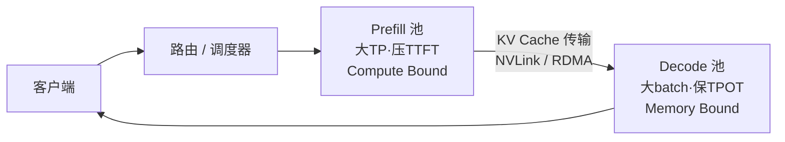

一次 LLM 推理请求的一生分成两段：Prefill 把整个 prompt 一口气算完、生成 KV Cache 和第一个 Token；Decode 拿着 KV Cache 一个 Token 一个 Token 往外吐。这两段跑的是同一个模型、同一套权重，计算特性却是两个极端——一个把 GPU 算力吃满，一个把显存带宽吃满。把它们塞进同一张卡的同一个 batch 里，就像让短跑运动员和马拉松选手在同一条跑道上按同一配速跑：谁也跑不出自己的最佳成绩。PD 解耦（Prefill/Decode Disaggregation）的答案是干脆给两人各修一条跑道。这一节把这套架构讲透：干扰的根源在哪、分离换来了什么、KV Cache 怎么在两个池子之间搬、P 和 D 的比例怎么定，以及 vLLM、SGLang、Mooncake、Dynamo 各自怎么落地——最后同样重要的：什么时候不该用它。

<!-- more -->

## 📑 目录

- [1. Prefill 与 Decode：两种截然不同的负载画像](#1-prefill-与-decode两种截然不同的负载画像)
- [2. 混布的代价：TTFT 与 TPOT 的拉扯](#2-混布的代价ttft-与-tpot-的拉扯)
- [3. PD 分离：核心思想与 Goodput 收益](#3-pd-分离核心思想与-goodput-收益)
- [4. KV Cache 传输：解耦架构的工程命门](#4-kv-cache-传输解耦架构的工程命门)
- [5. P 与 D 的配比：xPyD 怎么定](#5-p-与-d-的配比xpyd-怎么定)
- [6. 异构硬件 PD：让 P 和 D 各用各的卡](#6-异构硬件-pd让-p-和-d-各用各的卡)
- [7. 代表系统盘点](#7-代表系统盘点)
- [8. 与 Prefix Cache 的协同](#8-与-prefix-cache-的协同)
- [9. 什么时候不该用 PD 分离](#9-什么时候不该用-pd-分离)
- [总结](#-总结)
- [自我检验清单](#-自我检验清单)
- [高频面试题解析](#-高频面试题解析)
- [参考资料](#-参考资料)

---

## 1. Prefill 与 Decode：两种截然不同的负载画像

判断一段计算是算力瓶颈还是访存瓶颈，看**算术强度**（Arithmetic Intensity）：每从显存搬一个字节，能做多少次浮点运算：

$$
I = \frac{\text{FLOPs}}{\text{访存字节数}}
$$

把它与 GPU 的"平衡点"比较（Roofline 模型）：$I^* = \dfrac{\text{峰值算力}}{\text{显存带宽}}$。以 H100 SXM 为例，FP16 稠密算力约 989 TFLOPS、HBM3 带宽约 3.35 TB/s，平衡点 $I^* \approx 295$ FLOPs/Byte——算术强度低于这个值的计算，算力再强也只能等数据。

- **矩阵乘 $[s, h] \times [h, h]$**（Prefill 的形态）：FLOPs 约 $2sh^2$，访存约 $2h^2$ 字节（权重为主，FP16），$I \approx s$。prompt 上千 Token 时 $I \gg I^*$，稳稳落在算力瓶颈区。
- **向量乘 $[1, h] \times [h, h]$**（Decode 的形态）：FLOPs 约 $2h^2$，访存仍是 $2h^2$ 字节，$I \approx 1$——离平衡点差两个数量级，注定是访存瓶颈；batch 到 $b$ 也只是 $I \approx b$，要逼近平衡点需要数百并发。

**Prefill** 一次前向处理 $s$ 个 Token（$s$ 可达数千上万），权重读一次被 $s$ 个 Token 复用，矩阵乘是"大矩阵 × 大矩阵"，算术强度极高——GPU 的 Tensor Core 被真正吃满，是 **Compute Bound**。它的性能指标是 **TTFT**（Time To First Token）：prompt 越长，Prefill 的计算量越大（线性层 FLOPs 随 $s$ 线性、attention 随 $s^2$），TTFT 越长。

**Decode** 每步只处理 1 个新 Token，却要把**全部权重 + 该请求全部历史 KV Cache** 从 HBM 读一遍，矩阵乘退化成"向量 × 矩阵"，每字节数据只做 $O(1)$ 次运算——算力大量闲置，瓶颈是显存带宽，是 **Memory Bound**。它的性能指标是 **TPOT**（Time Per Output Token）：上下文越长、并发 KV 越多，每步要搬的数据越多，TPOT 越差。提高 Decode 效率的唯一正道是攒大 batch，让一次权重搬运服务更多请求。

| 📊 维度 | Prefill | Decode |
|---|---|---|
| 单请求单步处理 Token 数 | 整个 prompt（数百到数万） | 1 |
| 瓶颈 | 算力（Compute Bound） | 显存带宽（Memory Bound） |
| 算术强度 | 高（权重复用 $s$ 次） | 低（权重复用 1 次/请求） |
| 关键指标 | TTFT | TPOT |
| 喜欢的 batch 形态 | 少量请求就能吃满算力 | 越大越好，靠并发摊薄访存 |
| 显存行为 | 生产 KV Cache | 持有并持续增长 KV Cache |
| 单步耗时 | 百毫秒到秒级 | 十毫秒量级 |

📌 **关键点**：两个阶段对资源的诉求是**正交甚至对立**的——Prefill 想要算力，来几个请求就饱和；Decode 想要带宽和显存容量，靠大并发过活。同一份硬件、同一套并行策略、同一个调度器同时伺候两者，必然两头不讨好。这是 PD 分离的全部出发点。

---

## 2. 混布的代价：TTFT 与 TPOT 的拉扯

Continuous batching（第 2 章）把 Prefill 和 Decode 混在同一个迭代里调度，问题随之而来。

**Prefill 干扰 Decode**：一个几千 Token 的 Prefill 进入 batch，这一步的迭代时间从十几毫秒被拉长到几百毫秒——batch 里所有正在 Decode 的请求，这一步的 TPOT 全部跟着膨胀。用户侧的体感是"打字打得好好的，突然卡一下"。流量里长 prompt 越多，这种尖刺越频繁，**P95/P99 TPOT 被严重拖尾**（本章概览引用的定量分析：可拖慢至 3~5 倍）。DistServe 论文把这类现象归纳为 prefill-decode interference，并指出混布下两者还被迫**共享同一套并行策略与扩缩容决策**——这是第二重耦合损失。

**Decode 也拖累 Prefill**：反过来，为了保护 TPOT 而限制 Prefill 的调度机会，TTFT 又会劣化。TTFT 与 TPOT 在混布架构里是一对**此消彼长**的指标，调度器只能在跷跷板上找折中。

**Chunked Prefill 为什么只能缓解、不能根治**：把长 Prefill 切成受 token budget 限制的小块（如每步至多 2048 Token），与 Decode 混合成批，尖刺确实被削平成"匀速的额外负担"。但三个结构性问题仍在：

1. **资源仍然共享**。chunk 与 Decode 同批执行，依旧抢同一份算力与显存带宽，Decode 的 TPOT 仍被系统性抬高——只是从"偶发尖刺"变成"持续温和的变慢"；干扰被平滑了，没有被消除。
2. **chunk 大小两难**。chunk 大，单步干扰重；chunk 小，Prefill 被切成多步、每步都要重读一遍此前累积的 KV（attention 部分重复访存），Prefill 总效率下降、TTFT 变长。不存在两头都好的取值。
3. **耦合没有解开**。并行策略、GPU 型号、扩缩容仍然是 P 和 D 一起定——Prefill 想要 TP=8 压 TTFT、Decode 想要小 TP 大 batch 保吞吐，混布架构永远只能取一个折中值。

三种调度形态放在一起看：

| 📊 方案 | TPOT 表现 | TTFT 表现 | 资源耦合 | 定位 |
|---|---|---|---|---|
| 朴素混布 | 长 Prefill 直插造成尖刺，P99 严重拖尾 | 取决于调度倾斜 | P/D 完全耦合 | 基线 |
| Chunked Prefill | 尖刺被平滑，但整体持续抬高 | chunk 越小越差 | 仍完全耦合 | 缓解 |
| PD 分离 | 与 Prefill 无关，平稳 | 独立优化 | 解耦，各自定制 | 根治，代价是传输与调度 |

⚠️ **注意**：这不是说 chunked prefill 没用——在单机、小规模、不能上 PD 分离的场景，它仍是控制 TPOT 尖刺的最实用手段（vLLM 已默认开启）。要点在于分清"平滑干扰"和"消除干扰"的边界。

---

## 3. PD 分离：核心思想与 Goodput 收益

PD 分离的做法直白：**把 Prefill 和 Decode 拆到两个独立的 GPU 池**。请求先进 Prefill 实例算完 prompt、产出 KV Cache 和首 Token，然后 KV Cache 被传输到 Decode 实例，后者接着自回归生成直到结束。



分离换来三层收益：

**其一，干扰归零。**Prefill 的长任务再也不会插进 Decode 的 batch，TPOT 恢复平稳；Decode 也不再挤占 Prefill 的调度机会，TTFT 与 TPOT 从跷跷板变成两个**独立可控**的旋钮。

**其二，按阶段定制并行策略与资源。**这是比"消除干扰"更深一层的收益：Prefill 池可以用更大的 TP 把单条长 prompt 的 TTFT 压下来；Decode 池可以用较小 TP + 超大 batch 榨显存带宽，MoE 模型甚至配大 EP（DeepSeek-V3 的生产部署正是 Prefill EP32、Decode EP320 两套完全不同的并行配置）。两个池子还能**独立扩缩容**，跟随各自的负载曲线。

| 📊 决策维度 | Prefill 池的偏好 | Decode 池的偏好 |
|---|---|---|
| 并行策略 | 大 TP，压单请求 TTFT | 小 TP 省通信税；MoE 配大 EP |
| Batch 组织 | 少量请求即可饱和算力，按长度分桶 | 并发越大越好，靠 KV 池上限约束 |
| 显存花在哪 | 峰值激活（长序列） | KV Cache 池（高并发） |
| 扩缩容信号 | 到达率 × prompt 长度分布 | 在飞请求数 × 上下文长度 |
| SLO 抓手 | 排队时间 + 单次 Prefill 时长 | 单实例并发上限（batch 越大 TPOT 越高） |

混布架构里，这张表的每一行都只能取折中值；分离后每一格都能独立取最优。

**其三，以 Goodput 论英雄。**DistServe（OSDI'24）提出了评价在线推理系统的正确视角：**Goodput = 单位时间内同时满足 TTFT SLO 和 TPOT SLO 的有效吞吐**。Raw throughput 会说谎——一个把 GPU 塞满的混布系统可能 QPS 很高，但一半请求 TTFT 超标、另一半 TPOT 超标，对用户而言这些吞吐是无效的。PD 分离牺牲了一点"账面利用率"（两个池子各有闲时），换来的是 SLO 达成率的大幅提升。DistServe 论文摘要报告：相较此前系统，在约 90% 请求满足延迟约束的前提下，可服务最高 7.4 倍的请求量，或承受最高 12.6 倍更严格的 SLO。Splitwise（ISCA'24）从成本视角给出同方向结论：论文报告相同功耗预算下最高 2.35 倍吞吐，或 1.4 倍吞吐同时降低约 20% 成本。

📌 **关键点**：面试里最能区分层次的表述——PD 分离的收益**不是**"让 GPU 更忙"，而是"让每一份忙都花在满足 SLO 上"。它用资源换确定性：吞吐指标从 QPS 换成 Goodput，系统设计目标从 utilization 换成 SLO attainment。

---

## 4. KV Cache 传输：解耦架构的工程命门

分离最直接的新增成本：Prefill 算出的 KV Cache 必须**整体搬运**到 Decode 实例。先算算要搬多少（沿用 6.1 的公式）：Llama-3.1-70B（80 层、8 个 KV 头、head_dim 128、FP16）每 Token 320KB。按上下文长度展开，并对照两种链路的裸传输时间（标称带宽、未计重叠）：

| 📊 prompt 长度 | KV 体量 | IB NDR 单端口（50 GB/s） | NVLink 4（900 GB/s 聚合） |
|---|---|---|---|
| 4K | ≈ 1.3 GB | ≈ 26 ms | ≈ 1.5 ms |
| 32K | ≈ 10.5 GB | ≈ 0.21 s | ≈ 12 ms |
| 128K | ≈ 42 GB | ≈ 0.84 s | ≈ 47 ms |

传输通道的量级与适用形态：

| 📊 通道 | 带宽量级 | 适用形态 |
|---|---|---|
| 同节点 NVLink / NVSwitch | 600~900 GB/s | P、D 实例在同一台机器（小规模 1P1D） |
| 跨节点 RDMA（IB NDR / RoCE） + GPUDirect | 每端口约 50 GB/s，多网卡聚合数百 GB/s | 生产级多机 PD 池 |
| PCIe + Host 内存中转 | 数十 GB/s，且占用 CPU | 无 RDMA 时的退路，慎用 |

对照 Prefill 本身的耗时看这笔账：4K prompt 在 70B 模型上的 Prefill 计算是数百毫秒量级，26ms 的传输是小头；但如果串行执行，它就白白加进 TTFT，而且多网卡聚合前的单端口带宽在 128K 长文下会拖出近一秒的尾巴。所以工程上的关键优化都围绕"把传输藏起来"：

1. **按层流式传输（layer-wise streaming）**：KV Cache 是逐层产生的，不必等 80 层全部算完再传。第 $i$ 层的 KV 一算完就异步发出，与第 $i+1$ 层的计算**重叠**。Splitwise 论文对此有系统描述：经过按层异步传输优化后，传输延迟基本被 Prefill 计算隐藏，对端到端延迟的影响可以忽略。Mooncake 的 Transfer Engine 同样按层流水。
2. **传输引擎与连接器抽象**：传输细节（选 NVLink 还是 RDMA、内存注册、分块、多路并发）被封装成独立组件——vLLM 的 **KV Connector** 抽象（NCCL 系连接器、NixlConnector、LMCache 等后端可插拔）、NVIDIA 的 **NIXL**（Inference Xfer Library，统一 NVLink/RDMA/存储多种介质的点对点传输 API，Dynamo 与 vLLM/SGLang 均可对接）、Mooncake 的 Transfer Engine（多网卡聚合、拓扑感知路径选择）。

除了"藏"，还可以"减"：KV Cache 量化到 FP8 直接把传输量与 D 端显存占用同时减半；MLA 类架构（DeepSeek 系）压缩后的 latent KV 本身就小一个量级，天然对 PD 分离友好。

💡 **提示**：判断 PD 分离在某套硬件上是否可行，第一道算术就是 $t_{\text{传输}} = \dfrac{M_{\text{KV}}}{BW}$ 与 Prefill 计算时间、以及"Decode 端重算一遍 prefill"的时间对比。传输时间能被计算重叠覆盖（或远小于重算），分离才有账可算——这也解释了为什么 PD 分离基本以 NVLink/RDMA 为前提。

---

## 5. P 与 D 的配比：xPyD 怎么定

两个池子规模怎么分？业界记法 **xPyD**：x 个 Prefill 实例配 y 个 Decode 实例（如 3P1D、1P3D）。配比错了，一个池子排队、另一个池子空转，分离反而不如混布。

配比由**流量特征**和 **SLO 松紧**共同决定，量级估算可从供需平衡出发：

$$
\frac{x}{y} \approx \frac{\text{单请求 Prefill 耗时} \times \text{到达率}}{\text{P 实例数}} \Big/ \frac{\text{单请求 Decode 总耗时} \times \text{到达率}}{\text{D 实例数}}
\quad\Longrightarrow\quad
\frac{x}{y} \approx \frac{T_P}{T_D}
$$

即两池各自的"单请求服务时间 × QPS"要匹配。走一遍示意推演（数字为假设值，用于演示方法而非 benchmark）：流量画像为平均输入 4K、输出 512 Token。P 端一条 4K prompt 的 Prefill 独占实例约 $T_P = 0.4$s；D 端生成 512 Token、TPOT 30ms，总时长约 15s，但 D 实例同时并发 128 路，摊到单请求的独占时间 $T_D \approx 15/128 \approx 0.12$s。于是 $x : y \approx 0.4 : 0.12 \approx 3.3$——从 3P1D 量级起步，再用压测校准。这个方法的价值在于暴露敏感变量：输入长度翻倍则 $T_P$ 近似翻倍（配比向 P 倾斜）；D 端并发上限被 KV 池卡住则 $T_D$ 上升（配比向 D 倾斜）。

定性规律：

- **输入长、输出短**（文档摘要、分类、RAG 重排）：Prefill 重，P 多 D 少（如 3P1D）；
- **输入短、输出长**（创作、代码生成、CoT 推理）：Decode 重，P 少 D 多（如 1P3D）；
- **TTFT SLO 紧**：即使 P 池平均利用率不高也要多配，用冗余容量压排队延迟（TTFT 里排队是大头）；
- **TPOT SLO 紧**：D 池要控制单实例并发（batch 越大 TPOT 越高），等效于多配 D。

再叠加两个现实因素：其一，流量是**时变**的，早高峰长文档、晚高峰闲聊，静态配比总有失配时段，因此 Mooncake、Dynamo 等系统都引入动态调整——按实时负载把节点在 P/D 角色间切换（角色翻转有权重常驻的便利：P 和 D 用同一模型，切角色不需要重新加载权重，只需切换调度身份与并行配置）。其二，Prefix Cache 命中率会直接削减 P 池的真实负载（见第 8 节），命中率波动也要纳入配比回路。

---

## 6. 异构硬件 PD：让 P 和 D 各用各的卡

分离之后还有一层红利：P 和 D 对硬件的诉求不同，**可以买不同的卡**。

- **Prefill 要算力**：FLOPS 高的旗舰训练卡（H100/H200 级）在 Prefill 上物尽其用；
- **Decode 要带宽和显存容量**：算力用不满，值钱的是 HBM 带宽和容量——带宽/容量规格突出而算力相对便宜的卡（H200 的大显存、或上一代 A100、或显存带宽导向的推理卡）反而是更优的性价比选择。

Splitwise 论文正是沿这条思路论证的：Decode 阶段在旗舰卡上的算力利用率很低，把 Decode 放到上一代或功耗受限（power-capped）的机器上，端到端性能损失有限，而集群成本与功耗显著下降——"P 用最新的算力卡、D 用便宜的带宽卡"由此成为异构 PD 的标准叙事。国内公开分享中也常见类似组合思路（算力型国产卡做 P、显存带宽型做 D）。

成本账的粗框架：把两个池子的"单位 Token 成本"拆开算，

$$
\text{Cost}_{\text{token}} = \frac{C_P}{\text{Throughput}_P^{\text{prefill}}} + \frac{C_D}{\text{Throughput}_D^{\text{decode}}}
$$

其中 $C_P$、$C_D$ 是两池的单位时间成本（卡价 + 功耗）。同构部署时两项的分母都被"用错卡"打了折扣——旗舰卡跑 Decode 时贵的算力在闲置；异构部署让每一项各自选分母最大、分子最小的卡型。判断某张"便宜带宽卡"值不值得进 D 池，只需比较它与旗舰卡的 **HBM 带宽/价格比**（Decode 吞吐近似正比于带宽）和 **显存容量/价格比**（决定 KV 池与并发上限），而不必看算力指标。

⚠️ **注意**：异构 PD 的工程前提比同构苛刻：两种卡的 KV Cache 内存布局、量化格式、算子实现必须对齐或可转换，传输引擎要处理跨代际的互联差异。收益模型也要把"两个池子分别过剩的部分"算进成本——异构是放大收益的选项，不是入门配置。

---

## 7. 代表系统盘点

**vLLM Disaggregated Prefill**：vLLM 内建的实验性 PD 支持，核心抽象是 **KV Connector**。1P1D 最小示例（v0 风格 API，具体参数以所用版本文档为准）：

```bash
# Prefill 实例：KV 生产者
CUDA_VISIBLE_DEVICES=0 vllm serve meta-llama/Llama-3.1-8B-Instruct \
  --port 8100 \
  --kv-transfer-config \
  '{"kv_connector":"PyNcclConnector","kv_role":"kv_producer","kv_rank":0,"kv_parallel_size":2}'

# Decode 实例：KV 消费者
CUDA_VISIBLE_DEVICES=1 vllm serve meta-llama/Llama-3.1-8B-Instruct \
  --port 8200 \
  --kv-transfer-config \
  '{"kv_connector":"PyNcclConnector","kv_role":"kv_consumer","kv_rank":1,"kv_parallel_size":2}'
```

外加一个代理服务编排请求流：先发给 Prefill 实例（`max_tokens=1` 触发 prefill 与 KV 发送），再发给 Decode 实例续接生成（官方 `examples` 目录提供 `disagg_prefill` 示例代理）。V1 引擎的对应物是 **NixlConnector**（基于 NIXL 的动态点对点传输）与 LMCache 等连接器，支持多机 xPyD。

**SGLang PD Disaggregation**：以 `--disaggregation-mode prefill / decode` 分别拉起两类实例，传输后端可选 **Mooncake Transfer Engine** 或 **NIXL**（RDMA），由 PD 路由器做请求编排，并与 SGLang 自家的 cache-aware 路由结合。最小拓扑示意（参数以所用版本文档为准）：

```bash
# Prefill 实例
python -m sglang.launch_server \
  --model-path meta-llama/Llama-3.1-8B-Instruct \
  --disaggregation-mode prefill --port 30000

# Decode 实例
python -m sglang.launch_server \
  --model-path meta-llama/Llama-3.1-8B-Instruct \
  --disaggregation-mode decode --port 30001

# PD 负载均衡器：对外暴露统一入口，编排 P→D 的请求流
python -m sglang.srt.disaggregation.launch_lb \
  --prefill http://127.0.0.1:30000 --decode http://127.0.0.1:30001
```

DeepSeek 官方开源周公布的推理系统实践（大 EP + PD 分离）与 SGLang 社区的复现是这条路线最重要的公开参照。

**Mooncake（Kimi / Moonshot AI）**：把"PD 分离"推进到"**以 KV Cache 为中心**"的完整架构，技术报告的三个核心设计：

1. **KVCache 池化**：把 GPU 集群里闲置的 CPU DRAM 和 SSD 组织成一个**分布式 KVCache 池**（Mooncake Store），KV Cache 不再是某张卡的私有状态，而是全局可寻址、可复用的一等资源——前缀缓存因此天然是全局的。
2. **Transfer Engine**：专门的高性能传输层，RDMA/GPUDirect 多网卡聚合、拓扑感知选路、按层流水，负责 P→D、池→P/D 之间所有 KV 搬运。
3. **KVCache 中心调度（Conductor）**：调度请求时同时权衡"哪台 P 节点前缀命中最多"与"负载是否均衡"；过载场景引入**基于预测的早拒绝**（early rejection）——预判某请求注定赶不上 SLO 就在入口拒掉，把资源留给能达标的请求，直面"超售集群里 Goodput 最大化"的现实。技术报告称该架构在长上下文模拟场景下吞吐最高提升 525%，真实负载下可多承接约 75% 的请求。

**NVIDIA Dynamo**：GTC 2025 发布的数据中心级分布式推理框架（Triton 路线的继任者），把 PD 分离产品化：内置 disaggregated serving、**KV-aware 智能路由**（按各实例的缓存持有情况和负载选路）、**Planner**（按流量动态调整 P/D 池规模）、**KV Block Manager**（多级 KV 存储：HBM/DRAM/SSD/对象存储）、以及作为传输底座的 **NIXL**；引擎层可挂 vLLM、SGLang、TensorRT-LLM。

| 📊 系统 | 定位 | KV 传输 | 特色 |
|---|---|---|---|
| DistServe / Splitwise | 论文原型 | NVLink / IB | 论证收益：Goodput 视角 / 异构与成本视角 |
| vLLM Disagg Prefill | 引擎内建能力 | KV Connector（NCCL/NIXL/LMCache） | 与 vLLM 生态无缝，1P1D 起步 |
| SGLang PD | 引擎内建能力 | Mooncake TE / NIXL | 与 cache-aware 路由结合，大 EP 实践参照 |
| Mooncake | 生产架构 | Transfer Engine | KVCache 池化 + 全局前缀缓存 + 早拒绝 |
| Dynamo | 编排框架 | NIXL + KVBM | 引擎无关，路由/配比/多级存储全家桶 |

📌 **关键点**：几条路线殊途同归——不管入口是引擎特性（vLLM/SGLang）、生产架构（Mooncake）还是编排框架（Dynamo），最终都收敛到同三块拼图：**独立的 P/D 资源池、可插拔的高速 KV 传输层、带全局 KV 视图的调度器**。面试答"如何落地 PD 分离"时，按这三块组织答案即可覆盖所有系统。

---

## 8. 与 Prefix Cache 的协同

PD 分离和 Prefix Cache（第 2 章）不是两个独立特性，而是互相放大的组合：

- **P 池是前缀缓存的天然宿主**。Prefill 节点本来就在生产 KV，把历史请求的 KV 按前缀哈希留存（本地 HBM → CPU DRAM → 池化存储逐级下沉），新请求命中前缀就只需增量 Prefill 未命中的尾部——TTFT 直接按命中比例缩短，P 池的有效算力被同步放大。
- **路由要变成 cache-aware**。前缀缓存分散在多个 P 节点上时，调度器面对经典权衡：发给"命中最多的节点"（省算力）还是"最空闲的节点"（均衡负载）？Mooncake 的 Conductor 与 Dynamo 的 KV-aware routing 都是在这两者之间做打分决策；SGLang Router 用近似基数树匹配前缀选实例。
- **命中率反馈进配比**。缓存命中削减的是 P 池负载（D 池不受影响），命中率每提高一截，xPyD 的合理配比就向 D 倾斜一格——第 5 节的配比公式里 $T_P$ 要按"未命中部分的计算量"折算。
- **池化让缓存跨池复用**。Mooncake 式的全局 KV 池更进一步：多轮对话中上一轮 Decode 产出的 KV 沉入池中，下一轮作为前缀直接命中，P 池几乎只处理真正的新增内容。

📌 **关键点**：这条协同链解释了为什么 Mooncake 自称 "KVCache-centric" 而不是 "PD-centric"——当 KV Cache 成为全局共享、可路由、可分级存储的一等资源后，PD 分离只是这套架构自然的推论之一。

---

## 9. 什么时候不该用 PD 分离

PD 分离是强负载假设下的架构，以下场景请保持克制：

1. **输入短、输出也短**。Prefill 只有几十上百 Token 时计算耗时与一步 Decode 同量级，混布干扰本来就小，chunked prefill 足以兜底；分离新增的传输、调度、跨实例排队开销反而净亏。
2. **小规模部署**。总共 2~4 张卡还要劈成两个池子，每个池子都失去了规模效应：D 池 batch 拼不大（Decode 效率靠大并发）、P 池闲时无事可做，而混布时这些资源是互相填谷的。分离的收益来自"两个池子各自都够大、能各自摊平波动"，小集群不满足前提。
3. **没有高速互联**。无 NVLink 又无 RDMA（纯 PCIe/TCP 环境）时，KV 传输慢到无法被计算重叠覆盖，甚至逼近"D 端重算一遍 Prefill"的耗时——传输的意义荡然无存。
4. **离线批处理 / 对延迟不敏感的场景**。没有 TTFT/TPOT SLO 就没有 Goodput 焦虑，混布 + chunked prefill 的"账面利用率最大化"恰恰是此时的最优解——PD 分离为确定性牺牲的那部分利用率，在离线场景是纯损失。
5. **流量极度不稳、无力运维动态配比**。xPyD 配错方向时分离劣于混布，没有配比调整与监控能力的团队会长期停在错误配比上。

💡 **提示**：一条实用的判断链——先看 prompt 长度分布（P95 输入是否上千 Token）、再看 SLO（是否同时约束 TTFT 和 TPOT）、再看规模（每个池子能否 ≥ 4~8 实例）、最后看互联（有无 RDMA/NVLink）。四问全过，PD 分离才进入方案候选。

---

## 📝 总结

- Prefill 是 Compute Bound（指标 TTFT），Decode 是 Memory Bound（指标 TPOT），资源诉求正交对立；混布使 TTFT/TPOT 互相拉扯，长 Prefill 造成 TPOT 尖刺。
- Chunked prefill 把尖刺平滑成持续负担，但资源共享、chunk 大小两难、并行策略耦合三个结构性问题未解——**缓解而非根治**。
- PD 分离把两阶段拆到独立 GPU 池：干扰归零、按阶段定制并行与扩缩容；评价标准从 raw QPS 升级为 **Goodput**（满足 SLO 的有效吞吐），DistServe/Splitwise 分别从 SLO 与成本视角论证了收益。
- KV Cache 传输是工程命门：量级为每 Token 数百 KB，靠 NVLink/RDMA + GPUDirect 承载，**按层流式 + 与计算重叠**把传输藏进 Prefill 时间；vLLM KV Connector、NIXL、Mooncake Transfer Engine 是三种代表抽象。
- 配比 xPyD 由输入/输出长度比、SLO 松紧、缓存命中率共同决定，且需随流量动态调整；异构 PD 让 P 用算力卡、D 用带宽卡，进一步压成本。
- 代表系统：vLLM disagg prefill（引擎内建）、SGLang PD（大 EP 实践）、Mooncake（KVCache 池化 + 早拒绝的 KVCache-centric 架构）、Dynamo（KV-aware 路由 + Planner 的编排框架）。
- 短输入短输出、小规模、无高速互联、离线负载——这些场景不要上 PD 分离。

## ✅ 自我检验清单

- 能用算术强度与 Roofline 平衡点，定量说明 Prefill 为什么 Compute Bound、Decode 为什么 Memory Bound
- 能描述混布下长 Prefill 如何造成 TPOT 尖刺，以及 TTFT 与 TPOT 的跷跷板关系
- 能说出 chunked prefill "只能缓解不能根治"的三个结构性原因（资源共享、chunk 两难、策略耦合）
- 能定义 Goodput，并解释它与 raw throughput 的差别为什么是 PD 分离叙事的核心
- 能算一条 4K prompt 在 70B 模型上的 KV 传输体量，并说出按层流式 + 计算重叠如何把它藏起来
- 能列出 KV 传输的三层抽象代表：vLLM KV Connector、NIXL、Mooncake Transfer Engine
- 能用 $x:y \approx T_P : T_D$ 的框架推演 xPyD 配比，并说出输入/输出长度比、SLO、缓存命中率如何拨动它
- 能解释异构 PD"P 用算力卡、D 用带宽卡"的依据与工程前提
- 能概述 Mooncake 的三个支柱（KVCache 池化、Transfer Engine、以 KVCache 为中心的调度与早拒绝）
- 能列举至少三个不该用 PD 分离的场景并说明理由

---

## 🎯 高频面试题解析

以下题目均出自本仓库 `docs/interview/` 收录的真实面经。

**Q1：大模型 Prefill 阶段与 Decode 阶段的区别及其成因？**（百度实习一面）
Prefill 单次前向并行处理全部 prompt Token，权重一次读取被 $s$ 个 Token 复用，算术强度高、Compute Bound，决定 TTFT；Decode 每步只算 1 个 Token，却要全量读权重和不断增长的 KV Cache，算术强度趋近常数、Memory Bound，决定 TPOT。成因归结为自回归生成的因果结构：prompt 各位置无生成依赖可并行，生成阶段每个 Token 依赖前一个，只能逐步进行（见第 1 节）。

**Q2：PD 分离机制的作用是什么？如何实现？请详细说明设计思路。**（小米校招 / 美团北斗校招）
作用：消除两阶段混布互扰，让 TTFT 与 TPOT 独立可控，并允许两阶段各自选择并行策略、硬件与扩缩容节奏，最终最大化 Goodput。实现四要素：（1）两个 GPU 池分别跑 Prefill 与 Decode；（2）KV Cache 经 NVLink/RDMA 从 P 传到 D，按层流式并与计算重叠；（3）全局调度器管理请求生命周期（P 排队 → prefill → KV 就绪 → D 续接）；（4）按流量与 SLO 确定并动态调整 xPyD 配比（见第 3、4、5 节）。

**Q3：多机 PD 分离会引入 KV Cache 传输开销，为何仍有必要？**（综合面经题库-3）
算两笔账。收益侧：混布干扰是**每个 Decode 步、持续存在**的税，且并行策略被迫折中；分离的收益作用于整个请求生命周期。成本侧：KV 传输每请求只发生**一次**，量级为每 Token 数百 KB，RDMA 下毫秒到几十毫秒，且可按层流式与 Prefill 计算重叠——Splitwise 报告优化后传输对端到端延迟影响可忽略。一次性、可隐藏的成本换持续性收益，账是划算的；前提是有高速互联，纯 TCP 环境这笔账不成立（见第 4、9 节）。

**Q4：是否了解 PD 分离？AF 分离的目的是什么？既然已有 PD 分离，为何还需要 AF 分离？**（快手一面）
PD 分离解决**阶段间**失配；AF（Attention-FFN）分离解决 **Decode 内部算子间**失配——这在 MoE 模型上尤其尖锐：Decode 中 Attention 部分要持有海量 KV Cache、访存密集，其负载随并发与上下文线性增长；而 MoE FFN 专家是算力密集的，需要极大的聚合 batch 才能吃满 GPU。两者绑在同一组卡上，Attention 的显存墙限制了并发，专家永远喂不饱。AF 分离（如字节 MegaScale-Infer 的实践方向）把 Attention 与专家放到不同资源组、各自独立扩缩与组 batch，中间以激活传输衔接——可以理解为在 Decode 池内部再做一次"资源画像分池"，与 PD 分离同构同理（见第 1、3 节的画像方法论）。

**Q5：PD 分离的原理，以及如何设计 P/D 两个队列的调度策略？**（文远知行校招一面 / 京东校招一面）
原理见 Q2。队列设计：**P 队列**按到达序为基础，叠加长度感知（短作业优先或长请求切 chunk，防一条超长 prompt 阻塞队头推高整体 TTFT）与前缀命中感知（命中多的节点优先）；**D 队列**核心是准入控制——按 KV 池水位决定接纳多少在飞请求，batch 越大吞吐越高但 TPOT 越差，以 TPOT SLO 反推并发上限。跨队列衔接：请求在 KV 传输完成后才进入 D 的可调度集合，传输与 P 端计算重叠以缩短空窗；全局层面按 Goodput 做超载早拒绝（Mooncake 的做法），而非任由队列排爆（见第 4、5、7 节）。

**Q6：Mooncake 中以 KV Cache 为中心的 PD 分离方案的设计思路是什么？**（综合面经题库-1）
三个支柱：（1）**池化**——用集群闲置 DRAM/SSD 构建分布式 KVCache 池，KV 从"实例私有状态"升格为"全局共享资源"，前缀缓存天然全局化；（2）**Transfer Engine**——RDMA 多网卡聚合、拓扑感知、按层流水的专用传输层，承载 P/D/池之间的所有 KV 流动；（3）**KVCache 中心调度**——Conductor 以"前缀命中收益 × 负载均衡 × SLO 可达性"为目标选节点，配合基于预测的早拒绝应对超载。视角转换是关键：不是"给 PD 分离加个缓存"，而是"KV Cache 是一等资源，PD 分离是其自然推论"（见第 7、8 节）。

**Q7：阐述 chunked prefill 的设计动机及其解决的核心问题。它为什么不能替代 PD 分离？**（腾讯实习一面）
动机：混布下长 Prefill 独占迭代造成 Decode TPOT 尖刺，而纯 Decode 批次又吃不满算力。做法：把 Prefill 切成受 token budget 约束的 chunk 与 Decode 混批，既平滑 TPOT 又回填算力空隙。不能替代分离的原因：chunk 与 Decode 仍共享算力与带宽（干扰变温和但持续存在）、chunk 尺寸在"干扰"与"Prefill 效率/TTFT"之间两难、两阶段仍被迫共用同一套并行策略与扩缩容。一句话：chunked prefill 优化的是**时间片划分**，PD 分离改变的是**资源划分**（见第 2 节）。

**Q8：prompt 长度是否会影响推理速度？decode 阶段呢？上下文长度的影响如何？**（卓驭实习）
影响 TTFT：Prefill 计算量随 prompt 长度线性增长（线性层）叠加二次项（attention），prompt 越长 TTFT 越长，前缀缓存命中可按命中比例削减。影响 TPOT：Decode 每步要读取全部历史 KV Cache，上下文越长每步访存越多、TPOT 越高；同时单请求 KV 占用越大，挤压 KV 池导致可拼 batch 变小、系统吞吐下降。这正是 PD 分离场景里"输入长度分布决定 P 池压力、上下文长度决定 D 池显存与带宽压力"的微观基础（见第 1、5 节）。

---

## 📚 参考资料

- [DistServe: Disaggregating Prefill and Decoding for Goodput-optimized Large Language Model Serving（OSDI'24）](https://arxiv.org/abs/2401.09670)
- [Splitwise: Efficient Generative LLM Inference Using Phase Splitting（ISCA'24）](https://arxiv.org/abs/2311.18677)
- [Mooncake: A KVCache-centric Disaggregated Architecture for LLM Serving（技术报告）](https://arxiv.org/abs/2407.00079)
- [Mooncake 开源仓库（Transfer Engine / Mooncake Store）](https://github.com/kvcache-ai/Mooncake)
- [vLLM 官方文档 — Disaggregated Prefilling](https://docs.vllm.ai/en/latest/features/disagg_prefill.html)
- [SGLang 文档 — PD Disaggregation](https://docs.sglang.ai/advanced_features/pd_disaggregation.html)
- [NVIDIA Dynamo（分布式推理框架）](https://github.com/ai-dynamo/dynamo)
- [NIXL: NVIDIA Inference Xfer Library](https://github.com/ai-dynamo/nixl)
