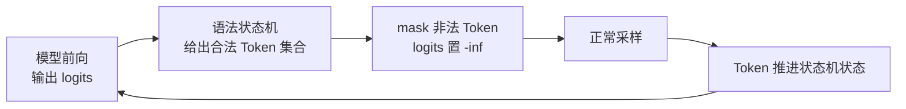
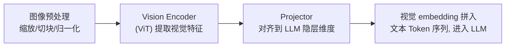

前几章解决的是"跑得快、装得下"，但把模型真正接进产品时，卡住项目的往往是另一类问题：下游代码要求输出必须是合法 JSON，Agent 框架要求模型会调工具，一份底座权重要同时服务十个业务的 LoRA，用户发来的是图文混合消息，产品还要求随机性可控、能拿到概率。这些需求都不改变推理速度的上限，却直接决定模型能不能落地。这一篇把 vLLM 的五大生产级服务特性——结构化输出、Tool Calling 与 Reasoning Parser、Multi-LoRA、多模态推理、采样与解码——从原理到可运行示例一次讲清，它们背后其实共享同一条主线：**在不动模型权重的前提下，用系统工程手段控制和扩展模型的输入输出**。

<!-- more -->

## 📑 目录

- [1. 结构化输出：让模型只生成合法 Token](#1-结构化输出让模型只生成合法-token)
- [2. Tool Calling 与 Reasoning Parser](#2-tool-calling-与-reasoning-parser)
- [3. Multi-LoRA：一份底座服务多个业务](#3-multi-lora一份底座服务多个业务)
- [4. 多模态推理：当输入不只是文本](#4-多模态推理当输入不只是文本)
- [5. 采样与解码算法](#5-采样与解码算法)
- [自我检验清单](#-自我检验清单)
- [6. 高频面试题解析](#6-高频面试题解析)
- [参考资料](#-参考资料)

---

## 1. 结构化输出：让模型只生成合法 Token

### 1.1 痛点：Prompt 里写"请输出 JSON"是不够的

给模型下指令"请严格输出 JSON"，它大概率照做，但"大概率"在生产里就是事故：偶尔多一句"好的，以下是结果："、偶尔漏一个引号、偶尔在 JSON 后面补一段解释。下游 `json.loads()` 一旦抛异常，整条链路就断了。重试能缓解但治标不治本——只要输出格式靠模型"自觉"，失败率就不为零。

结构化输出（Structured Output）换了一个思路：**不是求模型输出合法格式，而是让它根本没有能力输出非法格式**。

### 1.2 受约束解码原理：每一步 mask 掉非法 Token

回忆解码过程：每一步模型对整个词表算出 logits，再从中采样一个 Token。受约束解码（Constrained Decoding）在采样前插一只手：

1. 把目标格式（JSON Schema、正则、语法）编译成一个**语法状态机**；
2. 每一步解码时，状态机根据"已生成的内容走到了语法的哪个位置"，算出**当前允许出现的 Token 集合**；
3. 把词表里所有非法 Token 的 logits 置为 $-\infty$（即加一个 mask），再做采样——非法 Token 概率为 0，永远不可能被选中；
4. 采样出的 Token 推动状态机转移到下一个状态，进入下一步。



🔑 **核心概念**：受约束解码 = **在采样前用语法状态机对 logits 做逐步过滤**。模型还是那个模型，概率分布只是被限制在合法子空间内重新归一化。生成结果必然合法——这是构造性保证，不是概率性期望。

📌 **关键点**：约束是**加在解码器上的，不是加在模型上的**。所以它对任何模型即插即用，不需要微调；代价是每一步多了"计算合法 Token 集合"的开销，这正是各家引擎优化的主战场（见 1.4）。

### 1.3 三种约束表达：JSON Schema、正则、EBNF

按表达能力从常用到通用，约束有三种写法：

| 📊 约束类型 | 表达的格式 | 对应的自动机 | 典型场景 |
|---|---|---|---|
| JSON Schema | 字段、类型、枚举、嵌套结构 | 转成语法后用下推自动机处理 | 信息抽取、API 返回体、Function Call 参数 |
| 正则表达式 | 正则语言（无嵌套递归） | 有限状态机（FSM） | 手机号、日期、固定格式编号、选项集 |
| EBNF 语法 | 上下文无关语言（可递归嵌套） | 下推自动机（PDA） | SQL、代码片段、自定义 DSL |

三者能力是包含关系：EBNF（上下文无关文法）最通用，JSON 本身就是一种上下文无关语言（对象里可以嵌对象，任意深度递归），所以 JSON Schema 约束在引擎内部通常也被转成语法来处理；正则只能表达无递归的平坦格式，但胜在状态机简单、优化空间大。

### 1.4 xgrammar：把运行时开销搬到编译期

受约束解码的性能难点在第 2 步：**词表有十几万 Token，每一步都要判断每个 Token 是否合法**。朴素实现是逐 Token 在状态机上试走一遍，这个计算在 CPU 上做，GPU 只能干等——约束越复杂，每步的停顿越长。

vLLM 默认后端 **xgrammar** 的核心思路是**把大部分判断从运行时搬到编译期**：

- **上下文无关文法 + 字节级下推自动机**：把 JSON Schema/正则/EBNF 统一编译成字节级 PDA，用持久化执行栈高效管理递归结构的多条可能路径。
- **自适应 Token Mask 缓存（Adaptive Token Mask Cache）**：编译期分析发现，对大多数自动机状态而言，**绝大多数 Token 的合法性与栈内容无关，只取决于当前状态**——这类"上下文无关 Token"的合法性可以预先算好，按状态缓存成 mask。运行时只需查缓存，再对剩下少量"上下文相关 Token"做逐个检查。
- **与 GPU 计算重叠**：mask 的生成在 CPU 上做，与 GPU 的模型前向异步重叠，把约束开销藏进 GPU 计算的影子里。

💡 **提示**：同一个 Schema 的编译结果会被缓存，所以第一条请求会付一次语法编译成本，后续同 Schema 请求直接复用。生产上如果 Schema 是固定的几种，这笔成本摊薄后几乎可忽略。

### 1.5 SGLang 的压缩 FSM 与跳跃解码

SGLang 在正则/FSM 这条线上给出另一个漂亮优化：**压缩 FSM（compressed FSM）与跳跃解码（Jump-Forward Decoding）**。

观察一个 JSON 约束下的生成过程：`{"name": "` 这样的骨架部分其实**每个字符都是确定的**——状态机在这些位置只有唯一一条出边。朴素受约束解码仍要一步一步让模型"生成"这些确定的 Token，每步都是一次完整的模型前向，纯属浪费。

SGLang 把 FSM 中"只有单一转移路径"的状态链**压缩成一条边**：解码走到这里时，不再调用模型，直接把这段确定的文本**一次性追加**到输出中（作为新输入做一次扩展 Prefill），然后跳到下一个真正需要模型决策的位置。输出的结构性越强（骨架占比越高），跳过的模型前向越多，加速越明显。

📌 **关键点**：受约束解码对性能是把双刃剑——**mask 计算带来每步的 CPU 开销**（xgrammar 用编译期缓存压低它），但**格式的确定性又创造了跳跃解码的加速机会**（SGLang 用压缩 FSM 兑现它）。结构化输出不必然更慢，约束很强时反而可能更快。

### 1.6 vLLM 用法：structured_outputs

在线服务：JSON Schema 走 OpenAI 标准的 `response_format`，正则/选项/语法用 vLLM 扩展参数 `structured_outputs`（旧版本参数名为 `guided_json` / `guided_regex` 等，新版本已统一到 `structured_outputs`）：

```python
from openai import OpenAI

client = OpenAI(base_url="http://localhost:8000/v1", api_key="EMPTY")

# 方式一：JSON Schema（OpenAI 标准 response_format）
resp = client.chat.completions.create(
    model="Qwen/Qwen2.5-7B-Instruct",
    messages=[{"role": "user", "content": "抽取信息：张三，28 岁，后端工程师"}],
    response_format={
        "type": "json_schema",
        "json_schema": {
            "name": "person",
            "schema": {
                "type": "object",
                "properties": {
                    "name": {"type": "string"},
                    "age": {"type": "integer"},
                    "job": {"type": "string"},
                },
                "required": ["name", "age", "job"],
            },
        },
    },
)
print(resp.choices[0].message.content)  # 必然是合法且符合 Schema 的 JSON

# 方式二：选项约束（分类任务输出只能是给定选项之一）
resp = client.chat.completions.create(
    model="Qwen/Qwen2.5-7B-Instruct",
    messages=[{"role": "user", "content": "这条评论是正面还是负面：物流太慢了"}],
    extra_body={"structured_outputs": {"choice": ["正面", "负面"]}},
)

# 方式三：正则约束
resp = client.chat.completions.create(
    model="Qwen/Qwen2.5-7B-Instruct",
    messages=[{"role": "user", "content": "生成一个合法的中国大陆手机号"}],
    extra_body={"structured_outputs": {"regex": r"1[3-9]\d{9}"}},
)
```

离线推理用 `SamplingParams` 的 `structured_outputs` 字段：

```python
from vllm import LLM, SamplingParams
from vllm.sampling_params import StructuredOutputsParams

llm = LLM(model="Qwen/Qwen2.5-7B-Instruct")
params = SamplingParams(
    temperature=0,
    max_tokens=256,
    structured_outputs=StructuredOutputsParams(json={
        "type": "object",
        "properties": {"city": {"type": "string"}, "date": {"type": "string"}},
        "required": ["city", "date"],
    }),
)
outputs = llm.generate("从下面文本抽取城市和日期：9 月 22 日我到了杭州。", params)
print(outputs[0].outputs[0].text)
```

⚠️ **注意**：约束只保证**语法合法**，不保证**内容正确**——Schema 能保证 `age` 是整数，不能保证它是对的。约束太严还可能挤压模型发挥（比如强制它在信息不足时也必须填满所有 required 字段，逼出幻觉），Schema 设计要给"不知道"留出口（如允许 null）。

---

## 2. Tool Calling 与 Reasoning Parser

### 2.1 OpenAI 的 tools / tool_choice 协议

Agent 应用的基础是模型会"调工具"：模型不直接回答，而是输出一个结构化的调用请求，由应用执行后把结果喂回去。事实标准是 OpenAI 的协议：

- 请求方用 `tools` 字段声明可用工具（JSON Schema 描述函数名、用途、参数）；
- `tool_choice` 控制调用策略：`"auto"`（模型自行决定调或不调）、`"none"`（禁止调用）、`"required"`（必须调用某个工具）、或指定具体函数名（必须调用该工具）；
- 模型决定调用时，响应的 `message.tool_calls` 里给出函数名与 JSON 参数；应用执行后以 `role: "tool"` 消息把结果传回，进入下一轮。

```python
tools = [{
    "type": "function",
    "function": {
        "name": "get_weather",
        "description": "查询某城市当前天气",
        "parameters": {
            "type": "object",
            "properties": {"city": {"type": "string", "description": "城市名"}},
            "required": ["city"],
        },
    },
}]

resp = client.chat.completions.create(
    model="Qwen/Qwen2.5-7B-Instruct",
    messages=[{"role": "user", "content": "杭州今天天气怎么样？"}],
    tools=tools,
    tool_choice="auto",
)
msg = resp.choices[0].message
if msg.tool_calls:
    call = msg.tool_calls[0]
    print(call.function.name)       # get_weather
    print(call.function.arguments)  # {"city": "杭州"}
```

### 2.2 服务端解析：为什么需要 --tool-call-parser

关键问题在于：**模型输出的永远只是一串文本**。不同模型在训练时学到的工具调用"记法"完全不同——Hermes/Qwen 系用 `<tool_call>{...}</tool_call>` 标签包 JSON，Mistral 用 `[TOOL_CALLS]` 前缀，Llama 3.1 输出特定格式的 JSON，还有模型直接输出 Python 函数调用式的文本（pythonic 风格）。

vLLM 要把这些五花八门的原始文本转成统一的 OpenAI `tool_calls` 结构，就需要**按模型选择对应的解析器**：

```bash
vllm serve Qwen/Qwen2.5-7B-Instruct \
  --enable-auto-tool-choice \
  --tool-call-parser hermes
```

- `--enable-auto-tool-choice`：允许模型自主决定是否调工具（支持 `tool_choice="auto"`）；
- `--tool-call-parser`：指定输出格式解析器，常见的有 `hermes`（Qwen 系）、`mistral`、`llama3_json`、`internlm`、`deepseek_v3`、`pythonic` 等，选错了会导致工具调用解析失败或被当成普通文本返回。

💡 **提示**：`tool_choice` 指定具体函数或 `required` 时，vLLM 会在底层用**结构化输出**（第 1 节）来约束模型必须生成符合该函数参数 Schema 的调用——两个特性在这里合流：Tool Calling 定义"要什么格式"，受约束解码保证"一定是这个格式"。

### 2.3 Reasoning Parser：把思维链从答案里剥出来

推理模型（DeepSeek-R1、Qwen3 思考模式等）的输出里混着两段内容：`<think>...</think>` 包裹的思维链，和其后的正式回答。产品通常希望把两者分开——思维链可以折叠展示或干脆不给用户看，正式回答才进对话流。

vLLM 用 `--reasoning-parser` 做这个剥离：

```bash
vllm serve deepseek-ai/DeepSeek-R1-Distill-Qwen-7B \
  --reasoning-parser deepseek_r1
```

开启后，响应消息里思维链进 `reasoning_content` 字段，正式回答进 `content` 字段；流式输出时两者也在 delta 里分开推送，客户端可以分别渲染：

```python
resp = client.chat.completions.create(
    model="deepseek-ai/DeepSeek-R1-Distill-Qwen-7B",
    messages=[{"role": "user", "content": "9.11 和 9.8 哪个大？"}],
)
print(resp.choices[0].message.reasoning_content)  # 思维链
print(resp.choices[0].message.content)            # 最终答案
```

不同模型的思考标记不同（`deepseek_r1`、`qwen3` 等各有对应 parser），和 tool-call parser 一样按模型选择。

### 2.4 本质：服务端后处理，不是模型能力开关

📌 **关键点**：`--tool-call-parser` 和 `--reasoning-parser` 都是**服务端的文本后处理器**——它们不给模型增加任何能力，只是把模型"本来就会输出"的特定格式文本，解析成协议字段。因此：

- 模型没被训练过工具调用格式，配再对的 parser 也没用——能力来自训练（配套的 Chat Template 负责把 `tools` 声明按模型习惯的格式注入 Prompt），parser 只负责"听懂"输出；
- 反过来，模型会调工具但 parser 配错，表现为工具调用被当成普通文本吐给用户；
- 这层后处理在解析失败时应有降级路径（当普通文本返回、应用层重试或 JSON 修复），这是 Agent 服务鲁棒性设计的一部分。

---

## 3. Multi-LoRA：一份底座服务多个业务

### 3.1 LoRA 原理一句话回顾

LoRA 微调不改动底座权重 $W$，而是训练一个低秩增量：$W' = W + \frac{\alpha}{r} BA$，其中 $A \in \mathbb{R}^{r \times d}$、$B \in \mathbb{R}^{d \times r}$，秩 $r \ll d$，可训练参数量从 $d^2$ 降到 $2rd$。训练时 $A$ 用高斯随机初始化、$B$ 初始化为零——保证起点上增量 $BA = 0$（模型行为与底座一致），又让梯度能同时流向两个矩阵。推理时有两种用法：把 $BA$ **合并**进 $W$（零额外开销，但权重被"焊死"成单一业务版本），或**不合并**、单独保存 Adapter 动态加载——Multi-LoRA 服务走的是后者。

### 3.2 批内多 Adapter：S-LoRA 与 Punica 的分组 GEMM

真实场景是"一个底座 + 几十个业务 Adapter"：客服、写作、代码各训了自己的 LoRA。如果每个 Adapter 部署一个实例，底座权重被复制 N 份，显存成本爆炸；如果同一实例内按 Adapter 串行切换，又丢掉了批处理的吞吐。

**Punica** 和 **S-LoRA** 给出的答案是：**同一个 batch 里混合服务不同 Adapter 的请求**。计算上拆成两部分：

$$
y = xW + x B_i A_i
$$

- $xW$ 是所有请求共享的底座 GEMM，天然可以合批，吃满 GPU；
- $xB_iA_i$ 是各请求按自己的 Adapter $i$ 算的低秩增量——用定制 CUDA kernel（Punica 的 **SGMV**，Segmented Gather Matrix-Vector multiplication）把**按 Adapter 分组**的小矩阵乘批量执行：同组请求共享 Adapter 权重读取，不同组在一个 kernel 里分段并行。由于 $r$ 很小，这部分增量计算相对底座 GEMM 是小头。

S-LoRA 进一步把 Adapter 权重也纳入**统一分页显存池**（与 KV Cache 同池管理，思路承接 PagedAttention）：Adapter 按需换入换出，支持在单卡上注册远多于"同时活跃数"的 Adapter。

🔑 **核心概念**：Multi-LoRA 服务 = **底座计算合批共享 + 低秩增量按 Adapter 分组 GEMM + Adapter 权重分页调度**。一份底座显存，服务 N 个业务。

### 3.3 vLLM 用法：--enable-lora 与动态加载

启动时静态注册 Adapter：

```bash
vllm serve meta-llama/Llama-3.1-8B-Instruct \
  --enable-lora \
  --lora-modules sql-lora=/models/lora/sql cs-lora=/models/lora/customer \
  --max-loras 4 \
  --max-lora-rank 32 \
  --max-cpu-loras 16
```

- `--max-loras`：单个 batch 内同时活跃的 Adapter 上限（决定 GPU 上预留的 Adapter 槽位）；
- `--max-lora-rank`：支持的最大秩（槽位按此预分配，实际 Adapter 秩可以更小）；
- `--max-cpu-loras`：CPU 内存中缓存的 Adapter 数量，超过 GPU 槽位的 Adapter 在 CPU/GPU 间按需换入换出。

请求时把 `model` 写成 Adapter 名即可路由，写底座名则不加增量：

```python
resp = client.chat.completions.create(
    model="sql-lora",  # 用哪个 Adapter，就"点"哪个模型名
    messages=[{"role": "user", "content": "查询上月销售额最高的门店"}],
)
```

运行时动态增删 Adapter（需要服务端开启环境变量 `VLLM_ALLOW_RUNTIME_LORA_UPDATING=True`）：

```bash
curl -X POST http://localhost:8000/v1/load_lora_adapter \
  -H "Content-Type: application/json" \
  -d '{"lora_name": "finance-lora", "lora_path": "/models/lora/finance"}'

curl -X POST http://localhost:8000/v1/unload_lora_adapter \
  -H "Content-Type: application/json" \
  -d '{"lora_name": "finance-lora"}'
```

新业务上线不用重启服务、不用多买卡——这是 Multi-LoRA 在多租户场景的核心价值。

### 3.4 显存与调度的代价

天下没有免费的多租户，代价记在两本账上：

- **显存账**：每个活跃 Adapter 的权重（$2rd \times$ 层数，随 $r$ 和挂载层数增长）要常驻 GPU 槽位；预留槽位本身也挤占了本可分给 KV Cache 的显存，间接压低最大并发。此外 LoRA Adapter 不同的请求前缀不能互相命中前缀缓存——vLLM 的块哈希把 LoRA ID 算进了哈希键（见 2.3 节的块哈希设计），这是正确性要求，但意味着缓存命中率按 Adapter 切碎。
- **调度账**：batch 内 Adapter 种类越多，SGMV 分组越碎、增量 GEMM 效率越低；活跃 Adapter 超过 `--max-loras` 时请求要排队等槽位，冷 Adapter 换入有 CPU 到 GPU 的搬运延迟。

💡 **提示**：容量规划时按"热 Adapter 数 ≤ `--max-loras`，温 Adapter 放 `--max-cpu-loras`"来配；`--max-lora-rank` 不要一律拉满，按实际最大秩设置，槽位显存是按它预分配的。

---

## 4. 多模态推理：当输入不只是文本

### 4.1 VLM 推理链路：图像如何变成"Token"

主流 VLM（LLaVA、Qwen-VL、InternVL 等）的架构可以概括为"**视觉编码器 + 投影层 + LLM**"，推理链路四步：



1. **图像预处理**：缩放、切 patch、归一化；高分辨率方案还会把大图切成多个子图分别编码（CPU 上的这步并不便宜，是多模态服务常见的隐藏瓶颈）；
2. **Vision Encoder**：通常是 ViT，把图像 patch 编码成一串视觉特征向量；
3. **Projector**：把视觉特征投影对齐到 LLM 的词嵌入空间——轻则一个 MLP（LLaVA 系），重则 Cross-Attention 结构（如 Q-Former / Resampler 类，用可学习 query 把视觉特征压缩成固定数量的 Token）；
4. **拼接进序列**：Prompt 里的图像占位符被替换成这串视觉 embedding，与文本 Token embedding 拼成一条序列，之后 LLM 一视同仁地做 Prefill 和 Decode。

📌 **关键点**：对 LLM 主干来说，**图像最终就是一段"特殊的 Prefill Token"**。理解了这一点，多模态推理的系统问题就全部化归为已知问题：这段 Token 怎么省着算（缓存）、怎么省着存（KV Cache）。

### 4.2 多模态 Token 对 KV Cache 的冲击

一张图值多少 Token？LLaVA-1.5 是固定 576 个（$24 \times 24$ patch）；Qwen2-VL 系按分辨率动态，一张高清图上千 Token 很正常。这意味着：

- 一条"一张图 + 一句话"的请求，序列长度直接是纯文本的几十倍，**Prefill 计算量和 KV Cache 占用同步膨胀**；
- 多图、视频（几十帧就是几万 Token）场景下，KV Cache 成为第一瓶颈，最大并发数显著低于同规模纯文本服务；
- 因此 vLLM 用 `--limit-mm-per-prompt` 限制单请求的多模态输入数量，容量规划要按"图数 × 每图 Token 数"折算成等效上下文长度。

### 4.3 vLLM 的 Encoder Cache 与图像哈希前缀缓存

vLLM V1 为多模态做了两层专门的缓存：

- **Encoder Cache**：Vision Encoder 的输出 embedding 先缓存起来。一个直接动机是配合 Chunked Prefill——一张图的几百个 Token 可能被拆到多个调度步里注入，encoder 只跑一次，各步从缓存取对应分片，而不是每步重算 ViT。同时，处理器层的缓存（mm processor cache）以**图像内容哈希**为键，同一张图短期内重复出现时可以跳过重复的预处理与编码。
- **图像哈希参与前缀缓存**：前缀缓存按 Token 块哈希判断"前缀相同"（见 2.3 节），但两条请求的图像占位符 Token 相同不代表图像相同。vLLM 把**图像内容的哈希**塞进对应块的哈希键（块哈希的 extra 字段），让"同一张图 + 同样前文"的请求能安全命中前缀缓存、直接复用视觉部分的 KV——多轮看图对话（同一张图反复出现在历史里）受益极大。

🔑 **核心概念**：多模态缓存的层次——**Encoder Cache 省的是 ViT 编码的计算，前缀缓存（带图像哈希）省的是视觉 Token 在 LLM 里的 Prefill**。两层各管一段，键都是图像内容哈希。

### 4.4 服务与请求示例

```bash
vllm serve Qwen/Qwen2.5-VL-7B-Instruct \
  --limit-mm-per-prompt '{"image": 4}' \
  --max-model-len 16384
```

请求走 OpenAI 的多模态消息格式，`content` 是文本与图像混合的列表，图像可以是 URL 或 base64：

```python
import base64

with open("invoice.png", "rb") as f:
    img_b64 = base64.b64encode(f.read()).decode()

resp = client.chat.completions.create(
    model="Qwen/Qwen2.5-VL-7B-Instruct",
    messages=[{
        "role": "user",
        "content": [
            {"type": "image_url",
             "image_url": {"url": f"data:image/png;base64,{img_b64}"}},
            {"type": "text", "text": "这张发票的总金额是多少？只输出数字。"},
        ],
    }],
)
print(resp.choices[0].message.content)
```

⚠️ **注意**：多模态与本章其他特性可以叠加——比如对发票抽取任务同时开结构化输出（第 1 节），让 VLM 的答案直接落成合法 JSON。生产里"VLM + JSON Schema"是信息抽取类业务的标准组合。

---

## 5. 采样与解码算法

### 5.1 温度与截断：temperature / top-k / top-p / min-p

模型每步输出 logits $z$，采样参数决定"怎么从中选一个 Token"。四个参数的语义：

- **temperature（温度）**：采样前把 logits 除以 $T$ 再过 softmax：$p_i = \text{softmax}(z_i / T)$。$T < 1$ 锐化分布（更确定），$T > 1$ 抹平分布（更随机），$T \to 0$ 退化为贪心（argmax）。它调整的是**整个分布的形状**。
- **top-k**：只保留概率最高的 $k$ 个 Token，其余置零后重新归一化。截断是**按名次**的，与分布形状无关。
- **top-p（nucleus sampling）**：按概率从高到低累加，保留累计概率刚超过 $p$ 的最小集合。截断是**自适应**的——分布尖锐时候选少，分布平坦时候选多。
- **min-p**：保留概率不低于 $p_{\max} \cdot \text{min\_p}$ 的 Token（$p_{\max}$ 是当前步最高概率）。它是**相对阈值**：头部越自信，砍尾巴越狠；比 top-p 更能在高温下保住质量，近年逐渐流行。

实现顺序上（vLLM 的 Sampler 即如此）：**先对 logits 施加各类 penalty（见 5.2），再除温度，然后依次做 top-k → top-p / min-p 截断，最后 softmax 归一化并采样**。顺序是有讲究的——温度在截断之前，意味着温度会影响 top-p 圈进多少候选；top-k 在 top-p 之前，两者同开时先按名次砍再按累计概率砍。

| 📊 参数 | 作用对象 | 语义 | 典型值 |
|---|---|---|---|
| temperature | 全分布形状 | 控制随机性强弱 | 0（贪心）~ 1.0 |
| top-k | 候选集（按名次） | 硬性保留前 k 名 | 20 ~ 100 |
| top-p | 候选集（按累计概率） | 自适应保留头部 | 0.8 ~ 0.95 |
| min-p | 候选集（按相对阈值） | 随头部置信度伸缩 | 0.05 ~ 0.1 |

### 5.2 重复惩罚三兄弟：repetition / presence / frequency

对付复读机，三种 penalty 都作用在"已出现过的 Token"的 logits 上，但公式不同：

- **repetition_penalty**（乘性）：出现过的 Token，正 logit 除以 $\gamma$、负 logit 乘以 $\gamma$（$\gamma > 1$ 时惩罚）。经典 CTRL 式设计，出现一次和出现十次惩罚相同。
- **presence_penalty**（加性、一次性）：只要出现过就减去固定值 $\alpha$，与出现次数无关——鼓励聊新话题。
- **frequency_penalty**（加性、按次数）：减去 $\beta \times$ 出现次数，越复读罚得越重——针对高频重复。

⚠️ **注意**：penalty 是无差别的统计手段，罚得太重会伤及必要的重复（代码里的变量名、JSON 的引号括号）。结构化输出场景慎开强 penalty。

### 5.3 logprobs：把概率交给调用方

`logprobs` 让服务在返回 Token 的同时返回其对数概率（以及每步概率最高的若干候选）。生产用途很实：**置信度估计**（分类任务拿选项概率做阈值）、**幻觉检测**（低概率片段提示不确定）、**蒸馏与评测**（离线算 PPL）。

### 5.4 并行采样 n > 1：一次 Prefill，多路 Decode

`n=3` 表示同一个 Prompt 生成 3 个候选回答。朴素做法是复制成 3 条独立请求，Prompt 的 Prefill 和 KV 存三份。vLLM 的做法是 **fork**：Prompt 部分只 Prefill 一次，3 条序列通过块表**共享同一份前缀 KV 物理块**（引用计数记录共享者），只有各自新生成的部分独立占块——这正是 PagedAttention 块共享 + Copy-on-Write 的直接应用，vLLM V1 里则由前缀缓存机制统一承接。Prefill 算力与 KV 显存都只花一份，$n$ 越大、Prompt 越长省得越多。

### 5.5 Beam Search 为什么被边缘化

Beam Search 每步保留全局得分最高的 $k$ 条部分序列（beam），不断扩展与剪枝，最后输出得分最高的完整序列——它是**近似搜索最大概率序列**，而采样是**从分布中抽样**。在机器翻译时代它是标配，但在 LLM 服务中被明显边缘化（vLLM V1 已把它从核心采样器中移出，仅作为离线包装接口 `llm.beam_search()` 提供）：

- **代价大**：每步维护 $k$ 条候选序列的 KV 状态，beam 之间频繁分叉合并，KV 管理与调度复杂度高，吞吐远差于普通采样；
- **收益小**：开放式生成里"概率最高的序列"并不等于"人觉得最好的回答"，高概率序列往往重复、平庸（这也是为什么采样 + 温度成为主流）；
- **破坏流式**：beam 之间随时可能反超换排名，前面已"输出"的内容可能被推翻，无法逐 Token 稳定地流式给用户——而流式恰是对话产品的刚需。

它仍有小众价值：翻译、语音识别后处理等"存在客观最优解、序列短、离线"的任务。

### 5.6 采样参数示例

```python
resp = client.chat.completions.create(
    model="Qwen/Qwen2.5-7B-Instruct",
    messages=[{"role": "user", "content": "给这款保温杯写一句广告词"}],
    temperature=0.8,
    top_p=0.9,
    presence_penalty=0.5,
    n=3,                    # 并行采样 3 个候选, 共享 Prompt 的 KV
    logprobs=True,
    top_logprobs=5,         # 每步返回 top-5 候选及其 logprob
    extra_body={            # OpenAI 协议没有的参数走 vLLM 扩展
        "top_k": 50,
        "min_p": 0.05,
        "repetition_penalty": 1.05,
    },
)
for choice in resp.choices:
    print(choice.message.content)
```

离线 Beam Search（仅当任务确实需要"最优序列"时）：

```python
from vllm import LLM
from vllm.sampling_params import BeamSearchParams

llm = LLM(model="Qwen/Qwen2.5-7B-Instruct")
outputs = llm.beam_search(
    [{"prompt": "Translate to English: 今天天气不错"}],
    BeamSearchParams(beam_width=4, max_tokens=64),
)
```

---

## ✅ 自我检验清单

**1. 能说清受约束解码为什么是"构造性保证"而非概率性期望，以及代价加在哪里**

<details>
<summary>参考答案</summary>

- 把 JSON Schema/正则/语法编译成语法状态机，每步解码时状态机根据已生成内容算出当前合法 Token 集合，把非法 Token 的 logits 置 $-\infty$ 后再采样——非法 Token 概率为 0 永远选不中，概率分布只是被限制在合法子空间内重新归一化，结果必然合法。
- 约束加在解码器上而不是模型上，对任何模型即插即用、无需微调；代价是每步多出"计算合法 Token 集合"的开销，这正是各引擎优化的主战场。
- 边界要记牢：约束只保证语法合法不保证内容正确，Schema 太严还会逼出幻觉，要给"不知道"留出口（如允许 null）。（对应 1.2、1.6 节）

</details>

**2. 能区分 JSON Schema、正则、EBNF 三种约束的表达能力与对应自动机**

<details>
<summary>参考答案</summary>

- 正则只能表达无递归的平坦格式，对应有限状态机（FSM），胜在状态机简单、优化空间大；EBNF 表达上下文无关语言（可递归嵌套），对应下推自动机（PDA）；三者能力是包含关系，EBNF 最通用。
- JSON 本身就是上下文无关语言（对象可任意深度嵌套），所以 JSON Schema 约束在引擎内部通常也被转成语法、用下推自动机处理。（对应 1.3 节）

</details>

**3. 能对比 xgrammar 与 SGLang 两条优化路线，并解释约束很强时结构化输出为什么可能"反而更快"**

<details>
<summary>参考答案</summary>

- xgrammar 压低每步开销：三类约束统一编译成字节级下推自动机（持久化执行栈管理递归结构的多条路径）；编译期发现多数自动机状态下绝大多数 Token 的合法性只取决于当前状态、与栈内容无关，预先按状态缓存成自适应 Token Mask（Adaptive Token Mask Cache），运行时查缓存 + 对少量上下文相关 Token 逐个检查；mask 生成在 CPU 上与 GPU 前向异步重叠。同一 Schema 的编译结果还会缓存复用。
- SGLang 整段跳过确定部分：压缩 FSM 把"只有单一转移路径"的状态链压成一条边，走到 `{"name": "` 这类骨架时不再逐 Token 调模型，直接把确定文本一次性追加（作为扩展 Prefill）再跳到下一个真正需要模型决策的位置（Jump-Forward Decoding），骨架占比越高加速越明显。
- 结论是双刃剑：mask 计算带来每步 CPU 开销（xgrammar 压低它），格式确定性又创造跳跃加速机会（SGLang 兑现它），结构化输出不必然更慢。（对应 1.4、1.5 节）

</details>

**4. 能说明 --tool-call-parser / --reasoning-parser 的本质，以及配错后的表现**

<details>
<summary>参考答案</summary>

- 两者都是服务端文本后处理器：不给模型增加任何能力，只把模型本来就会输出的特定格式文本（`<tool_call>` 标签、`[TOOL_CALLS]` 前缀、`<think>` 思维链等）解析成协议字段（`tool_calls`，或 `reasoning_content` 与 `content` 分离）。
- 能力来自训练：Chat Template 负责把 `tools` 声明按模型习惯注入 Prompt，模型没学过该格式则 parser 配对了也没用；反过来模型会调工具但 parser 选错（hermes/mistral/llama3_json 等需按模型对应），工具调用会被当普通文本吐给用户。
- `tool_choice` 指定具体函数或 `required` 时，vLLM 底层用结构化输出约束参数必须符合该函数的 Schema——两个特性在此合流；解析失败还应有降级路径（当普通文本返回、重试或 JSON 修复）。（对应 2.2~2.4 节；另见 Q8）

</details>

**5. 能写出 Multi-LoRA 批内混合服务的计算拆分，并说出 SGMV 与 S-LoRA 分页各解决什么问题**

<details>
<summary>参考答案</summary>

- 前向拆成 $y = xW + xB_iA_i$：底座 GEMM $xW$ 是所有请求共享的，天然合批吃满 GPU；低秩增量 $xB_iA_i$ 按 Adapter 分组，用 Punica 的 SGMV kernel（Segmented Gather Matrix-Vector multiplication）批量执行——同组请求共享 Adapter 权重读取、不同组在一个 kernel 里分段并行，$r$ 很小所以增量相对底座 GEMM 是小头。
- S-LoRA 进一步把 Adapter 权重纳入与 KV Cache 同池的统一分页显存池，按需换入换出，单卡可注册远多于"同时活跃数"的 Adapter。
- 一句话：底座计算合批共享 + 低秩增量按 Adapter 分组 GEMM + Adapter 权重分页调度。（对应 3.2 节；另见 Q3）

</details>

**6. 能解释 --max-loras / --max-lora-rank / --max-cpu-loras 的语义，并算清 Multi-LoRA 的显存账与调度账**

<details>
<summary>参考答案</summary>

- 参数语义：`--max-loras` 是单 batch 内同时活跃的 Adapter 上限（GPU 预留槽位数）；`--max-lora-rank` 是支持的最大秩，槽位显存按它预分配，应按实际最大秩设置而非一律拉满；`--max-cpu-loras` 是 CPU 内存缓存的 Adapter 数，超出 GPU 槽位的按需换入换出（配合 `VLLM_ALLOW_RUNTIME_LORA_UPDATING` 还可运行时动态增删）。
- 显存账：每个活跃 Adapter 的权重（$2rd \times$ 层数）常驻槽位，预留槽位挤占本可分给 KV Cache 的显存、间接压低最大并发；且 LoRA ID 被算进前缀缓存的块哈希键，不同 Adapter 的请求不能互相命中缓存——命中率按 Adapter 切碎。
- 调度账：batch 内 Adapter 种类越多，SGMV 分组越碎、增量 GEMM 效率越低；活跃数超过槽位要排队，冷 Adapter 换入有 CPU 到 GPU 的搬运延迟。配比原则："热 Adapter ≤ max-loras，温 Adapter 放 max-cpu-loras"。（对应 3.3、3.4 节）

</details>

**7. 能描述 VLM 推理链路的四步，并把多模态输入折算成对 KV Cache 与并发的冲击**

<details>
<summary>参考答案</summary>

- 链路四步：图像预处理（缩放/切块/归一化，CPU 上并不便宜，是多模态服务常见的隐藏瓶颈）→ Vision Encoder（ViT）提取视觉特征 → Projector 对齐到 LLM 词嵌入空间（轻则 MLP 直连，重则 Q-Former/Resampler 类用可学习 query 压缩）→ 视觉 embedding 替换占位符拼进序列。对 LLM 主干而言，图像就是一段"特殊的 Prefill Token"。
- Token 折算：LLaVA-1.5 一张图固定 576 个（$24 \times 24$ patch），Qwen2-VL 系按分辨率动态、高清图上千 Token，视频几十帧就是几万 Token——Prefill 计算量与 KV Cache 占用同步膨胀，最大并发显著低于同规模纯文本服务。
- 工程上用 `--limit-mm-per-prompt` 限制单请求的多模态输入数量，容量规划按"图数 × 每图 Token 数"折算成等效上下文长度。（对应 4.1、4.2 节；另见 Q6）

</details>

**8. 能区分 Encoder Cache 与图像哈希前缀缓存各省掉哪一段计算**

<details>
<summary>参考答案</summary>

- Encoder Cache 省的是 ViT 编码的计算：缓存 Vision Encoder 输出的 embedding，配合 Chunked Prefill 时一张图的几百个 Token 被拆到多个调度步注入、encoder 也只跑一次；处理器层的 mm processor cache 以图像内容哈希为键，同一张图短期重复出现可跳过预处理与编码。
- 图像哈希前缀缓存省的是视觉 Token 在 LLM 里的 Prefill：图像占位符 Token 相同不代表图像相同，vLLM 把图像内容哈希塞进 KV 块哈希键（extra 字段），让"同一张图 + 同样前文"安全命中前缀缓存、直接复用视觉部分的 KV——多轮看图对话受益极大。
- 两层各管一段，键都是图像内容哈希。（对应 4.3 节；另见 Q7）

</details>

**9. 能按 vLLM Sampler 的实际执行顺序排出采样参数处理链，并区分三种重复惩罚**

<details>
<summary>参考答案</summary>

- 执行顺序：先对 logits 施加各类 penalty，再除以温度，然后依次做 top-k（按名次）→ top-p / min-p 截断，最后 softmax 归一化并采样；温度在截断之前，所以温度会影响 top-p 实际圈进多少候选（另见 Q1）。
- min-p 是相对阈值：保留概率不低于 $p_{\max} \cdot \text{min\_p}$ 的 Token，头部越自信砍尾巴越狠，高温下比 top-p 更能保住质量。
- 三种 penalty 公式不同：repetition 乘性（出现过的 Token 正 logit 除以 $\gamma$、负 logit 乘以 $\gamma$，出现一次与十次罚相同）；presence 加性一次性（出现过就减固定 $\alpha$，鼓励聊新话题）；frequency 加性按次数（减 $\beta \times$ 出现次数，专治高频复读）。罚太重会伤及代码变量名、JSON 引号括号等必要重复，结构化输出场景慎开强 penalty。（对应 5.1、5.2 节）

</details>

**10. 能解释并行采样 n>1 如何做到"一次 Prefill、多路 Decode"**

<details>
<summary>参考答案</summary>

- 朴素做法把 `n=3` 复制成 3 条独立请求，Prompt 的 Prefill 计算与 KV 各存三份；vLLM 用 fork：Prompt 部分只 Prefill 一次，3 条序列通过块表共享同一份前缀 KV 物理块（引用计数记录共享者），只有各自新生成的部分独立占块。
- 这是 PagedAttention 块共享 + Copy-on-Write 的直接应用（vLLM V1 中由前缀缓存机制统一承接）：Prefill 算力与 KV 显存都只花一份，$n$ 越大、Prompt 越长省得越多。（对应 5.4 节）

</details>

---

## 6. 高频面试题解析

**Q1：Temperature 的数学原理是什么？Temperature、Top-k、Top-p 三个参数的作用顺序是怎样的？**（华为 AI Infra 实习二面）

Temperature 是 softmax 前对 logits 的缩放：$p_i = e^{z_i/T} / \sum_j e^{z_j/T}$。$T<1$ 拉大 logits 差距、分布更尖（确定性强），$T>1$ 缩小差距、分布更平（随机性强），$T \to 0$ 等价 argmax 贪心。作用顺序：**先温度缩放，再 top-k 按名次截断，再 top-p 按累计概率截断**（vLLM 中 penalty 在温度之前，min-p 在截断链之后），最后归一化采样。顺序意味着温度会改变 top-p 实际圈住的候选数（见 5.1 节）。

**Q2：Beam Search 的原理是什么？与直接采样有何区别？为什么 LLM 服务里很少用？**（百度 AI Infra 校招二面）

Beam Search 每步保留得分最高的 $k$ 条部分序列并扩展剪枝，近似搜索整体概率最大的序列，是确定性算法；采样是按分布随机抽 Token，同一输入可得不同输出。LLM 服务边缘化它的三个原因：维护 $k$ 路候选的 KV 与调度代价大；开放式生成中最大概率序列常常重复平庸、收益小；beam 排名随时反超，无法稳定流式输出。vLLM V1 仅保留离线的 `llm.beam_search()` 接口（见 5.5 节）。

**Q3：LoRA 的工作原理是什么？推理阶段 LoRA 微调后的模型是否仍需要加载额外的 Adapter 模块？**（MiniMax AI Infra 一面）

LoRA 冻结底座 $W$，训练低秩增量 $\Delta W = \frac{\alpha}{r}BA$，前向为 $y = xW + xBA$。推理阶段分两种：**合并部署**——把 $BA$ 加进 $W$ 得到新权重，不需要 Adapter 模块、零额外延迟，但一份权重只服务一个业务版本；**动态加载**——保持底座不变、单独挂 Adapter，需要在前向中多算低秩分支，但支持一份底座权重上多 Adapter 共存与热切换。Multi-LoRA 服务选后者，用分组 GEMM 把增量计算的开销做小（见 3.1、3.2 节）。

**Q4：LoRA 中降维矩阵 A 和升维矩阵 B 的初始化方式为何不同？**（MiniMax AI Infra 实习二面；贝壳面经同款："为什么不能把 A 初始化为零"）

$A$ 高斯随机初始化、$B$ 置零：这样初始时 $BA=0$，微调起点上模型行为与底座完全一致，训练稳定。梯度上，$\nabla_B \propto x^T A^T$ 非零（$A$ 随机），$B$ 能立刻学起来；$B$ 更新后 $\nabla_A$ 也随之非零。若 $A$、$B$ 同时置零则两者梯度都恒为零、无法训练；同时随机初始化则起点上 $BA \neq 0$，等于一开始就随机扰动了底座行为（见 3.1 节）。

**Q5：LoRA 的秩 r 如何影响效果？Rank 设置不当会出现什么现象？**（字节跳动抖音电商 / 百度 AI Infra 二面）

$r$ 决定增量矩阵的表达容量与参数量（$2rd$）。$r$ 太小：容量不足，学不动目标任务，表现为欠拟合、任务指标上不去；$r$ 太大：参数与显存开销上升，小数据集上易过拟合、遗忘底座通用能力，且收益通常饱和。工程上从小 $r$（如 8/16）起步按任务难度上调。在 Multi-LoRA 服务侧，$r$ 还直接决定每个 Adapter 的显存占用和 `--max-lora-rank` 的槽位预算（见 3.3、3.4 节）。

**Q6：多模态大模型中，将视觉特征传递给 LLM 有哪些常见方法？**（阿里巴巴 AI Infra 一面）

主流三类：（1）**线性投影/MLP 直连**（LLaVA 系）：ViT 特征过 MLP 对齐到词嵌入空间，作为 Token 序列拼进输入，简单直接但 Token 数多；（2）**可学习 Query 压缩**（Q-Former/Resampler 类，BLIP-2、Qwen-VL 早期版本）：用固定数量的可学习 query 对视觉特征做 Cross-Attention，把图压成固定几十个 Token，省序列长度但可能丢细节；（3）**深层 Cross-Attention 注入**（Flamingo 类）：视觉特征不进输入序列，而是在 LLM 中插入交叉注意力层按需读取。当前开源主流是第一类（配合动态分辨率），对推理系统的影响见 4.1、4.2 节。

**Q7：多模态场景下开启 TP 时，ViT 的 image embedding 如何在多个进程间高效复用？**（小厂 AI Infra 实习一面，SGLang 背景）

要点是**避免每个 TP rank 重复算 ViT、避免重复传大图**：图像预处理与编码只做一次（由单一进程或独立的 encoder 阶段完成），得到的 embedding 通过共享内存或一次 broadcast 分发给各 TP rank，而不是把原始图像发给每个 rank 各自跑一遍 encoder；配合以图像内容哈希为键的 embedding 缓存，同一张图在多轮对话中反复出现时可直接复用编码结果。这与 vLLM 的 Encoder Cache / processor cache、图像哈希前缀缓存是同一思想的不同落点（见 4.3 节）。

**Q8：工具调用的调度机制如何设计？异常情况下如何 Fallback 降级？**（MiniMax AI Infra 一面）

先分清两层：推理服务层只负责"声明工具（tools 注入 Prompt）→ 解析输出（tool-call parser）→ 约束格式（必要时用结构化输出保证参数合法）"；调用的调度在应用/Agent 层——串并行编排（无依赖的工具调用并发执行）、超时与重试、限流与熔断。降级路径自上而下：参数解析失败时先做 JSON 修复或让模型重生成（或直接用 `tool_choice` + 结构化输出从源头堵住非法参数）；工具执行失败时把错误信息作为 `tool` 消息回传让模型自行调整或改答；工具整体不可用时置 `tool_choice="none"` 退化为纯文本回答并明示能力受限。核心原则呼应 2.4 节：parser 是服务端后处理，每一层后处理都必须有失败分支（见 2.2、2.4 节）。

---

## 📚 参考资料

- [vLLM Docs — Structured Outputs](https://docs.vllm.ai/en/latest/features/structured_outputs.html)
- [XGrammar: Flexible and Efficient Structured Generation Engine for Large Language Models](https://arxiv.org/abs/2411.15100)
- [SGLang Blog — Fast JSON Decoding with Compressed FSM](https://lmsys.org/blog/2024-02-05-compressed-fsm/)
- [vLLM Docs — Tool Calling](https://docs.vllm.ai/en/latest/features/tool_calling.html)
- [vLLM Docs — Reasoning Outputs](https://docs.vllm.ai/en/latest/features/reasoning_outputs.html)
- [vLLM Docs — LoRA Adapters](https://docs.vllm.ai/en/latest/features/lora.html)
- [S-LoRA: Serving Thousands of Concurrent LoRA Adapters](https://arxiv.org/abs/2311.03285)
- [Punica: Multi-Tenant LoRA Serving](https://arxiv.org/abs/2310.18547)
- [vLLM Docs — Multimodal Inputs](https://docs.vllm.ai/en/latest/features/multimodal_inputs.html)
- [vLLM V1 Alpha Release（Encoder Cache 与多模态优化）](https://blog.vllm.ai/2025/01/27/v1-alpha-release.html)
- [The Curious Case of Neural Text Degeneration（Nucleus/Top-p Sampling）](https://arxiv.org/abs/1904.09751)
- [Min-p Sampling: Balancing Creativity and Coherence](https://arxiv.org/abs/2407.01082)
